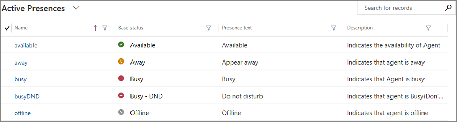
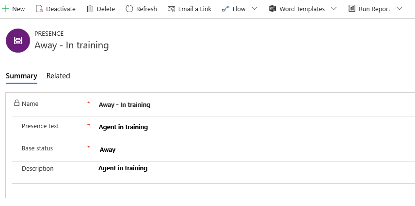

# Configure and manage custom presence

[!INCLUDE[cc-use-with-omnichannel](../../includes/cc-use-with-omnichannel.md)]

Presence status indicates an agent's availability.

A presence status consists of two elements:

- **Base status**: The base presence status which indicates an agent's status. Work distribution system distributes work items to agents according to base statuses. There are five base statuses – **Available**, **Busy**, **Busy-DND**, **Away**, and **Offline**. The base statuses are available to be selected as **Allowed Presences** while creating a [work stream](work-streams-introduction.md).
- **Presence text**: The text that is associated with a specific base status. This is the text that is visible to agents. 

## Out of the box presence statuses
Out of the box, Omnichannel provides the following presence statuses:

- Available
- Away
- Busy
- Busy - DND
- Offline

> [!div class=mx-imgBorder]
> 

> [!NOTE]
> You cannot edit or delete these out of the box presence statuses.

## Create custom presence status 

In addition to the out-of-box presence statuses, admins can configure custom presence statuses for agents. For example, if the agents on your team want to attend a training, you can create a custom **Away – In Training** presence status. 

Follow these steps to create a new presence record.

1. In the Omnichannel site map, go to **Agent Experience \> Custom Presence**.

    The **Active Presences** view is shown.

2. On the command bar, select **New** to create a presence record.
3. On the **Summary** tab, provide the following information:

    1. **Name**: Enter a name for the custom presence status.
    2. **Presence Text**: Enter presence text that should be associated with the new custom entity.
    3. **Base Status**: Select the most applicable base status in the list.
    4. **Description**: Enter a brief description of the custom presence record.

4. Select **Save** to save the new presence record.

> [!div class=mx-imgBorder]
> 

### See also

[Understand and create work streams](work-streams-introduction.md)

[Understand unified routing and work distribution](unified-routing-work-distribution.md)
