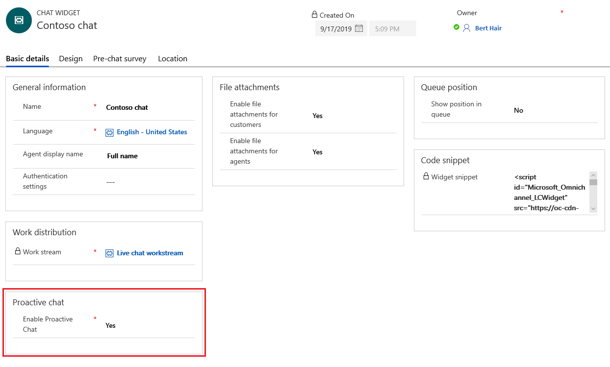
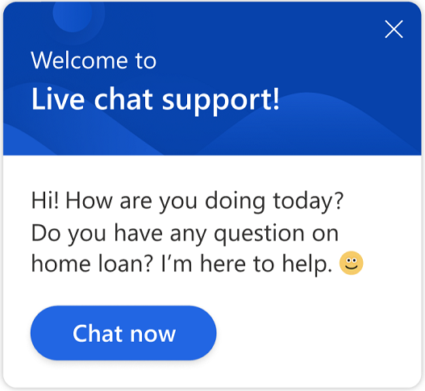
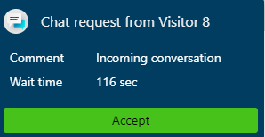

# Configure proactive chat

[!INCLUDE[cc-use-with-omnichannel](../../includes/cc-use-with-omnichannel.md)]

Chat channel allows your customers to effortlessly engage with customer service agents using the chat widget on a website. Proactive chat allows customer service agents to engage with customers by automatically inviting them to a chat conversation based on the configured rules. Proactively engaging with a customer at the time when they need help, improves customer experience and satisfaction.

Information, such as user journey information, time spent on web page, and more can be used to decide when to engage with a customer. The proactive chat experience can be controlled by using personalized trigger messages and configurable rules to define the target audience, time frame, and target location.

> [!NOTE]
> Proactive chat can be triggered only on pages where the chat widget is embedded.

## Enable proactive chat

1.	Sign in to Omnichannel Administration.
2.	Open the chat widget for which you need to turn on proactive chat.
3.	Go to the **Basic details** tab.
4.	Under **Proactive chat**, select **Yes** for **Enable Proactive Chat**. By default, it is set to **No**.

    > [!div class=mx-imgBorder]
    > 

The conditions to trigger the proactive chat are defined in the web page code in which the chat widget is embedded. If the conditions are fulfilled, the proactive chat invitation is displayed with the help of an API.

## Customer experience of proactive chat

When proactive chat is enabled, the chat invitation is displayed to customer based on the configured triggers.

> [!div class=mx-imgBorder]
> 
 
A customer can either choose to accept the chat invitation or close it. The chat invitation is closed automatically after one minute if it is not accepted by the customer.

> [!NOTE]
> For this release, the timer of one minute is not configurable.

## Agent experience of proactive chat

When a customer accepts the proactive chat invitation, an agent receives the notification about the same.

> [!div class=mx-imgBorder]
> 

The agent can then accept the chat request and start conversing with the customer to provide the required help. The [customer summary](../agent/agent-oc/oc-customer-summary.md) is loaded and displayed if customer’s details matches with the stored data. 

If your administrator or developer configures the **Additional details** tab and if there are any additional context variables, such as time spent on a page and the page URL from where the chat is initiated, they are displayed on the **Additional details** tab. 

To learn more, see [setContextProvider](../developer/reference/methods/setContextProvider.md).

> [!div class=mx-imgBorder]
> 

