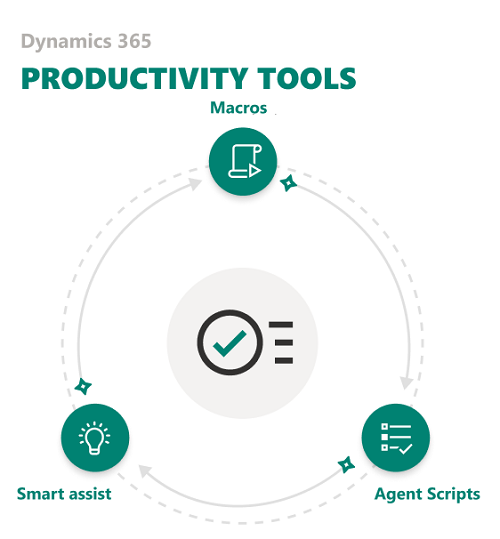

# Overview of productivity tools

[!INCLUDE[cc-use-with-omnichannel](../../includes/cc-use-with-omnichannel.md)]

## Introduction

The Dynamics 365 Productivity Tools app provides capabilities that help users perform day-to-day operations in a fast, efficient, and process-compliant manner and deliver value to customers.

> [!NOTE]
>
> The productivity pane and productivity tools are not available in Omnichannel for Customer Service on Unified Service Desk.

### Challenges

In the customer service industry, agents are expected to handle a large volume of customer issues and resolve them quickly with high customer satisfaction value while adhering to the process standards.

Whilst there are challenges such as:

- Too many clicks to perform actions (open a form, fill out the form, save the form, and so on).
- Repetitive or monotonous tasks (greet a customer, verify a customer, send acknowledgment mail, take notes, and so on).
- Human errors introduced during copy paste of data across different pages.
- Process adherence and compliance that are specific to the contact center business organizations.
- Lack of real-time insights to the customer, knowledge articles, and other relevant needs based on the context of the interaction.

The Dynamics 365 Productivity Tools app contains the following functionality to help address these challenges, aiding users to perform day-to-day operations in a fast, efficient, and process-compliant manner.

- [Macros](#macros)
- [Agent scripts](#agent-scripts)
- [Smart assist](#smart-assist)

    > [!div class=mx-imgBorder] 
    > 

### Macros

With macros, agents can perform repetitive, monotonous tasks—Open model-driven app forms, pre-populate fields with the details, send an email to a customer, take notes, and much more—all in a single click. A macro is a set of sequential actions that tells the system how to complete a task. When an agent runs a macro, the system performs each action and this helps save time and accommodate agents to handle more customer issues. Also, macros provide preciseness, clarity, and consistency to the tasks that agents perform.

### Agent scripts

Agent scripts provide guidance to agents about what to do when they get a customer issue. The scripts ensure that only accurate, company-endorsed information is being shared, while also safeguarding the organization in regard to legal-compliance issues. Agent scripts help organizations to be unified, accurate, and effective while being quick and  efficient in handling customers.

### Smart assist

Smart assist is an intelligent assistant that provides real-time recommendations to agents, helping them take actions while interacting with customers. It allows organizations to build a custom bot and plug-in real-time to their environment. Also, organizations can develop relevant recommendations such as knowledge articles, similar cases, and next-best steps using Microsoft Adaptive cards. These recommendation cards are displayed on the agent user interface based on the context of the current conversation.

The smart assist feature can be enabled across all channels like Chat for Dynamics 365 Customer Service, SMS, and Facebook, except entity records, making it a consistent experience for agents.

## Agent guidance in productivity pane

The productivity pane, when enabled, displays the agent guidance control that shows the agent scripts and smart-assist cards.

> [!div class='mx-imgBorder']
> 

To learn more, see [Enable the productivity pane to provide guidance to agents](productivity-pane.md).

## Set up Dynamics 365 Productivity Tools

If you use new Omnichannel for Customer Service environment, then Dynamics 365 Productivity Tools will be available by default.

If you are using Omnichannel for Customer Service, and want Productivity Tools, then you must install it manually from the Microsoft AppSource. To learn more, see [Prerequisites](#prerequisites) and [Install Dynamics 365 Productivity Tools package](#install-dynamics-365-productivity-tools-package).

### Prerequisites

- Identify the Common Data Service environment to which you want to deploy Dynamics 365 Productivity Tools. To know the environment details, sign in to Common Data Service platform > **Settings** > **Customizations** and then select **Developer resources**. To learn more, see [Developer resources page](https://docs.microsoft.com/powerapps/developer/common-data-service/view-download-developer-resources).

- Get the latest version of Omnichannel for Customer Service (Omnichannel Prime Chat package version 1.5.3.259). Get the trial version from [Dynamics 365 Trials](https://trials.dynamics.com/).

- Obtain global administrator permissions in Office 365 to download and install the Dynamics 365 Productivity Tools (solution).

- Deploy Chat for Dynamics 365 Customer Service in your environment as Dynamics 365 Productivity Tools works only with the Omnichannel for Customer Service app. To learn more, see [Try channels for Dynamics 365 Customer Service](../try-channels.md) and [Configure a chat channel](set-up-chat-widget.md).

### Install Dynamics 365 Productivity Tools package

To set up the Dynamics 365 Productivity Tools, follow the steps. 

1. Go to [Microsoft AppSource](https://appsource.microsoft.com/product/dynamics-crm/mscrm.d365_productivity_tools-preview?flightCodes=d365productivitytoolspreview). The Dynamics 365 Productivity Tools page appears.

2. Select **GET IT NOW**.

3. In the **‘One more thing…’** window, select **Continue**. 

4. Read and select the check box to agree to the following: 
    - Microsoft’s Legal Terms and Privacy Statement. 
    - Privacy Statement and Legal Terms for importing the solution into Dynamics 365.

5. Select **Agree**. The Dynamics 365 Productivity tools application (solution) import starts in the background.

    > [!div class=mx-imgBorder] 
    > 

After the installation is successful, you can view the Productivity Tools such as macros and agent scripts in the sitemap of the Omnichannel Administration app.

> [!div class=mx-imgBorder] 
> 

### See also

[Macros](macros.md)  
[Agent scripts](agent-scripts.md)  
