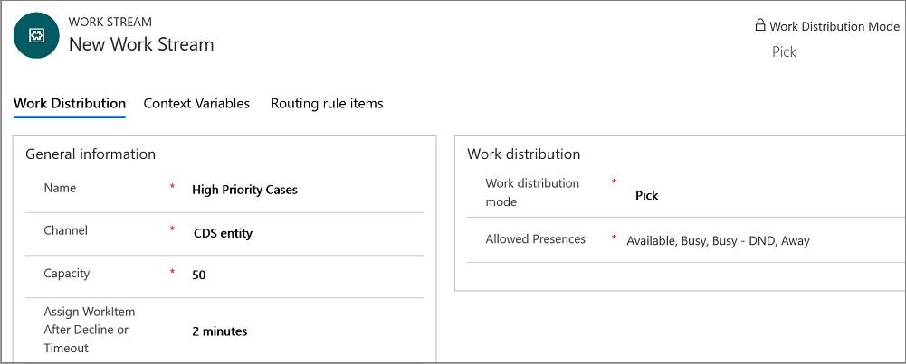

---	
title: "Set up entity work stream | MicrosoftDocs "	
description: "Learn how to set up entity work stream in the Omnichannel for Customer Service"	
keywords: Create entity channel; Omni-channel Engagement Hub	
author: kabala123	
ms.author: kabala	
manager: shujoshi	
applies_to: 	
ms.date: 08/16/2019
ms.service: dynamics-365-customerservice	
ms.topic: article	
ms.assetid: 62703F93-3484-4D3E-B682-A9601619567F	
ms.custom: 	
---	

# Cases entity work streams

[!INCLUDE[cc-use-with-omnichannel](../../includes/cc-use-with-omnichannel.md)]

[!include[cc-beta-prerelease-disclaimer](../../includes/cc-beta-prerelease-disclaimer.md)]

> [!IMPORTANT]
> - A preview is a feature that is not complete, as it may employ reduced privacy, security, and/or compliance commitments, but is made available before it is officially released for general availability so customers can get early access and provide feedback. Previews are provided “as-is,” “with all faults,” “as available,” and without warranty.​
> - This preview features does not come with technical support and Microsoft Dynamics 365 Technical Support won’t be able to help you with issues or questions.  If Microsoft does elect to provide any type of support, such support is provided "as is," "with all faults," and without warranty, and may be discontinued at any time.​
> - Previews are not meant for production use, especially to process Personal Data or other data that is subject to heightened compliance requirements, and any use of "live" or production data is at your sole risk.  All previews are subject to separate [Terms and Conditions](../../legal/dynamics-insider-agreement.md).

## Create case entity work stream

This topic describes how to create a work stream that is used to route case entity record.

1. Sign in to Omnichannel for Administrator app.

2. Select **Cases** entity record under **Channels** in the sitemap. A blank **Case Workstreams** view is displayed.

3. Select **+ New** in the **Case Workstreams** view.

    > [!div class=mx-imgBorder] 
    > 

4. Specify the following in the **New Work Stream** page.

    | Tab | Field | Value | Description | 
    |---------------------|-----------------------------|-------------------------------------------|-------------------------------------------------|
    | Work Distribution | Name | High Priority Cases | Provide a name to the work stream.   **Note:**   If you update the name of the work stream, you must update **Cases Work Distribution flow** by navigating to Microsoft Flow.  |
    | Work Distribution | Channel | CDS Entity | Select the CDS Entity channel from the list. Cases from this channel are automatically distributed to the agents. |
    | Work Distribution | Capacity | 50 |Specify the units of capacity that are required to process a conversation for the work stream in the text box. |
    | Work Distribution | Auto-close after inactivity | 5 minutes | Set time after which a conversation is moved from the **Waiting** state to the **Closed** state because of inactivity.  |
    | Work Distribution | Assign Work Item After Decline or Timeout | 2 minutes | Set the time after which the case is assigned to the agent again once the agent has declined the work item or the request has timed out.  |
    | Work Distribution | Work distribution mode | Push | Select **Push** when you to automatically route the cases to the agents. |
    | Work Distribution | Allowed presences | Allowed, Busy | Set the allowed presence status    Select the option and type a presence status in the search box. Select a status from the list. |

    > [!div class=mx-imgBorder] 
    > 

4. Select **Save** to save the work stream.

## See also

[Automate case routing](entity-channel.md)