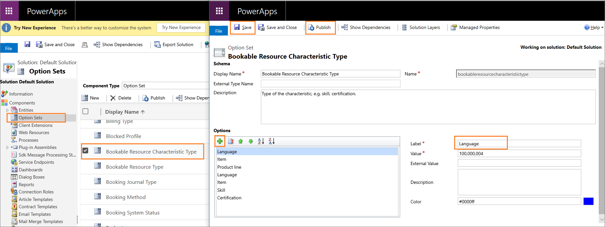

# Preview: Set up skills and assign agents

[!INCLUDE[cc-use-with-omnichannel](../../includes/cc-use-with-omnichannel.md)]

[!include[cc-beta-prerelease-disclaimer](../../includes/cc-beta-prerelease-disclaimer.md)]

> [!IMPORTANT]
> - A preview is a feature that is not complete, as it may employ reduced privacy, security, and/or compliance commitments, but is made available before it is officially released for general availability so customers can get early access and provide feedback. Previews are provided “as-is,” “with all faults,” “as available,” and without warranty.​
> - This preview features does not come with technical support and Microsoft Dynamics 365 Technical Support won’t be able to help you with issues or questions.  If Microsoft does elect to provide any type of support, such support is provided "as is," "with all faults," and without warranty, and may be discontinued at any time.​
> - Previews are not meant for production use, especially to process Personal Data or other data that is subject to heightened compliance requirements, and any use of "live" or production data is at your sole risk.  All previews are subject to separate [Terms and Conditions](../../legal/dynamics-insider-agreement.md).

## Set up skills

As an administrator, to create skills, you need at least one skill type in the system. For example, to add **Spanish** as a skill, you need a skill type called **Language**. You must first create a skill type and then create skills.

### Create skill type

1. Sign in to the Common Data Service platform as an administrator.

2. Select **Settings** > **Customizations** >  **Customize the System**.

3. Select **Option Sets** from the left pane.

4. Double-click the **Bookable Resource Characteristic Type** from the list. A new window opens.

5. Select the **Add** icon under the Options container.

6. Type a name for the Label field. For example, **Language**.

7. Select **Save** to save the skill type.

8. Select **Publish** to publish the customization changes.

    > [!div class=mx-imgBorder] 
    > 

### Create skills

After you create a skill-type, you can create skills.

1. Sign in to the Omnichannel Administration app.

2. Select **Skills** under **Users & Queues** in the sitemap.

3. Select **+ New**.

4. Specify the following in the **New Skill** page.

    | Field | Description  | Example value |
    |-----------|---------------------|------------------------------|
    | Name | Specify the name of the skill. | Spanish   **Note:**   The name must be unique. |    
    | Type | Select a skill type from the drop-down list. | Language |
    | Description | Provide a description of the skill. | This record is used to define the skill level of the Spanish language. |

5. Select **Save**. 

After you save, the **Agents** section appears. In this section, you add the agents and rating value. To learn more, see [Assign agents to the skill](#assign-agents-to-skill).

### Add agents as bookable resource

To assign agents to a skill, you need to add the agents as bookable resource. 

1. Sign in to the Omnichannel Administration app.

2. Select **Users** under **Queues & Users**.

3. Select a user from the list and select **Omnichannel** tab.

4. Select **+ New Bookable Resource** in the **Skills Configurations** section. The **New Bookable Resource** page appears.

5. Specify the name of the user in the **Name** field.

6. Select **Save**.

### Assign agents to skill

1. Sign in to the Omnichannel Administration app.

2. Select **Skills** under **Users & Queues** in the sitemap.

3. Select a skill from the list for which you want to assign the agents.

4. Select **+ New Bookable Resource Characteristic** in the **Users (Agents)** section. The **Quick Create: Bookable Resource Characteristic** pane appears.

5. Select an agent name for the **User (Agent)** field. Only the name of the agents who are added as Bookable Resources appears in drop-down.

6. Select a rating value from the list. The values that appear are based on the rating model and rating values that you created. To learn more, see [Rating value of skills](enable-skill-routing-create-rating-model.md#rating-value-of-skills).

7. Select **Save and Close** to save and add the user (agent) to the grid.

    > [!div class=mx-imgBorder] 
    > 

8. Repeat steps 4 through 7 to add more agents to the skill.

9. Select **Save** to save the skill.

Alternatively, you can also add a skill to the user (agent). To learn more, see [Manage users](users-user-profiles.md).

## See also

[Overview of skill-based routing](overview-skill-work-distribution.md)

[Enable skill-based routing and create rating model](enable-skill-routing-create-rating-model.md)

[Attach skills to conversation](attach-skills.md)

[Manage users](users-user-profiles.md)
