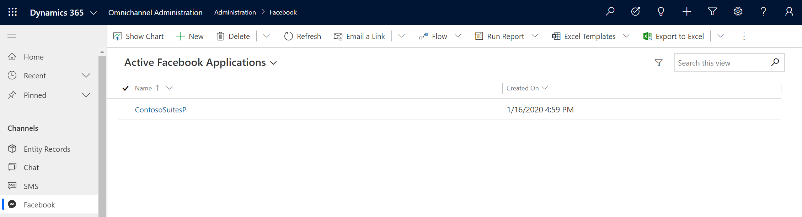
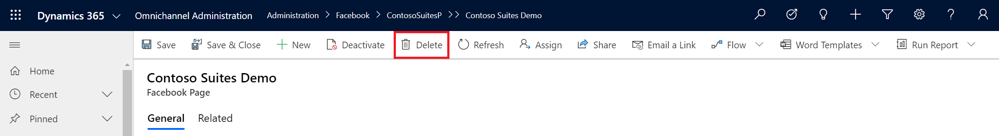

# Stop receiving messages on a channel

1. Log in to Omnichannel Administration.

2. Select the messaging channel in the left navigation pane.

3. Select the social media page or SMS number that should stop receiving messages.

    > [!div class=mx-imgBorder]
    > 

4. In the page toolbar, click **Delete** to remove the page. This is a permanent action and cannot be undone.

    > [!div class=mx-imgBorder]
    > 

If you want to re-add your social media page or SMS number to Omnichannel for Customer Service, follow the instructions for that channel as if you were adding it for the first time. 

### See also

[Channels in Omnichannel for Customer Service](channels.md)  
