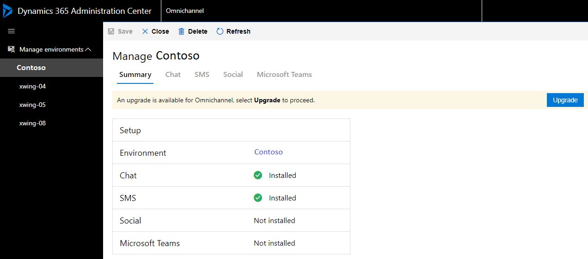
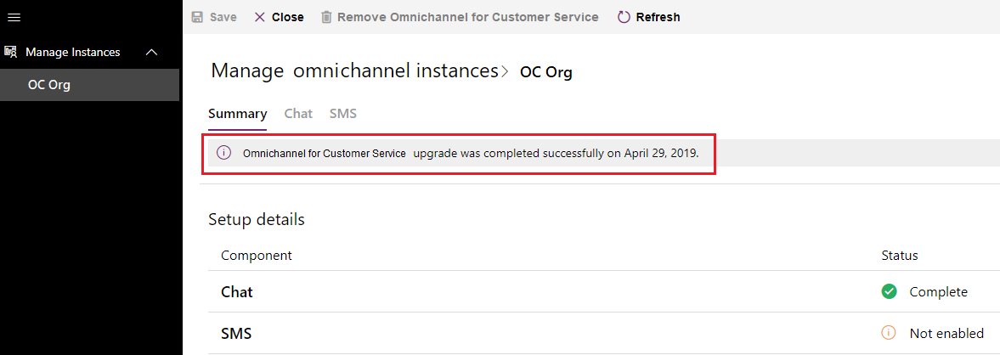

# Upgrade Omnichannel for Customer Service

[!INCLUDE[cc-use-with-omnichannel](../../includes/cc-use-with-omnichannel.md)]

Upgrade to the latest version of Omnichannel for Customer Service to unlock the benefits of new features. You can now upgrade to the latest release of Omnichannel for Customer Service from the **Omnichannel environments** page in **Dynamics 365 Admin Center**.

See [What's new in Omnichannel for Customer Service](https://go.microsoft.com/fwlink/?linkid=2083527) to learn about the new features in the latest release.

Do the following steps to upgrade Omnichannel for Customer Service:

1. Log in to the [Dynamics 365 Admin Center](https://admin.microsoft.com/adminportal/home#/homepage).
2. Select **Admin centers** > **Dynamics 365**. The **Manage your Dynamics 365 instances** page appears.
3. Select the **APPLICATIONS** tab, navigate to the **Omnichannel for Customer Service** application, and select **MANAGE**. The **Omnichannel environments** page appears.
4. Select your environment under **Manage environments** in the left pane.
5. Check for an upgrade notification for your environment. If an upgrade is available, select **Upgrade available**.

     > [!div class=mx-imgBorder] 
     > 

6. Select the **Upgrade** button.
         
     > [!div class=mx-imgBorder] 
     > 
     
    The system begins the upgrade and displays the message **Omnichannel upgrade is currently in progress**.
     
     > [!div class=mx-imgBorder] 
     > 

    When the upgrade process is completed successfully, your environment is upgraded to the latest version, and the message **Omnichannel for Customer Service upgrade was completed successfully** is displayed with the date.

    > [!div class=mx-imgBorder] 
    > 

## Upgrade Omnichannel for Customer Service package on Unified Service Desk

If you are using Omnichannel for Customer Service on Unified Service Desk, see [Deploy package on Dynamics 365 Customer Service instance](omnichannel-customer-service-package.md#deploy-package-on-dynamics-365-customer-service-app) to upgrade.

### See also

[Omnichannel for Customer Service system requirements](../system-requirements-omnichannel.md)  
[Provision Omnichannel for Customer Service](omnichannel-provision-license.md)  
