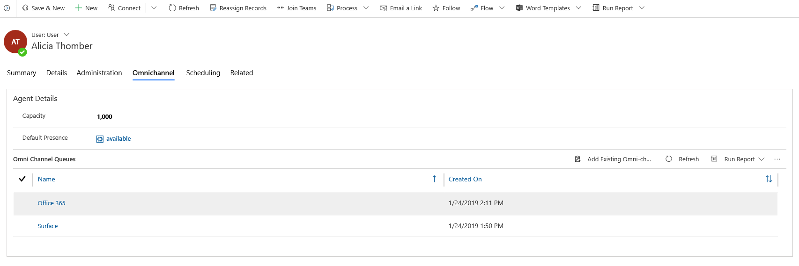

# Manage users in Omnichannel for Customer Service

[!INCLUDE[cc-use-with-omnichannel](../../includes/cc-use-with-omnichannel.md)]

All users who are assigned the **Omnichannel administrator**, **Omnichannel supervisor**, or **Omnichannel agent** security role are enabled to use Omnichannel for Customer Service.

For more information on how to create users and assign security roles, see [Assign roles and enable users for Omnichannel for Customer Service](add-users-assign-roles.md).

Navigate to **Queues & Users > Users** to view the list of Omnichannel for Customer Service users in the **Omnichannel Users** view.

> [!div class=mx-imgBorder]
> 

## Manage a user in Omnichannel for Customer Service

1. Sign in to the Omnichannel Administration app.

2. Select **Users** under **Queues & Users**.

3. Double-click a user from the list. For example, **Kenny Smith** is the user (agent).

4. Select the **Omnichannel** tab.

5. Specify the following in the user page.

    | Section | Field | Description | Example value |
    |---------------|---------------------|---------------------|-------------------------------------------------|
    | User Details | Capacity | Allocate capacity to agent. | 100 |
    | User Details | Default Presence | Assign a default presence status for agent. This is the status that the agent is logged in with, in the Omnichannel for Customer Service app. |

    Capacity is an arbitrary scale chosen by the administrator and set on the workstream for each channel. The capacity must be a multiplier of the capacity unit the administrator has defined on the workstream itself. Check the capity unit on the workstream to determine what value to assign to agents (users). The unit could be 1, 5, 10, 100, 1000 or anything. For example, if your capacity unit is 1 on the workstream and you want an agent to be able to take up to 3 converstions the capacity you assign to the agent would be 3. If your capacity unit is 5 on the workstream and you wanted an agent to be able to take up to 3 chats you would assign the agent a capacity of 15 on the agent.
    
6. Select **New Bookable Resource** under the **Skills Configuration** section. The **New Bookable Resource** page appears.

7. Specify the name of agent in the **Name** field.

8. Select **Save**.

> [!div class=mx-imgBorder]
> 

### See also

[Work with queues in Omnichannel for Customer Service](queues-omnichannel.md)  
[Configure and manage presence status](presence-custom-presence.md)  
