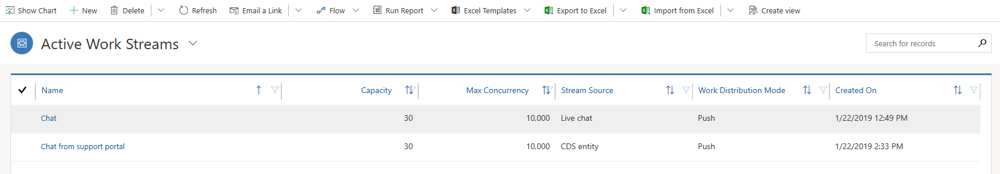
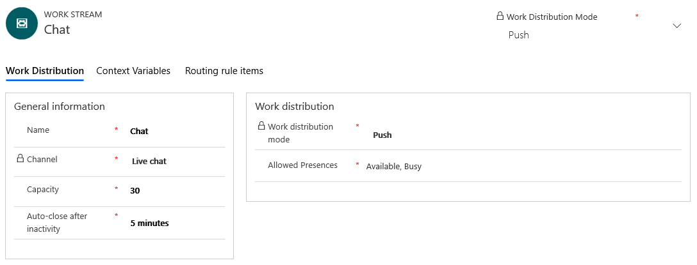
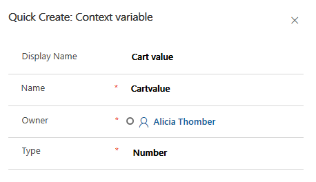

# Understand and create work streams 

[!INCLUDE[cc-use-with-omnichannel](../../includes/cc-use-with-omnichannel.md)]

A work stream is a collection of routing and work distribution settings. Routing settings define how conversations should be routed to queues. Work distribution settings define how conversations should be allocated to agents within a queue. 

In Omnichannel for Customer Service, you can create the following types of work streams:

- Live chat work stream
- SMS work stream

> [!NOTE]
> A work stream can belong to multiple channels of the same type, like multiple chat channels. In this case, all the conversations from these channels inherit the routing and work distribution settings of the work stream they belong to.

## Create a work stream

Follow these steps to create a new work stream in Omnichannel for Customer Service:

1. In the Omnichannel site map, go to **Work Distribution Management** > **Work Streams**.

    The **Active Work Streams** view is displayed. 

    > [!div class=mx-imgBorder] 
    > 

2. On the command bar, select **New** to create a work stream.

3. In the **Work Distribution** tab of the new work stream, follow these steps:

   1. In the **General information** section, specify the following information:  
      - **Name**: Enter a name for the work stream.
      - **Channel**: Channel is defined as a medium through which a customer reaches out for support. For example, a customer can contact an agent through chat. 

        Select a channel from the drop-down list:
        - Live Chat
        - SMS
        - Facebook
        - Entity Records
        - WeChat
        - Microsoft Teams
        - LINE
        - WhatsApp
        - Custom
        - Twitter

      - **Capacity**: Specify the units of capacity that are required to process a conversation for the work stream in the text box.

      - **Auto-close after inactivity**: Enter the unit of time after which a conversation is moved from the **Waiting** state to the **Closed** state because of inactivity. 

   2. Select **Save**. The work stream is saved.

   3. In the **Work distribution** section, perform the following steps:

      1. Select whether the **Work distribution mode** should be **Push** or **Pick** for agents to take up a conversation.

         In **Push** mode, a conversation is dispatched to agents automatically via a screen-pop. You can configure a push conversation to be explicitly picked up.

         In **Pick** mode, a conversation is dispatched to agents when they explicitly pick a conversation from the **Open work items** in the agent dashboard.

      2. Select **Allowed Presences** from the drop-down list. For more information, see [Configure and manage custom presence](presence-custom-presence.md).

          > [!div class=mx-imgBorder] 
          > 

      3. If you have selected **Push** in **Work distribution mode**, set the toggle to **Yes** for **Enable selecting from push-based work streams**. The agents can assign work items to themselves irrespective of constraints, such as capacity and presence.
4. View and create context variables in the **Context variables** tab. Context variables enrich conversations with pre-chat data, channel data, and custom context data. These attributes can then be used to define routing rules to route conversations into different queues.

   1. Select **New** to create a new context variable in the **Quick Create** window.
   2. Enter **Display Name** for the new variable. The **Name** field is populated accordingly.
   3. Select the **Type** of variable from the drop-down list. You can choose from **Text** or **Number**.

      > [!div class=mx-imgBorder] 
      > 

5. Define routing rule items in the **Routing rule items** tab. Routing rule items are configured for each work stream, so that conversations can be routed to the correct queues. To learn how to configure a routing rule, see [Create and manage routing rules in Omnichannel](routing-rules.md). 

6. Select **Save** to save the work stream.

## Associate work streams with channel artifacts

You can associate work streams with channel artifacts so that the conversations can be assigned to agents seamlessly. For example, for a live chat widget, a default work stream is already associated in the **Work stream** field. You can select the search icon to associate another work stream. Select **New** to create a new work stream from within the live chat widget.

To learn more about how to set up channels and associate work streams, see the following topics:

- [Configure a chat channel](set-up-chat-widget.md)
- [Configure an SMS channel](configure-sms-channel.md)

### See also

[Automatically identify customers using pre-chat responses](record-identification-rule.md)  
[Create workstream for entity record routing](set-up-entity-workstream.md)  
[Work with queues](queues-omnichannel.md)