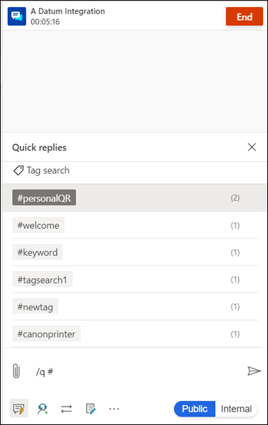

# Preview: Create personal quick replies

[!INCLUDE[cc-use-with-omnichannel](../../../includes/cc-use-with-omnichannel.md)]

[!include[cc-beta-prerelease-disclaimer](../../../includes/cc-beta-prerelease-disclaimer.md)]

## Overview

The personalization menu that is accessible through the application tab allows you to add personal quick replies. You can create quick replies to cater to the common questions and scenarios that you need to address in your role. You can tag the replies with keywords that help you invoke the quick replies when interacting with customers.

You can edit and delete the personal quick replies that you create.

## Create personal quick replies

1. Sign in to Omnichannel for Customer Service, and on the home page, select the plus (**+**) icon on the application tab.
   > 

2. Select **Personalization**. The **Personalization User settings** page appears.

3. On the **Personal quick replies** tab, select **New Personal quick reply**, and do the following:
    - **Message:** Enter the quick reply text.
    - **Locale:** Select the language in which you want to create the quick reply.

        > [!NOTE]
        > Omnichannel for Customer Service does not localize quick responses. To provide quick responses in multiple languages, create a separate quick response record for each language and select its corresponding locale.
   
   > 
4. In the **Tags** area, enter the keyword you want to associate with the quick reply, and select the plus (**+**) icon. If you want to use the number sign (**#**), do not use it anywhere else in the keyword except at the beginning.
5. Select **Save**.

## Use personal quick replies

Use the personal quick responses when you are in a conversation with a customer. You can invoke them by selecting the quick responses icon and by typing in the compose box the tags that are associated with the personal quick responses.

> 

### See also

[View communication panel](oc-conversation-control.md)  
[Manage applications](oc-manage-applications.md)  

