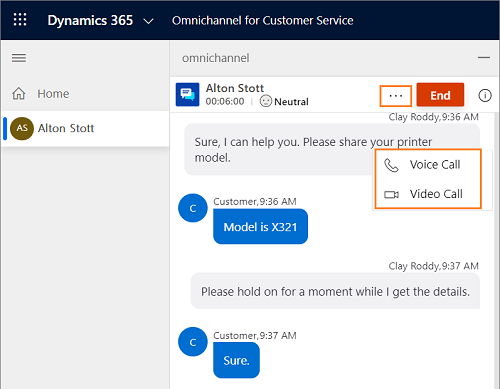
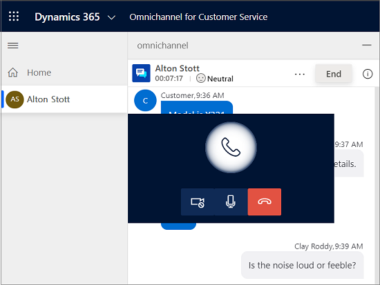

# Make voice and video calls in live chat

[!INCLUDE[cc-use-with-omnichannel](../../../includes/cc-use-with-omnichannel.md)]

## Overview

Make voice and video call in chat conversation feature helps you to initiate a voice or video call while communicating with the customer via chat channel. 

As an agent, when you communicate with a customer via chat, there is a huge exchange of information, which might increase the time you spend on resolving the customer issue. Or, the customer prefers to show and explain the issue with a physical product​. In these scenarios, you want to initiate a voice or video call while still the chat conversation is active, and resolve the issue quickly. The voice and video call option in the communication panel helps you to make a voice and video call during the chat conversation.

## Advantages of voice and video call in live chat

- Resolve the customer issue quickly
- Reduces average handle time and improves productivity
- Enhanced customer satisfaction
- Positive relationship with the customers

## Initiate voice and video call

When you are chatting with the customer, you can initiate the voice or video call. In the communication panel, beside the **End** button, an ellipsis (...) is present.Select the ellipsis and the **Voice Call** and **Video Call** options are displayed to you. Based on your administrator configuration, you might see **Voice Call** and **Video Call** or just **Voice call** option.

> [!div class=mx-imgBorder]
> 

When you initiate a voice call, you can view the call fly-out with buttons.

|Button | Name | Description |
|----------------------|-------------------------|-----------------------------|
|| Turn on video / Turn off video |  Use the button to turn on or off the video while in a call with the customer.|
|| Mute / Unmute | Use the button to mute or unmute the call while communicating with the customer. |
|| End call | Use this button to end the call. |

> [!div class=mx-imgBorder]
> 

## Capacity of the agent

When you initiate a voice or video call, your capacity is consumed, and you can't get any conversation request until you hang up.
