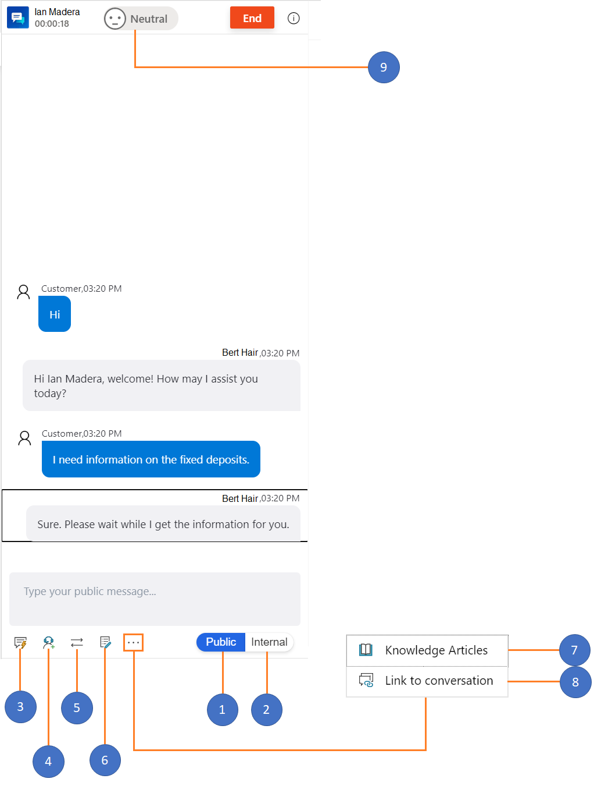
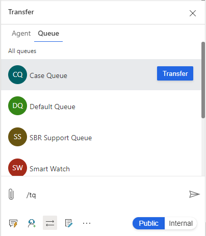
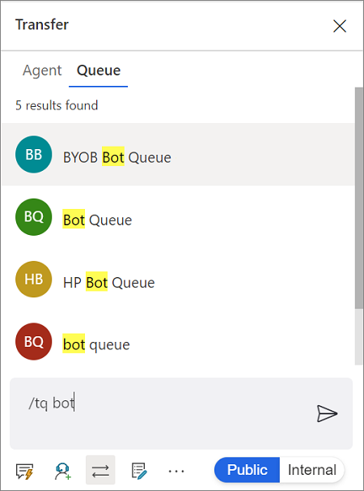
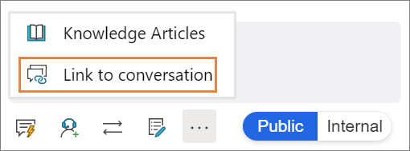
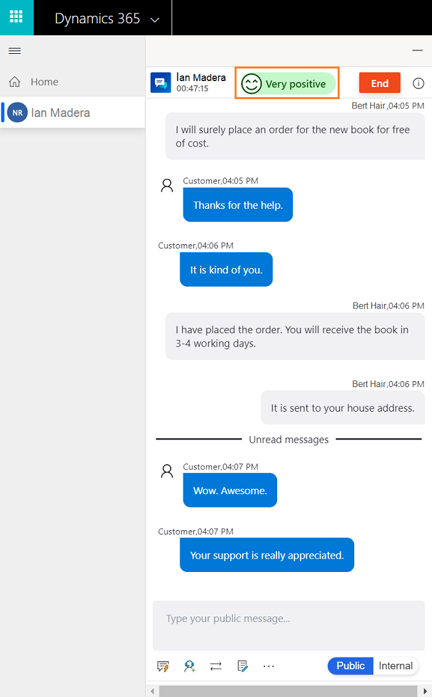

# View communication panel

[!INCLUDE[cc-use-with-omnichannel](../../../includes/cc-use-with-omnichannel.md)]

The communication panel is where you, as an agent, interact with your customer. When you sign in to the application, by default, the communication panel is in hidden mode. You cannot view the communication panel unless you accept a incoming conversation to communicate with the customer.

From a conversation channel:

- You can send quick replies.
- You can search for and share knowledge articles with the customer with whom you are interacting.
- You can transfer the conversation (work item) to another agent or queue.
- You can use the consult option if you need help to resolve the work item.
- You can switch between internal and public mode to send messages to the internal participants (other agents and/or supervisors).

 > [!div class=mx-imgBorder]
 >   
## Enhance agent productivity using keyboard commands

The communication panel has options that, as an agent, you can use to perform actions such as see quick replies, consult, and transfer, launch notes control, and much more.

In addition, as an agent, you can use the keyboard commands in the communication panel to perform the actions that are such as see quick replies, consult, and transfer list, launch notes control, and much more.

The keyboard commands helps allows you completing the scenario effectively and efficiently thus increasing your productivity.

In the communication panel, you can see the following options:
 
| Annotation | Option     | Description                                   | command |
|------|------------------|-----------------------------------------------|----------|
|  1   | Public           | Send messages to public | `/p` |
|  2   | Internal         | Send messages to internal users | `/i` |
|  3   | Quick replies    | Send templatized messages  | `/q` |
|  4   | Consult          | View list to consult with other users | `/c` |
|  5   | Transfer         | View list to transfer the request | `/t` and `/tq` |
|  6   | Notes            | Take notes specific to conversation | |
|  7   | Knowledge articles | Search for knowledge articles and share | `/kb` |
|  8   | Link to conversation | Link the record to this conversation | |
|  9   | Customer sentiment | View real-time customer satisfaction levels |  |

## Send messages using Public and Internal mode

The communication panel allows you to send messages in two modes: **Internal** and **Public**.

When you want to send messages only to the internal participants like other agents and/or supervisors, then use the **Internal** option. The internal messages are not shown to the customers.

When you want to send messages to all the participants in the conversation including the customer, then use the **Public** option.

 > [!div class=mx-imgBorder]
 > 

You can use keyboard commands to send internal and public messages:

- **/i** – Type the forward slash (/) key and the letter **i** to send an internal message to other agents and/or a supervisor. 

- **/p** – Type the forward slash (/) key and the letter **p** to send a public message to all the participants in the interaction.

When you type the keyboard command, the mode changes to as per the command. For example, now, you are on Public mode. Type **/i** to change to **Internal** mode.

## Send templatized messages in the chat

The communication panel allows you to send predefined templatized messages to the customer with whom you're interacting. These predefined templatized messages are stored as quick replies. Select the **Quick replies** button to retrieve the messages and send them to the customers and/or internal participants.

 > [!div class=mx-imgBorder] 
 >   

You can use a keyboard command to see the list of quick replies. Type the forward slash (/) key and the letter q (**/q**). When you type **/q** the **Quick replies** fly-out is displayed.

### Search for messages

After you type **/q** in the communication panel messaging area, you can continue typing any keywords and if the **Quick replies** library has at least one message associated with the word, it is filtered and displayed to you.

 > [!div class=mx-imgBorder] 
 >   

## Consult with agent or supervisor

The communication panel allows you to consult with other agents and/or supervisors using the consult option. You can invite the agent or supervisor by selecting the **Consult** button in the communication panel.

 > [!div class=mx-imgBorder]
 > 

You can use a keyboard command to see the list of agents and/or the supervisor who are available for consultation. Type the forward slash (/) key and the letter c (**/c**).

> [!Note]
> We recommend inviting a maximum of five consulting agents when conversing with the customer.

### Search for consulting participants

After you type **/c** in the communication panel messaging area, you can continue typing the name of the participant and if it is present, the names are filtered and displayed to you.

## Transfer the conversation

The communication panel allows you to transfer a conversation request. You can transfer the conversation (work item) either to an agent or a queue.

 > [!div class=mx-imgBorder]
 > 

You can transfer a request only to agents who are configured in the same work stream and queue. If the request belongs to another queue and you transfer the request, routing rules assign the conversation (work item) to the appropriate agent in the queue.

Use the keyboard command to see the list of agents and/or the supervisor who is available for transfer. Type the forward slash (/) key and the letter t (**/t**).

Use the keyboard command to see the list of queues to transfer the conversation request. Press the forward slash (/) key and the letters T and Q (**/tq**).

**/t** (forward slash, letter t) launches the **Agent** and **Queue** tabs. Select either tab and then select the agent or the queue from the list to transfer the conversation. The **/t** command keeps the focus on the Agent tab whereas the **/tq** command keeps the focus on the Queue tab.

When skill-based routing is enabled, then during transfer, the **Transfer** flyout shows users sorted in order of matching skills.

 

### Search agents or queues for the transfer of a conversation request

After you type **/t** or **/tq** in the communication panel messaging area, you can continue typing the name of the participant and if it is present, the agent or queues names are filtered and displayed to you.

## Take notes specific to conversation

Use the notes option to capture information specific to the conversation when you interact with customers. Use the option in the communication panel to launch the notes.

 > [!div class=mx-imgBorder]
 > 

To learn more, see [Take notes specific to conversation](oc-take-notes.md).

## Search for and share knowledge articles

From the communication panel, you can search for relevant knowledge articles based on the context of the session and share it with the customers through the communication panel. Use the command to launch knowledge articles search.

 > [!div class=mx-imgBorder]
 >   

**/kb** (forward slash, letter K, and letter B) is the keyboard command to launch the knowledge articles search control. You can search and share the article with the customer through the communication panel. Use the **Send link** button to share the knowledge article link with the customer.

To learn more, see [Search for and share knowledge articles](oc-search-knowledge-articles.md).

## Link to conversation

When you have a conversation with a customer, you can link the conversation to the record (case or account/contact).

> [!div class=mx-imgBorder]
> 

To learn more, see [Search, link, and unlink a record to the conversation](oc-search-link-unlink-record.md).

## Monitor real-time customer satisfaction

As an agent, you can view the real-time customer satisfaction levels on the communication panel. A sentiment icon is displayed at the top of the communication panel based on the previous six customer messages sent to you.

> [!div class=mx-imgBorder]
> 

To learn more, see [Monitor real-time customer sentiment](oc-monitor-real-time-customer-sentiment-sessions.md)

## See also

- [Monitor real-time customer sentiment](oc-monitor-real-time-customer-sentiment-sessions.md)
- [Introduction to the agent interface](oc-introduction-agent-interface.md)
- [Manage sessions](oc-manage-sessions.md)
- [Manage applications](oc-manage-applications.md)
- [Manage presence status](oc-manage-presence-status.md)
- [View customer summary and know everything about customers](oc-customer-summary.md)
- [Search for and share knowledge articles](oc-search-knowledge-articles.md)
- [Take notes specific to conversation](oc-take-notes.md)
- [View customer summary for an incoming conversation request](oc-view-customer-summary-incoming-conversation-request.md)
