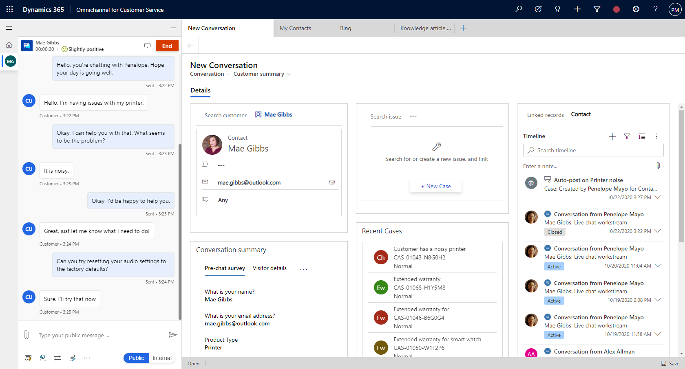

# View customer summary

[!INCLUDE[cc-use-with-omnichannel](../../../includes/cc-use-with-omnichannel.md)]

One of the major challenges that customers face when contacting customer support is providing repetitive information about the issue with the support agent. Also, if the customer wants to review the status of the request later, the customer shares the same information with another support agent to explain the context of the engagement. To avoid this, the support agent needs access to customer information with details about the product/service, issue, case history, related cases, location, and so on.

Having this information ready when a customer contacts the support agent can reduce the hold time that the agent spends to retrieve the customer information, reduce the average handling time (AHT), and increase customer satisfaction with faster resolution of the issue.

## What is Customer summary?

Customer summary is a page that gives you complete information about a customer. The page appears when you accept an incoming request from any channel. The default Customer summary view provides the following sections:

 - Customer (Contact or Account)

 - Conversation summary

 - Case

 - Recent cases

 - Timeline

> [!div class='mx-imgBorder']
> 

## Customer (Contact or Account)

This section provides details like the contact name or account name. For a contact, you can view the location, email, and any other details of the contact. For an account, you can view location, telephone number, and primary contact person for the account.

Use the customer form to search for an existing contact or account record in omnichannel and select the record to link it to the conversation. If the record doesn't exist, you can create a new contact or account record using the **+ Add Contact** or **+ Add Account** button respectively.  After you create, search the record and then select it to link to the conversation.

> [!div class='mx-imgBorder']
> 

## Conversation summary

The conversation summary section displays tabs with the details that help you understand the information about the conversation with customer. It displays the following tabs:

- Pre-chat survey
- Self service
- Visitor details
- Additional details (Only if configured and additional context variables available)

The Conversation details section shows the following details:

- Engagement channel
- Waiting time
- Skills
- Queue
- Start time

  > [!div class='mx-imgBorder']
  > 

### Pre-chat survey

The **Pre-chat survey** tab displays the survey answers against the questions that are requested by your organization, which helps your interaction with the customer.

### Self service

The **Self service** tab displays information on the activites that the customer had performed prior to initiating a conversation through chat. The information enables the agents to understand the customer intent and provide a personalized service for improved customer satisfaction. The activity information is categorized into the following action types and appears in reverse chronological order:

| Action type | Description |
|-------------|-----------------------------------|
| Page visited | The page visited on the portal with the timestamp.|
| Phrase searched | The keyword or phrase searched for, with the timestamp. |
| Knowledge article viewed | The knowledge article viewed with the timestamp. |
| Custom action performed | Any other custom action that is tracked by your organization as per your business requirements are displayed with the timestamp. |

   > [!div class='mx-imgBorder']
   > 

To configure the appearance of the **Self service** tab, see [Enable portal navigation](../../administrator/portal-navigation.md).

### Visitor details

The **Visitor details** tab provides some information such as whether the customer is authenticated or not, browser used by the customer for contacting support, operating system used by the customer, location of the customer, interacting language of the customer, and so on.

> [!div class='mx-imgBorder']
> 

If the customer signs in to the portal to initiate a chat with the support, then as an agent, you can see the **Authenticated** field value as **Yes** in the **Visitor details** tab of the **Conversation summary** section. Otherwise, the **Authenticated** field value is shown as **No**.

 

To learn more, see [Create chat authentication settings](../../administrator/create-chat-auth-settings.md).

### Additional details

If your administrator or developer configures the **Additional details** tab and if there are any additional context variables, it is displayed in the **Additional details** tab. 

To learn more, see [setContextProvider](../../developer/reference/methods/setContextProvider.md).

## Case

Use the case form to search for an existing case in omnichannel and select the case to link it to the conversation. If the record doesn't exist, you can create a new case using the **+ Add Case** button.  After you create, search the record and then select it to link to the conversation.

> [!div class='mx-imgBorder']
> 

## Recent cases

This section displays recent cases related to the customer.

> [!div class='mx-imgBorder']
> 

## Timeline

This section displays case- and customer-related activities in the form of a timeline. You can create quick notes based on the discussion with the customer. Use the **Linked records** field to switch the timeline based on the Case, Contact, or Account record linked to the conversation.

> [!div class='mx-imgBorder']
> 

The **Linked records** field drop-down shows the record that is linked to conversation. For example, if you link a contact and case to the conversation, the **Linked records** field drop-down shows **Contact** and **Case** respectively.

> [!div class='mx-imgBorder']
> 

> [!div class="nextstepaction"]
> [Next topic: Search for and share knowledge articles](oc-search-knowledge-articles.md)

## See also

- [View communication panel](oc-conversation-control.md)
- [Monitor real-time customer sentiment](oc-monitor-real-time-customer-sentiment-sessions.md)
- [View customer summary for an incoming conversation request](oc-view-customer-summary-incoming-conversation-request.md)
- [setContextProvider](../../developer/reference/methods/setContextProvider.md)
