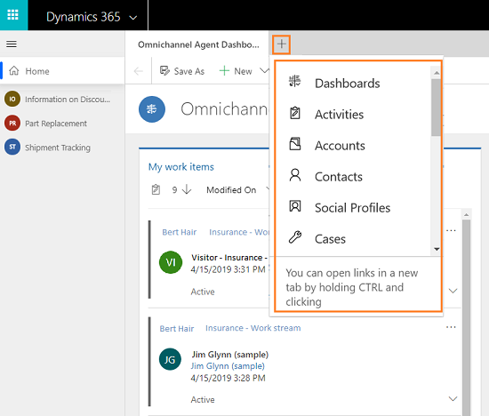
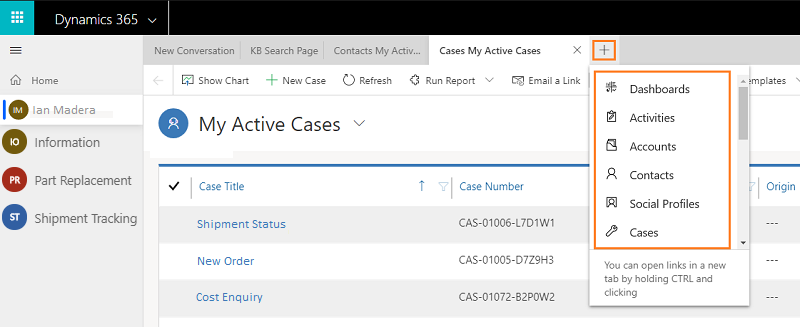

# Manage applications in Omnichannel for Customer Service

[!INCLUDE[cc-use-with-omnichannel](../../../includes/cc-use-with-omnichannel.md)]

The horizontal bar below the navigation bar is called the application tab panel. Every customer session has at least one application that is not closable; it is called a **Anchor** tab. In the image shown, **Omnichannel Agent Dashboard** is the anchor tab.

The Application tab has a **+** icon. If you select the icon, a menu  appears that lists the out-of-box and custom entities. Also, you can access any third-party Line-of-Business applications that is extended within Omnichannel for Customer Service app. Select the option from the list to open it in the application tab.

> [!div class=mx-imgBorder]
> 

## Open an application

You can open an application in the application tab panel in the following ways:

- Use the application tab menu
- Use **Ctrl + mouse-click** gesture.

### Use the application tab menu

On the application tab panel, select **+** icon to view the menu that has a list of out-of-the-box and custom entities. Selecting an option from the menu opens the application in the application tab panel. The application opens in the current active session.

> [!div class=mx-imgBorder]
> 

### Use gesture (Ctrl + mouse-click) to open an application

Use a combination of keyboard and mouse-click gesture to start an application. You can press **Ctrl** and select on a link to open in a new application tab. The application opens in the current active session.

## Work with applications

Every session has an application tab which is called **Anchor** tab. A session can have a maximum of one **Anchor** tab and there will be no close option on the application tab. When you are working on a Omnichannel conversation request, then customer summary page is the default anchor tab.

When you switch sessions or between applications in the current session, unsaved changes are not lost and you can continue to work on them.

For example, you are working on a case by entering the title of the case. Before saving the form, you open an account record in a new application tab. Now, the application focus changes to the account record. However, the unsaved changes is preserved for you to continue working on the form.

You can close an application tab manually by selecting the close icon on the application tab. After closing the application tab, the focus moves to the next available application tab in the left-side.

You can switch between applications by selecting the application tab title.

### Title of the application tab

The title of the application tab will be the name of the entity. For example, dashboard names, Case, Contact, Account names and so on. Third-party applications, the name appears as configured by your administrator.

> [!div class=mx-imgBorder]
> 

> [!div class="nextstepaction"]
> [Next topic: View agent dashboard and conversations (work items)](oc-agent-dashboard.md)

## See also

- [Manage sessions](oc-manage-sessions.md)
- [Understand conversation states](oc-conversation-state.md)
- [View communication panel](oc-conversation-control.md)
