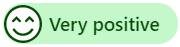

# Monitor real-time customer sentiment

[!INCLUDE[cc-use-with-omnichannel](../../../includes/cc-use-with-omnichannel.md)]

As an agent, when you interact with your customers, you want to know their sentiment intensities in real time. Analysis of the customer's satisfaction helps you understand the problem level and take a course of action to solve the problem. In Omnichannel for Customer Service, you can see the customer's satisfaction levels instantly while you communicate with the customer.

## View real-time customer sentiment

The real-time sentiment is displayed at the top of the communication panel. The sentiment icon changes dynamically based on the most recent six customer messages sent to you.

When you get an incoming conversation request, you accept the request and communicate with the customer. By default, you see the neutral sentiment icon, which indicates at this moment the customer satisfaction is neutral. As you continue to communicate with the customer, the sentiment icon changes dynamically according to the conversation.

When a conversation is escalated from a bot, the sentiment icon you see is based on the previous messages exchanged between the customer and the bot.

> [!div class=mx-imgBorder]
> 

## Understand real-time customer sentiment

The sentiment analysis is an automatic and unbiased measurement of satisfaction levels of the customer in real time.

The sentiment icons displayed on the communication panel are as follows:

| Sentiment | Icon |
|--------------------------|---------------------------------------------------|
| Very positive |  |
| Positive |  |
| Slightly positive |  |
| Neutral |  |
| Slightly negative |  |
| Negative |  |
| Very negative |  |

> [!Note]
> The real-time sentiment is shown to you only if the supervisor or administrator has enabled sentiment analysis for a queue where you are added as a member.

> [!div class="nextstepaction"]
> [Next topic: Manage presence status](oc-manage-presence-status.md)

##  Preview: Multi-language sentiment 

Multi-language sentiment displays sentiment scores on some non-English conversations.

> [!Note]
> Multi-language sentiment is only available if the administrator enables it for you.

To learn more, see [multi-language sentiment](../../administrator/enable-sentiment-analysis.md).

## See also

- [Introduction to the agent interface](oc-introduction-agent-interface.md)
- [Enable sentiment analysis](../../administrator/enable-sentiment-analysis.md)
- [Manage sessions](oc-manage-sessions.md)
- [Manage applications](oc-manage-applications.md)
- [View customer summary](oc-customer-summary.md)
- [Search for and share knowledge articles](oc-search-knowledge-articles.md)
- [Take notes specific to conversation](oc-take-notes.md)
- [View customer summary for an incoming conversation request](oc-view-customer-summary-incoming-conversation-request.md)
