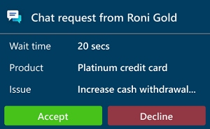
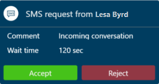
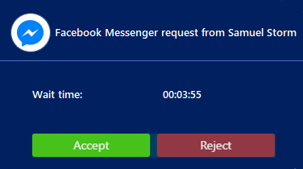

# View notifications

[!INCLUDE[cc-use-with-omnichannel](../../../includes/cc-use-with-omnichannel.md)]

A notification is a visual alert you see as a dialog box each time you get a chat, or SMS conversation request from a customer. When you get a notification, you see the details of the customer with whom you are going to interact. When you accept the request, a session is started, and you can view the contextual information of the customer and case in the customer summary page.

Some of the scenarios where you can receive notifications:

- Incoming chat conversation

- Incoming SMS conversation

- Conversation (work item) assignment

- Conversation transfer

- Conversation escalation

- Conversation escalation from Bot

### Receive notification when app is in background

You'll receive desktop notifications when the Omnichannel for Customer Service app is not in focus. The desktop notification helps you not to miss any conversation notification requests. Some of the scenarios, where the app is not focus are: 

- When you've minimized the app.
- When you are working on another browser window.
- When you are working on a another browser tab.

 > [!div class=mx-imgBorder]
 > 

You can accept or reject by selecting a button on the desktop notification. When you accept the conversation by selecting a button on the desktop notification, the Omnichannel for Customer Service app is made active, displayed to you, and a session is started.

If you select the notification message/body and not the button, then the Omnichannel for Customer Service app is made active, and the notification is displayed to you in the app. Now, you can choose to accept or reject the conversation using appropriate buttons.

The wait time that is configured by your administrator applies to the desktop notification, but doesn't display the wait time on the desktop notification. The desktop notification theme is based on Windows operating system theme and settings.

#### Allow browser to show notification

To get the desktop notification, you need to allow the browser (Microsoft Edge and Google Chrome) to shown notification. When agent get the browser notification, they need to select the **Allow** button.

 > [!div class=mx-imgBorder]
 > 

## Types of notifications

There are two types of notifications:

- **Toast notifications:** A toast notification or floating notification is a notification message type where you receive information in a dialog, which disappears after a stipulated time. This type notifications appear for conversation (work item) assignments, conversation escalations, and conversation transfer scenarios and so on. 

- **Alert notifications:** An alert notification is a type of notification where a dialog appears with actionable buttons. When you select the **Accept** button, a screen pops up with Customer summary details. You need to take an action within the stipulated time and the notification disappears when the time is up.

## Incoming chat notification

You receive a notification for an incoming chat request. When you accept the chat request, you’ll see a details about the customer in the Customer summary page. A simultaneous session starts, and a chat window expands so you can exchange messages with the customer.

 > [!div class=mx-imgBorder]
 >   

The details you’ll see for a chat channel are as configured by your administrator.

## Incoming SMS notification

You receive a notification for a SMS conversation request. When you accept the SMS request, a session is started, and the communication panel appears where you can exchange messages with the customer.

Identification of a customer happens based on the **Mobile Phone** field present in the Contact record in Dynamics 365 Customer Service. That is, if the incoming SMS conversation is from a phone whose number is present in the mobile phone field of a Contact record, the conversation automatically links to the contact record.

 > [!div class=mx-imgBorder]
 >  

The details you’ll see for a SMS channel are as configured by your administrator

## Incoming Facebook notification

You receive a notification for a Facebook conversation request. When you accept the Facebook request, a session is started, and the communication panel appears where you can exchange messages with the customer.

> [!div class=mx-imgBorder]
> 

> [!div class="nextstepaction"]
> [Next topic: View customer summary and know everything about customers](oc-customer-summary.md)

## See also

- [View communication panel](oc-conversation-control.md)
- [Monitor real-time customer sentiment](oc-monitor-real-time-customer-sentiment-sessions.md)
- [Manage presence status](oc-manage-presence-status.md)
- [Search for and share knowledge articles](oc-search-knowledge-articles.md)
- [Take notes specific to conversation](oc-take-notes.md)
- [View customer summary for an incoming conversation request](oc-view-customer-summary-incoming-conversation-request.md)
