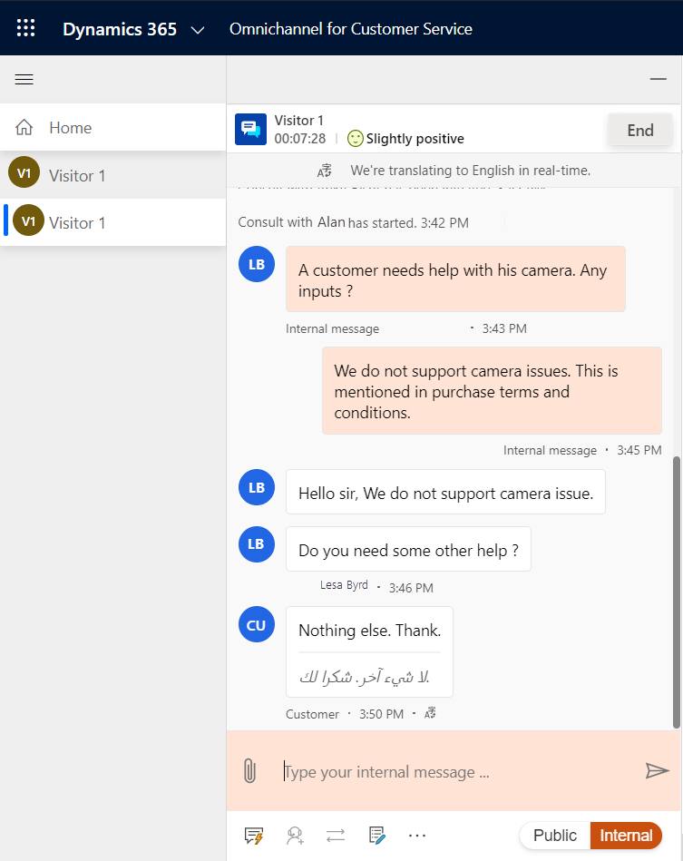
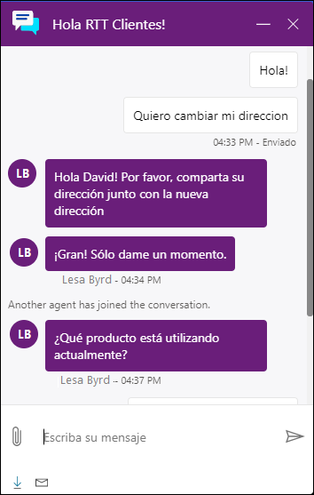

# Preview: Real-time translation of conversations for agents and customers

[!INCLUDE[cc-use-with-omnichannel](../../../includes/cc-use-with-omnichannel.md)]

[!include[cc-beta-prerelease-disclaimer](../../../includes/cc-beta-prerelease-disclaimer.md)]

## Introduction

When language translation is enabled for conversations that are exchanged between the agent and customer or among agents internally, agents can view the conversation in a language that is set as the default for them. The customer receives the agent's messages in the language they used for initiating the chat. This feature removes the dependency of conversations being routed to only those agents who know the language used by the customer.

## How language translation of conversations works

When a customer initiates a chat conversation on the portal, irrespective of the language used by the customer, the assigned agent receives the chat text in the language that is set as the default for them. The language translation happens in real time. For example, if a customer initiates chat in Spanish, the message text appears to the agent in Spanish along with the translated version, such as English, that has been set as the default for the agent. The agent has the option to view and respond to the chat in the customer or default language.

If the agent has to consult a peer or supervisor, it can be done in a language preferred between the agent and peer or supervisor, which can be different from the language used between the agent and customer. The chat transcripts are saved in the languages used in the conversation.

The agent can see the following details pertaining to the feature:

- Information on the language in which agent receives the chat content is displayed on the top of the chat window.

- The chat content is displayed in the customer and translated languages.

A sample screenshot of the agent experience is as follows.

  > [!div class=mx-imgBorder]
  > 

A sample screenshot of the customer experience is as follows.

  > [!div class=mx-imgBorder]
  > 

### See also

[View customer summary](oc-customer-summary.md)  
[View communication panel](oc-conversation-control.md)  
