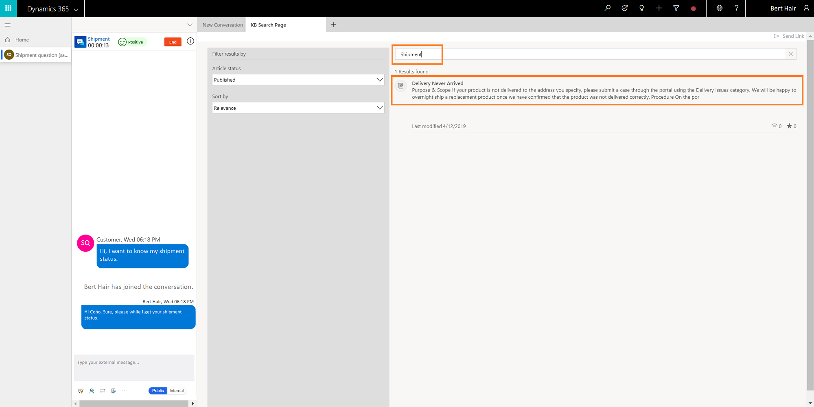
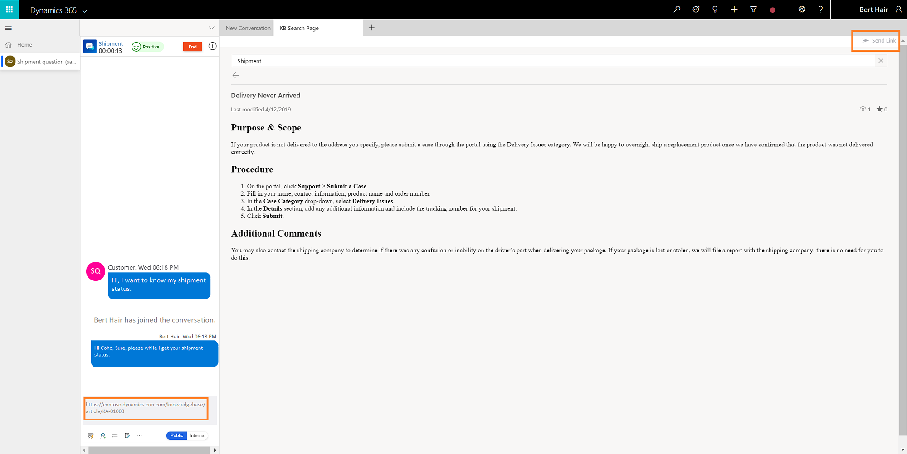

# Search for and share knowledge articles

[!INCLUDE[cc-use-with-omnichannel](../../../includes/cc-use-with-omnichannel.md)]

## Search knowledge articles

Knowledge management plays an important part in the customer service process, and access to accurate and up-to-date information can help you reduce the average handling time to provide quick and accurate answers to your customers.

Omnichannel for Customer Service enables you to use the rich knowledge base (KB) so you can quickly search for relevant information while working on a case and provide accurate answers to customers without having to switch applications.

## Launch KB Search Page

You can launch KB Search in two ways:

- From the application tab menu.
- From the communication panel.

### Launch the KB Search from the application tab menu

When working on a session, you can use the **+** button on the application table panel to launch **KB Search**. You can search for a KB article using the **KB Search** tab, and then view the article and use the **Send Link** option to share the link with the customer.

1. Select the + button in the application tab panel.
2. From the menu, select **KB Search**. The KB Search opens as a new tab in the application tab panel.
3. Search for the KB articles and view.
4. Select **Send Link** to share the KB article with the customer.

### Launch the KB Search from the communication panel

When you interact with a customer in the conversation control, you can use the **Knowledge articles** option to launch the **KB Search** tab. Then you can search and share the KB articles.

1. Select the KB Search option in the communication panel. The KB Search tab opens in the application tab panel.
2. Search for the KB articles and view.
3. Select **Send Link**. The link is displayed in the message area of the communication panel.
4. Select **Send** in the communication panel.

## See also

- [Take notes specific to conversation](oc-take-notes.md)
- [View communication panel](oc-conversation-control.md)
- [Monitor real-time customer sentiment](oc-monitor-real-time-customer-sentiment-sessions.md)
- [View conversation and session activity types in the model-driven apps](oc-view-activity-types.md)
- [View customer summary](oc-customer-summary.md)
