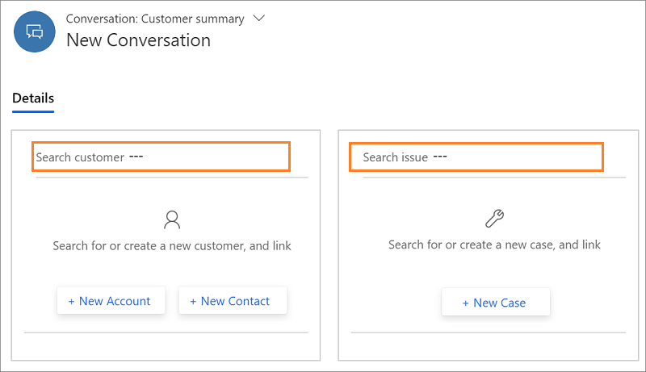
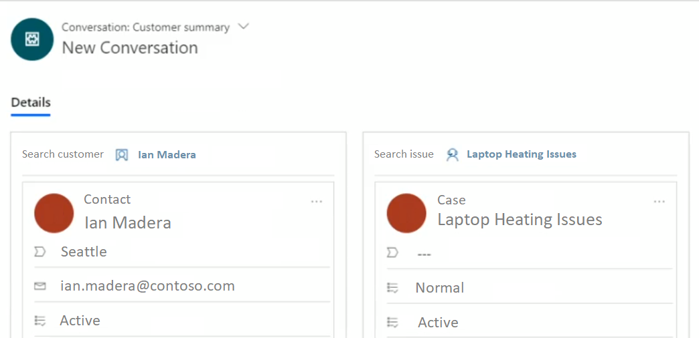
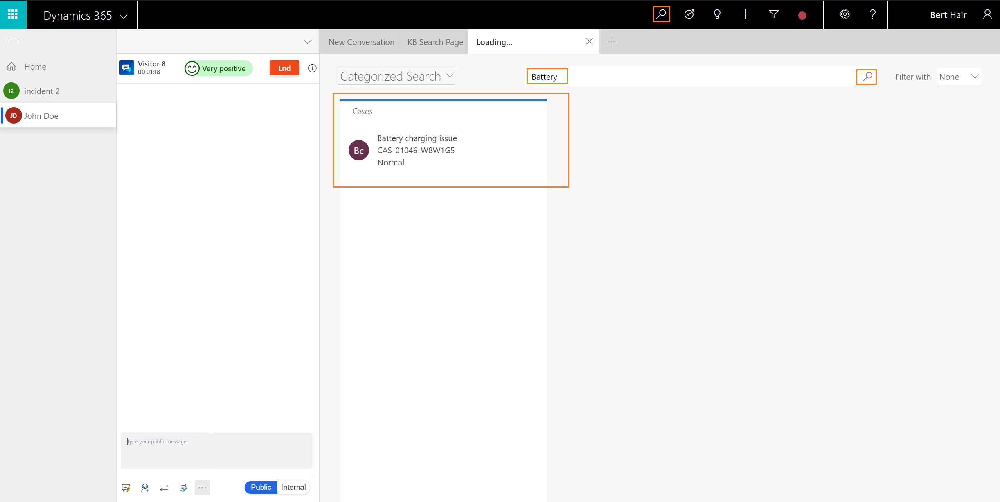
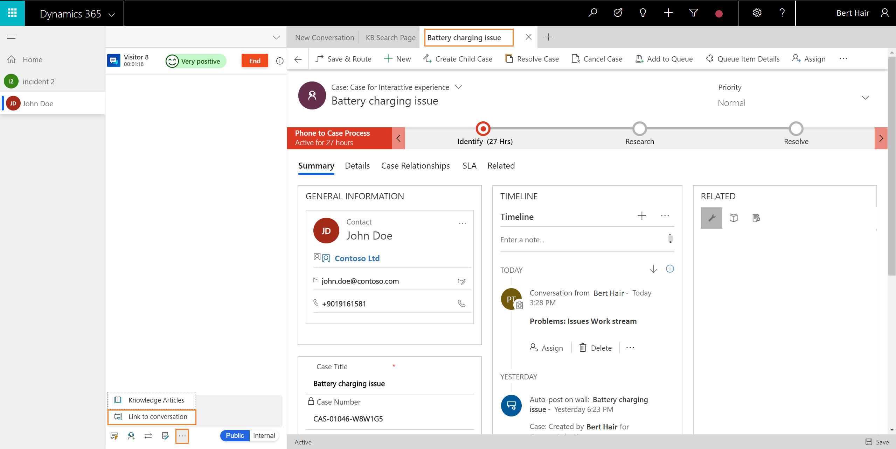

# Search, link, and unlink a record in Omnichannel for Customer Service

[!INCLUDE[cc-use-with-omnichannel](../../../includes/cc-use-with-omnichannel.md)]

The topic explains how to Search for records, link a record to the conversation, and unlink a record from the conversation.

You can search for the records in two ways:

- Inline search
- Relevance search

## Search for records using inline search option

You accept an incoming conversation request, and there is no customer record identified in Omnichannel for Customer Service. In this case, use the inline search option in the customer (contact or account) section and case section to search for a contact or account and case respectively.

The inline search is based on the Lookup View and Quick Find View. You can search the fields (attributes) that is based on the Lookup View and Quick View Field.

For the customer (contact or account) section, you can search for Contact or Account entity. By default, you can search using the following fields.

|Entity|Fields|
|----------|----------|
|Account| <ul> <li>Account Name</li> <li>Account Number</li> <li>Email</li> <li>Main Phone</li> </ul>  |
|Contact| <ul> <li>Company Name </li> <li>Email</li> <li>First Name</li> <li>Last Name</li> <li>Middle Name</li> <li>Full Name</li> <li>Mobile Phone</li> </ul>|

For the **Case**, you can search for Case (Incident) entity. By default, you can search using the following fields.

|Entity|Fields|
|--- |--- |
|Case| <ul> <li>Case Number</li> <li>Case Title</li> </ul>|

Only active views are displayed for the search results. Also, you can customize the **Quick Find View** and **Lookup View** to change the searchable fields as per your business requirements. More information [Understand views](/dynamics365/customer-engagement/customize/create-edit-views) and [Unified Interface Lookup view leverages Quick Find View](https://blogs.msdn.microsoft.com/crm/2018/11/02/unified-interface-lookup-now-leverages-quick-find-view/)

## Link a record to the conversation when doing inline search

> [!div class=mx-imgBorder]
> 

During inline search, the search results are displayed and you can select a record to link the conversation to the selected record. After you link the record, the **Customer summary** page loads with the details.

> [!div class=mx-imgBorder]
> 

> [!Note]
> You can link only one contact or account in the customer (Contact or Account) section and one case in the case section.

## Search for records using relevance search

Search the records using the relevance search option. When you select the Search icon, the search page launches in the application management toolbar. Specify the details and select the search icon. You will see the details in the form of a list.

You can search for the case, account, contact and its associated fields as enabled by your administrator.

1. Select the search icon . The application launches the **Relevance Search** tab in the application tab.  

2. In the search box, specify the entity or attribute based on your search requirements and select the search icon.

3. Select **Search**. The search results appear.

 

## Link a record to the conversation when doing relevance search

After you search a record using Relevance Search, you can link the record to the conversation from the communication panel. To link a record to the conversation when using Relevance Search, select the record from the list, the record opens in the Application tab. Now, go to the communication panel and select the more options (**...**) and select Link to conversation.

> [!Note]
> You can link only one record to a conversation.

1. Select the record to open it using the Application tab.

2. Select the more options (**...**) in the communication panel, and select **Link to conversation**. The record is linked to the conversation.

> [!div class=mx-imgBorder]
> 

Now, the Customer summary page refreshes and reflects the details. Similarly, you can link other record types.

> [!Note]
> You can link only one contact or account in the customer (Contact or Account) section and one case in the case section.

## Unlink a record from the conversation

You can unlink a record only when you are interacting with a customer using the communication panel. That is, after you accept an incoming conversation request and view the **Customer summary** page, you can unlink the record from the conversation. 

> [!div class=mx-imgBorder]
> 

To unlink a record, select the **X** button next to the customer name in the customer (Contact or Account) section. After the record is removed, the customer (Contact or Account) form is blank.

> [!div class=mx-imgBorder]
> 

> [!Note]
> You can link and unlink only one contact or account in the customer (Contact or Account) section and one case in the case section.

> [!div class="nextstepaction"]
> [Next topic: Understand conversation states](oc-conversation-state.md)

## See also

- [View customer summary and know everything about customers](oc-customer-summary.md)
- [View conversation and session activity types in the model-driven apps](oc-view-activity-types.md)
- [View customer summary for an incoming conversation request](oc-view-customer-summary-incoming-conversation-request.md)
- [Create a record](oc-create-record.md)
