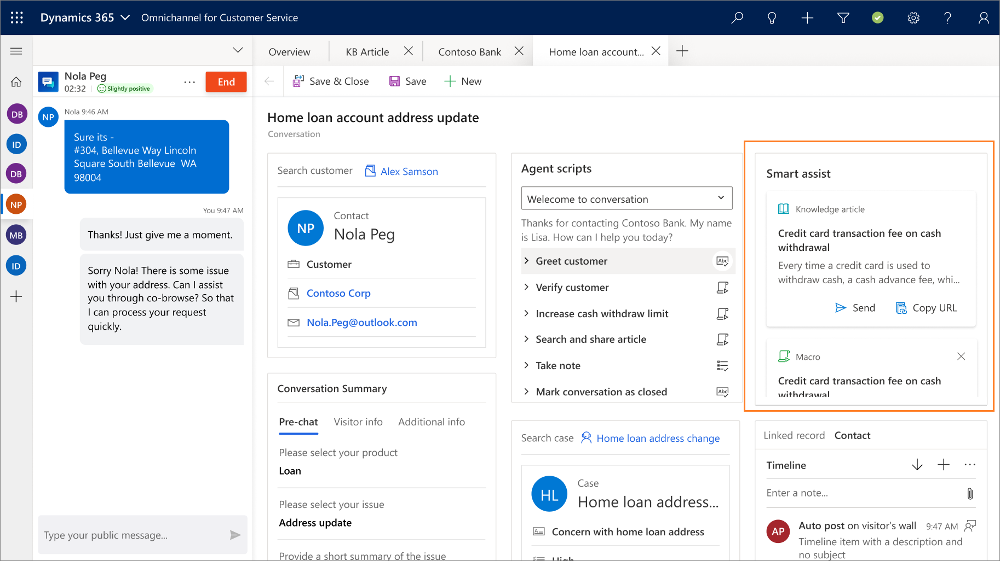

# Smart assist for agents

[!INCLUDE[cc-use-with-omnichannel](../../../includes/cc-use-with-omnichannel.md)]

## Overview of smart assist

Smart assist is an intelligent assistant that provides real-time recommendations to you (an agent), helping you to take actions while interacting with customers. It shows relevant recommendations such as knowledge articles, similar cases, and next-best steps.

If your administrator has configured the Productivity pane, then the productivity pane appears and on which the smart assist cards appear. To configure productivity pane, see [Enable productivity pane](../../administrator/productivity-pane.md).

> [!div class='mx-imgBorder']
> 

The smart assist bot interprets the conversation in the communication panel and provides real-time recommendations.

The recommendations appear in the user interface as cards. The most recent card (recommendation) appears at the top on the control. If you feel a recommendation doesn't meet the context of the conversation, you can choose to dismiss the card.

For a macro recommendation card, if the execution is successful, a success message is displayed; otherwise, an error message is displayed in the user interface.

When a conversation is escalated from a bot, the agent needs to accept the request and start the conversation with the customer. Now, from this instance, the smart assist bot interprets the conversation in real-time and provides recommendations.

> [!div class=mx-imgBorder]
> 

## See also

[Smart assist for agents (admin)](../../administrator/smart-assist.md)
