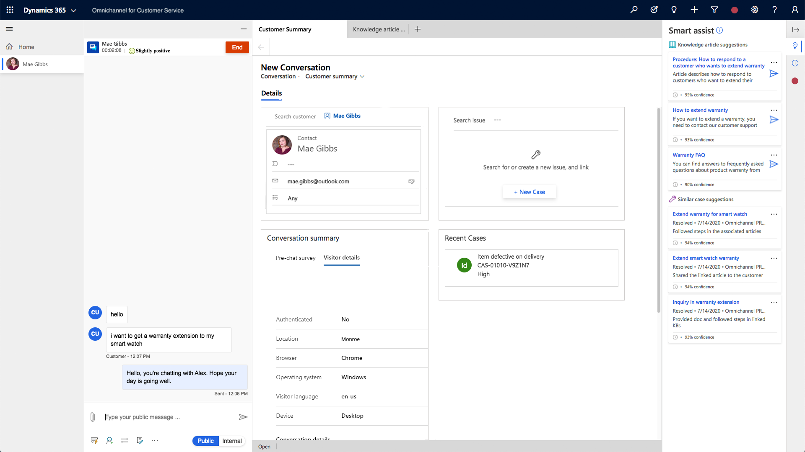
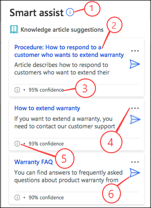
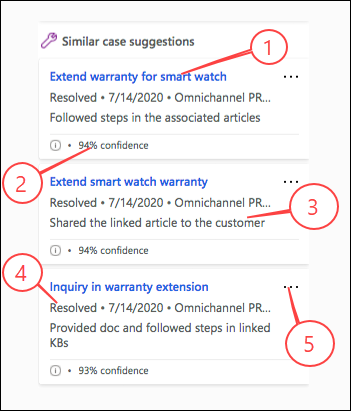

# View smart assist suggestions for knowledge articles and similar cases using AI

[!INCLUDE[cc-use-with-omnichannel](../../../includes/cc-use-with-omnichannel.md)]

## Introduction

The AI suggestions are displayed in smart assist, which is an intelligent assistant that provides real-time recommendations to you, helping you take actions during your interactions with customers.

The AI-suggestions for similar cases and knowledge articles are powered by a set of pre-trained natural language understanding models that help you find relevant knowledge articles or similar cases quickly, based on the context of ongoing conversations that you are handling. Your administrator can enable AI-suggested similar cases and knowledge articles through a single click. These suggestions are displayed in real time based on the conversation context.
> [!div class=mx-imgBorder]
> 

If the productivity pane has been enabled for you, then the smart assist cards appear on the productivity pane when you are interacting with a customer in an ongoing conversation. By default, the productivity pane is enabled out of the box.

## Understand the knowledge article components in smart assist

When you are interacting with a customer in an ongoing conversation, up to three top knowledge articles that match the conversation context are displayed in the **Smart assist** pane. The suggestions are dynamically refreshed based on the conversation context.

> [!div class=mx-imgBorder]
> 

The following table lists the explanation of the smart assist card for AI-suggested knowledge articles.

| Label | Description |
|--------|-------------|
| 1 | Displays the information about the cards when selected.|
| 2 | Title of the related knowledge article. When selected, opens the knowledge article in an application tab. |
| 3 | Displays the confidence score based on which the knowledge article was selected by the AI model. Usually, the suggested knowledge articles are highly relevant to the context of conversations when the confidence score is above 80%; suggestions with lower confidence score may still be relevant based on the semantic meaning of some key words in the conversation. The minimum confidence score is 65%. |
| 4 | Displays the actions that you can perform.|
| 5 | Displays information on the keywords that were used by the AI model to match the article. |
| 6 | When selected, the link to the knowledge article is pasted in the conversation window that the agent can share with the customer. |
|  |  |

## Understand the similar cases components in smart assist

When you are interacting with a customer in an ongoing conversation, up to three top similar cases that match the conversation context are displayed in the **Smart assist** pane. The suggestions are dynamically refreshed based on the conversation context.

> [!div class=mx-imgBorder]
> 

The following table lists the explanation of the smart assist card for AI-suggested similar cases.

| Label | Description |
|--------|-------------|
| 1 | Displays the title of the similar case. When selected, opens the customer summary form in an application tab.|
| 2 | The confidence score based on which the similar case was selected by the AI model. Usually, the suggested similar cases are highly relevant to the context of conversations when the confidence score is above 80%; suggestions with lower confidence score may still be relevant based on the semantic meaning of some key words in the conversation. The minimum confidence score is 65%. |
| 3 | Summary of the case resolution that is generated by the AI model. |
| 4 | Status of the similar case. |
| 5 | Displays the actions that can be performed when you select more commands. |
| | |

If no cases match, then the card displays an appropriate message, such as "No suggestions found for similar cases."

## Sign up for the insider preview

To use the smart assist suggestions using AI (preview), as an administrator, you need to do the following:

- Register at [Insider preview](https://experience.dynamics.com/Account/Login/Register?returnUrl=%2Finsider%2F).
- Submit the form [Sign-up - Survey](https://customervoice.microsoft.com/Pages/ResponsePage.aspx?id=v4j5cvGGr0GRqy180BHbR5mjjZ3rRrtBn7meF_Sg_vlURFBMM0g4T1ZIUUIzNFRJSU0yTkhNMlJWWC4u).
-	Use a sandbox environment and tenant or Org ID to sign-up for the preview program. We do not recommend using the production environment for signing up for preview.

After you sign up, the participation goes through an approval process. It may take up to 48 hours for you to be onboarded to the preview program.

After your participation is approved, you will be able to see the program listed in **My Programs** at [**My Insider Programs**](https://experience.dynamics.com/insider/).

> [!IMPORTANT]
> Upgrade of the preview environment to the production environment is not supported.

### See also

[Enable AI-suggested cases and knowledge articles](../../../customer-service/csw-enable-ai-suggested-cases-knowledge-articles.md)  
[Smart assist suggestions using bot user](oc-smart-assist.md)  
