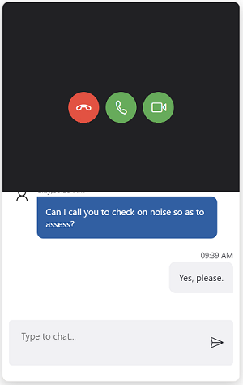
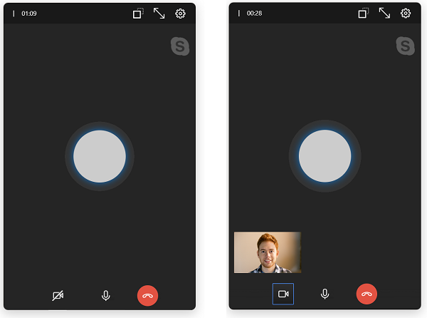

# Remote assistance and calling options in live chat

[!INCLUDE[cc-use-with-omnichannel](../../../includes/cc-use-with-omnichannel.md)]

## Calling options in live chat

With calling options in a live chat conversation, you can<!--note from editor: Suggested.--> initiate a voice or video call while you're<!--note from editor: Suggested.--> communicating with the customer over chat.

As an agent, you exchange a lot of information when you communicate with a customer via chat<!--note from editor: Suggested.-->. This can slow down your effort to resolve the customer's issue. The customer might prefer to show you the problem and explain the issue by using a physical product. In these scenarios, you might want to initiate a voice or video call during the chat conversation to resolve the issue quickly. The calling options in the communication panel help you to easily <!--note from editor: Suggested.-->make these calls.

### Advantages of voice and video call in live chat

With calling options in live chat, you can:

- Resolve customer issues quickly.
- Reduce your average call-handling time<!--note from editor: Is this the correct phrase?--> and improve your productivity.
- Improve customer satisfaction.
- Develop a positive relationship with customers.

### Initiate voice and video call

When you're chatting with the customer, you can initiate the voice or video call. In the communication panel, beside the **End** button, select the ellipsis button <!--note from editor: Is it okay to add this graphic? Style Guide encourages us to use it. If the ellipsis has a tooltip in the UI, please add it to the alt text field.-->. The **Voice Call** and **Video Call** options are displayed. (Depending on your system configuration, you might see **Voice Call** and **Video Call**, or just **Voice call**.)

> [!div class=mx-imgBorder]
> 

When you initiate a voice call, you can view the flyout call control<!--note from editor: Via Style Guide, "flyout" isn't a noun but is okay as an adjective.-->, which includes the following buttons.
<!--note from editor: You definitely don't need the "Description" column in the following table; suggest deleting it. -->
|Button | Name | Description |
|----------------------|-------------------------|-----------------------------|
|| Turn on video / Turn off video |  Use this button to turn on or off the video while in a call with the customer.|
|| Mute / Unmute | Use this button to mute or unmute the call while in a call with the customer. |
|| End call | Use this button to end the call. |

> [!div class=mx-imgBorder]
> <!--note from editor: Please double-check alt text for this and the following two graphics. They were all the same. -->

### Capacity of the agent

When you initiate a voice or video call, your capacity is consumed<!--note from editor: Will the reader know what this means?-->, and you can't take any conversation requests until you hang up. However, your supervisor can still assign conversations to you.

### Site permissions

As an agent, you need to enable camera and microphone access<!--note from editor: Suggested.--> in the browser to make a video and audio call, respectively.

## Customer experience

When a customer on the portal receives a call, they can accept the voice call with audio, accept the voice call with video, or reject the call.

> [!div class=mx-imgBorder]
> 
<!--note from editor: You truly don't need the following table, not only because you've (extensively) covered these buttons above, but because the customer isn't reading this article. It's just noise at this point. -->
<!--
After accepting the call, the customers can view and use the following options.

|Button | Name | 
|----------------------|-------------------------|
|| Turn on video / Turn off video | 
|| Mute / Unmute | 
|| End call | 

-->
After accepting the call, the customer can turn on or off the video, mute or unmute the conversation, and end the call.

> [!div class=mx-imgBorder]
> 

### Site permissions

Customers need to provide the camera and microphone access in the browser.

## Use co-browse and screen share in live chat

The co-browsing and screen sharing features help you quickly and easily understand the customer's issue while communicating with the customer via chat channel. These visual engagement channels allow agents to interact with customers within their browsers for a concrete and effective support experience. This integration capability allows agents to initiate a third-party co-browse or screen sharing session from the chat conversation. 

Note: Third-party providers of co-browse or screen share capabilities may have separate pricing and licensing requirements. Before enabling and using remote assistance features through third-party applications, ensure you understand the terms of using these applications. 
