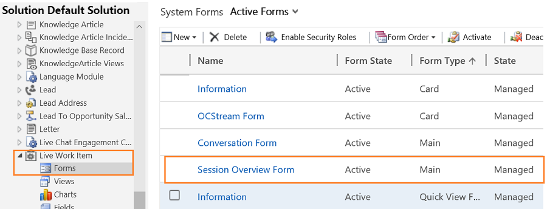

# Modify the position or alignment of a section in the Customer summary

[!INCLUDE[cc-use-with-omnichannel](../../includes/cc-use-with-omnichannel.md)]

1. Sign in to the Common Data Service platform.

2. Go to **Settings** > **Customization** > **Customize the system**.

3. Expand **Components** > **Entities** > **Conversation** and then select **Forms**.

4. Select **Session Overview Form** in the list.

 > [!div class=mx-imgBorder]
 >   

5. Drag and drop the section in the order you want to align.

6. Select **Save** and then select **Publish**.

> [!div class="nextstepaction"]
> [Customize quick view forms](customize-quick-view-form.md)

## See also

- [Omnichannel system customizers](omnichannel-customizer.md)
- [Customize Customer summary form](customize-customer-summary.md)
- [Add or remove the fields in the form](customize-quick-view-form.md)
- [Customize the conversation form](customize-session-form.md)
- [Configure agent and supervisor configurations in Unified Service Desk](create-agent-supervisor-configurations-unified-service-desk.md)
- [Configure notification (Screen pop) for agents](configure-notification-screen-pop-agents.md)
