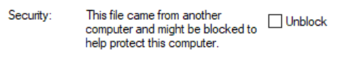
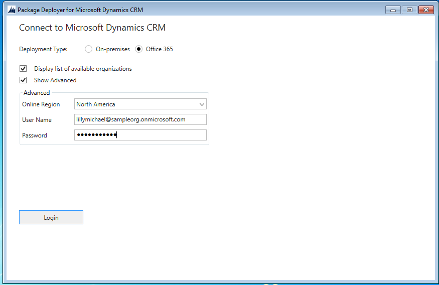
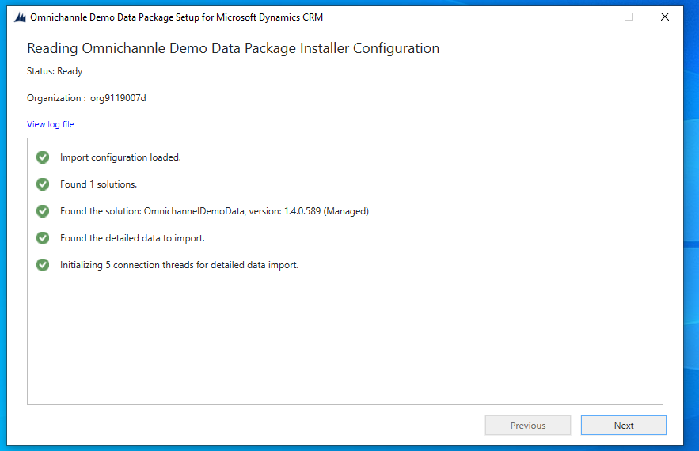
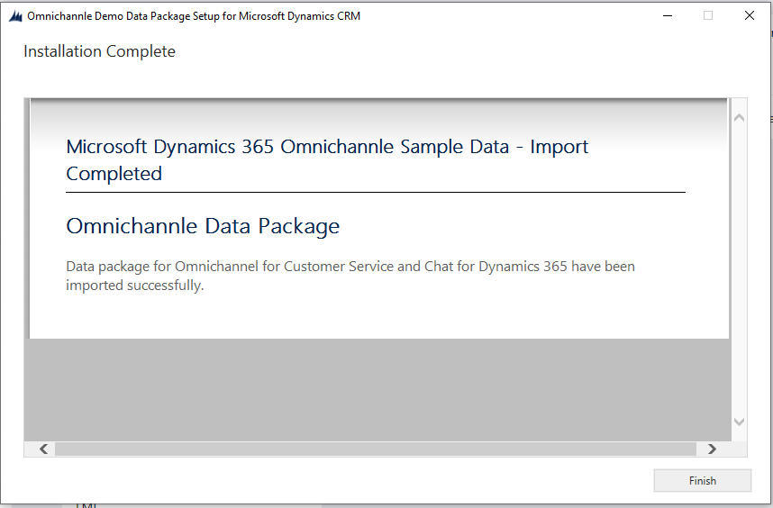

# Demo data installation for Omnichannel for Dynamics 365 Customer Service

This topic describes instructions to install sample/demo data for Chat for Dynamics 365 Service capabilities to help you build your own demo environments.

The sample data is available as a downloadable demo package, which you can install in your Omnichannel for Dynamics 365 Customer Service demo environment.

## Requirements

The following are the requirements to install sample data in your target environment:

- Latest version of Common Data Service platform
- Base language is English
- The environment has no Omnichannel for Customer Service data already, or only has default data that comes with any new org
- The correct version of the business application is already installed Chat for Dynamics 365 Customer Service 
- The org has Omnichannel for Customer Service provisioned and the Chat channel is enabled.

> [!NOTE]
> If you need to install the Demo data on top of an existing Chat for Dynamics 365 trial or a demo environment that already has data (not recommended), you'll need to suspend the safety prechecks performed by the installer. For more information, see the \<technical notes\> [create jump link].

## Download the sample data

Download the demo data from the Download center and save it on your computer.

[Chat for Dynamics 365 Customer Service demo data](https://go.microsoft.com/fwlink/p/?linkid=2026536&clcid=0x409)

> [!IMPORTANT]
> - Once installed, you can't uninstall the demo data. 
> - The Chat for Dynamics 365 Customer Service demo data is available only in English. 
> - Install the demo data on a demonstration, evaluation, training, or test environment. We recommend not to install the demo data in the production environments.

## Prepare for installation

Installer needs to run on a computer with a recent version of Windows (Windows 10 preferred).

Plan for the computer to remain connected to a network, and installation to run
for up to one (1) hour. (Normally installation takes 15-30 minutes
for **OmnichannelDemoData**, which includes Demo data and configuration for
Chat).

Computer should have a screensaver function turned off, otherwise, session
credentials for the installation may be lost when the screensaver engages
(unless you keep your session active throughout).

When installing any of the Demo data packages, the following actions occur during the installation process:

- Default parameters for using Omnichannel are created and/or set.
- Demo data and configuration for the applications are imported (e.g.: Chat
            widget, Work Streams, Queues, and other entities) to demonstrate key
            capabilities.

Wondering what capabilities you can demo with the Demo data? See the Fabrikam scenario below.

## Extract files

The Chat for Dynamics 365 Customer Service demo data installer is a self-extracting executable file. After you download the demo data, perform the following steps:

1. Run the downloaded **.EXE** file.

2. Accept terms and conditions to unpack the compressed zip file. 

3. Extract contents of that file to a folder on your computer.

Depending on the operating system and security settings, you may need to perform the following steps after unpacking the zip file:

1. Open the **OmnichannelDemoDataPackage** folder.

2. Right-click the **OmnichannelDemoDataPackage.dll** file and choose **Properties**.

3. Choose **Unblock**.

    > [!div class=mx-imgBorder] 
    > 

4. Select **Apply**.

5. Select **OK**.

## Set up users

The **OmnichannelDemoData** package is installs with a few users per the settings described below:

To install the demo data, you need to create (or temporarily rename) users in your Common Data Service platform to match the incoming demo data configuration.

| First Name | Last Name | User Alias   | Email                                    | Role                      |
|------------|-----------|--------------|------------------------------------------|---------------------------|
| Alex       | Allman    | alexallman   | <alexallman@sampleorg.onmicrosoft.com>   | Omnichannel Supervisor    |
| Lilly      | Michael   | lillymichael | <lillymichael@sampleorg.onmicrosoft.com> | Omnichannel Administrator |
| Penelope   | Mayo      | penelopemayo | <penelopemayo@sampleorg.onmicrosoft.com> | Omnichannel Agent         |

### Configure users

1. Sign in to the Common Data Service platform.

2. Select **Settings** > **Security** > **Users**.

3. Replace `"Lilly Michael"`with `"lillymichael"` in the `UserFullname="Lilly Michael"` tag. Ensure the username is in lowercase.

4. Select the **Lilly Michael** user. The user page appears.

5. Select the **Manage Roles** in the command bar at the top. The **Manage User Roles** dialog appears.

6. Select the check box for the following role names. 

    - **System Administrator**
    - **Omnichannel Administrator** role.

7. Select **OK** to grant full admin rights to Lilly Michael.

    This ensures that demo data records are created with the correct user ownership and therefore populate views correctly.

### Update data mapping file

Now, you need to update a data mapping file with email addresses of the default user context in the downloaded package.

1. Open **PkgFolder**.

2. Open **usermap.xml** file in Notepad (or Visual Studio or another XML editor).

3. Set `DefaultUserToMapTo=` field to the email address of the Lilly Michael user. 

    For example: `<MappingConfiguration DefaultUserToMapTo="lilymichael@sampleorg.onmicrosoft.com">`

4. Select **Save**.

> [!TIP]
> We recommend creating a backup of your environment so you can revert to the initial stage  if face issues during the demo data installation. To learn more, see [Backup and restore instances](/admin/backup-restore-instances).

## Run the Package Deployer

1. Open the **OmnichannelDemoData** folder

2. Run **PackageDeployer.exe**.

3. Accept the terms and conditions.

4. Specify the following in the connect screen and select **Login**. In this step, you need to connect to the Common Data Service environment where you want to deploy the demo data:

    | Field | Value |
    |-------------------------|------------------------|
    | Deployment Type | Office 365 | To connect to a Common Data Service environment. |
    | Display list of available organizations | Select the check box |
    | Show Advanced | Select the check box |
    |  Online Region | Select the organization that you want to connect to. |
    | User Name | Specify the user name of the system administrator user that you configured in the [Configure users](#configure-users) section.   For example:   `lilymichael@sampleorg.onmicrosoft.com` |
    | Password | Specify the password of the system administrator user that you configured in the [Configure users](#configure-users) section. |

    

5. Select **Next** in the subsequent screens until you see the **Demo Data Setup** dialog.

    

6. Select **Next** to start the demo data installation.
    
7. Select **Finish** after the demo data is installed successfully.

    

## Verify demo data installation

Verify the number of records and types of entities listed in **Fabrikam** fictitious scenario appear as expected as a sanity check.

After the Demo data completely loads, sign in as the Lilly Michael user and
confirm the following:

- Go to **Omnichannel Administration** > **Queues & Users** > **Users** to
    confirm the three Omnichannel users are created.

- Go to **Omnichannel Administration** > **Queues & Users** > **Queues** to
    confirm Queue 1 (sample) and Queue 2 (sample) are created.

- Go to **Omnichannel Administration** > **Channels > Chat** to confirm
    Portal Chat (sample) is created.

- Go to **Omnichannel Administration** \> **Work Distribution Management \>
    Work Streams** to confirm Chat Push (sample) is created.

## Technical notes

See below for more technical details on the installation of this data.

**Installing Demo data on top of existing data (not recommended)**

If you need to install Demo data on top of an existing Omnichannel trial or demo
environment that already has data, you'll need to suspend the safety prechecks
performed by the installer, to do this:

1. Go to **PkgFolder** folder

2. Open **DemoDataPreImportConfig.xml** file with Notepad (or another XML
    editor).

3. Find the following value, and change setting from true to false:

>   \<TerminateOnPreCheckFailure\>true\</TerminateOnPreCheckFailure\>

>   This change causes the installer to bypass some important safety checks,
>   which includes confirming there is no more than one active **Organizational
>   Unit** record, and then renaming it to **Fabrikam**.

## Configuration components

There are several configuration components in this pre-import configuration
file. For technical users, these include:

- **\<RequiredSolutions\>** specifies prerequisite solution installations and
    their version numbers.

- **\<InstallSampleData\>** installs Demo data to Dynamics 365 instance. This
    is the same Demo data that you can install from **Settings** \> **Data
    Management** area in Dynamics 365.

- **\<DefaultParameterDescription\>** specifies the default description for
    the parameters.

**Fabrikam Scenario**

The fictional company, Fabrikam, is a manufacturer of electronic device assembly
line of robots and is known for their product quality, innovation, and solid
customer service, including: installation planning, implementation, and ongoing
maintenance services. Fabrikam is headquartered in the United States (Fabrikam,
U.S.), and has Customer Service Support operations centered in the United
States, primarily in the greater Seattle area. The CSS contact center is focused
on providing excellent support experience to their customers.

A high-level overview of the Omnichannel Demo data is as follows:

- 3 Omnichannel users

- 1 Web customer

- 1 Case

- 4 sessions

- 1 Omnichannel Chat workstream

- 1 Chat widget

- 2 Omnichannel queues

## See Also

[Omnichannel For Customer Service
Guide](https://docs.microsoft.com/en-us/dynamics365/customer-engagement/omnichannel/omnichannel-customer-service-guide)
