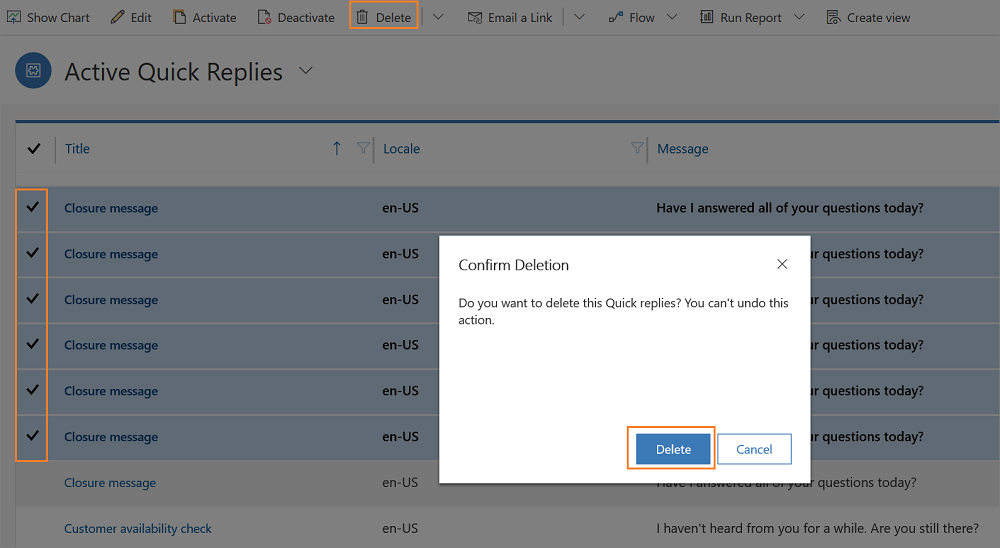
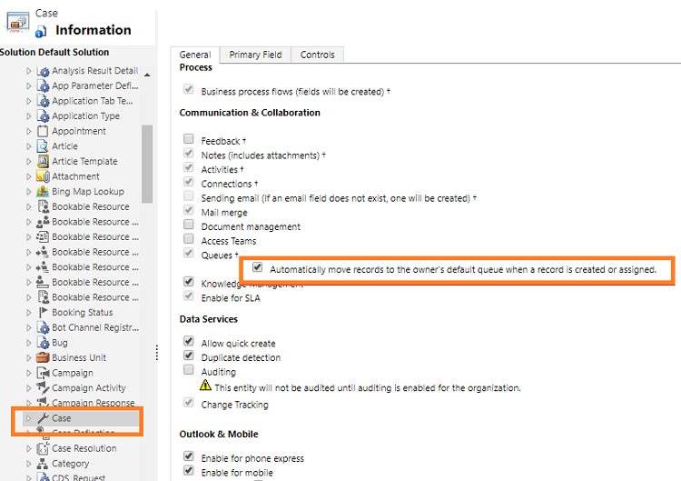

# Omnichannel for Customer Service readme (known issues and limitations)

[!INCLUDE[cc-use-with-omnichannel](../includes/cc-use-with-omnichannel.md)]

The topic explains the known issues and limitations of Omnichannel for Customer Service.

> [!Important]
> We recommend updating Omnichannel for Customer Service to the latest versions for the best experience. More information: [Upgrade Omnichannel for Customer Service](administrator/upgrade-omnichannel.md)

## Cases are routed to agents with higher skill rating value even when agents with exact skill rating value are available

When skill-based routing is configured, cases will be routed to agents who have a higher rating on skills even when agents with exact match are available. This known issue occurs only when exact match is configured with minimum rating value model.

### Workaround

As a workaround, decrease the minimum rating value of the rating model by at least one (1).

## Productivity pane is disabled after the upgrade of Omnichannel for Customer Service

If you have enabled the **Productivity pane** in Omnichannel for Customer Service, it'll be disabled after the upgrade. You need to enable it again to be able to provide guidance to agents. For information about enabling the **Productivity pane**, see [Enable productivity pane](administrator/productivity-pane.md).

## Loss of agent script state

When you refresh the browser or close the session, agent script changes to initial state rather retaining the states. 

For example, you've completed executing two agent scripts and three steps in the third agent script. Now, when you refresh the browser or close and open the session again, you will lose existing state and the agent script state is reset to first script or default script.

## Third-party application tab refreshes when focus is changed

When you host first- or third-party URLs in Omnichannel for Customer Service using the application tab, and when an agent switches from the current application tab to another application tab within the session or switches to another session, the application that is hosted in the tab will be refreshed to the initial state. 

For example, your session has two application tabs, **Knowledge Search** and **Bing Search** (`https://www.bing.com`. You select the **Bing Search** tab and see the Bing search page. Now, you'll search for a keyword - **Latest Surface laptop**, and the search results are displayed.  When you switch from  **Bing Search** to **Knowledge Search**, and again switch to **Bing Search**, the search page is refreshed, and you'll see the Bing search page.

## Install routing rules solution to use entity records routing

In your entity records channel, if you see an error that states: **You must install routing rule solution to use entity records routing. To learn more see aka.ms/routingrules.**, then perform the following:

- If you use Omnichannel for Customer Service in a production environment, go to your Omnichannel for Customer Service provisioning page and install the latest version. If there are no upgrade available, contact Microsoft support.

- If you use Omnichannel for Customer Service preview or trial version, contact Microsoft support.

## Closed conversations don't appear in the Closed work items stream and Closed conversations view

After you upgrade Omnichannel for Customer Service to the latest version in the sandbox or trial environment, conversations that agent closes may not appear in the **Closed work items** stream of the agent dashboard and closed conversations view.

### Workaround

As an administrator, you must activate the **SDK Message Processing Steps** associated to Omnichannel solution.

To work-around the issue, follow these steps:

1. Sign in to the Common Data Service platform.

2. Go to **Settings** > **Customizations**.

3. Select **Customize the System**.

4. Select all the Omnichannel associated plugins. See the image to select the Omnichannel associated plugins.

    > [!div class='mx-imgBorder']
    > 

5. Select **Activate** from the command bar. The **Confirm Sdk Message Processing Step Activation** dialog appears.

6. Select **Activate** to enable the plugins.

## Messages repeated in the quick replies menu

When you open the quick replies menu in the communication panel (Chat and SMS), you see the messages are repeated multiple times.

### Workaround

To work-around the issue, follow these steps:

1. Sign in to Omnichannel Administration app.
2. Select **Quick Replies** in the site map.
3. Select the messages that are repeated several times from the **Active Quick Replies** view.
4. Select **Delete**. A confirmation dialog appears asking you to confirm.
5. Select **Delete** to delete the records.

    > [!div class=mx-imgBorder]
    > 

6. Select **Save** to save the changes.

> [!Note]
> The changes you make might take up to 15 mins to reflect in the system. 

Now, sign in to Omnichannel for Customer Service app and verify if the messages are repeated in the quick replies menu.

## Customer Summary page shows default icons

If your organization is using earlier releases of chat for Dynamics 365 Customer Service, and after you upgrade to the latest version, the Customer summary page shows the default icon instead of the conversation icon instead of the conversation icon.

## Send Link button in the KB Search Page is not localized 

If you are using Omnichannel for Customer Service app, then the **Send Link** button in the **KB Search Page** control appears in english for other locales and is not localized.

## Upgrade doesn’t start if the organization name is changed

If you change the organization name, the upgrade process doesn’t start, and an internal server error is displayed. To begin the upgrade, rename the organization to its original name.

## Conversation does not open as session or as a form

When you use Omnichannel for Customer Service with Unified Service Desk and use **IE Process** to host web applications, a conversation (work item) from the Omnichannel agent dashboard doesn't open as a session or as a form in the application management toolbar.

### Workaround

To work-around the issue, follow these steps:

1. Go to `https://<orgURL>.dynamics.com/apps` and select the **Unified Service Desk Administrator** app.
2. In the sitemap, under **Basic Settings**, select **Action Calls**.
3. Select **+ New**.
4. In the **New Action Call** page, enter the details and then select **Save**.

   | Field | Value |
   |-------|-------|
   | Name  |Open Conversation from Omnichannel Agent Dashboard |
   | Hosted Control | Agent Home Page |
   | Action | RunScript |
   | Data | if(navigator.userAgent.search("Trident") >= 0)  {  window.top.notifyUSD = function(data) { window.open(data); } } |
5. In the sitemap, under **Basic Settings**, select **Events**, and select **PageLoadComplete** from the list of events.
6. In the **PageLoadComplete** page, select **Add Existing Action Call**. The **Lookup Records** pane appears on the left.
7. In the **Lookup Records** pane, enter the name of the action call you want to add. In this case, enter **Open Conversation from Omnichannel Agent Dashboard** in the search box and select the search icon. The action call appears.
8. Select the **Open Conversation from Omnichannel Agent Dashboard** action call and select **Add**, and then select **Save** to save the event.

Now, if you open the conversation (work item) from the Omnichannel agent dashboard, the conversation opens as a session or as a form in the application management toolbar.

## Context variable duplication and delete dependency check

While creating a context variable, the system does not perform duplication detection in the work stream. Also, while deleting a context variable, the system does not perform dependency check.

## Refresh queue configuration to reflect the addition of new user

When you add a user to a queue, the sub grid doesn’t reflect the new member automatically. You are required to refresh the sub grid by selecting the **Refresh** button to see the new user in the list of queue members.

## Support for third-party channel providers with Omnichannel for Customer Service

If your organization has deployed a third-party channel provider using the Dynamics 365 Channel Integration Framework, and when you use Omnichannel for Customer Service in the same environment, the Channel Integration Framework solution upgrades to version 2.0. With Channel Integration Framework version 2.0, you can integrate only third-party telephony channel providers.

You can continue to use the third-party channel provider in the unified interface apps such as Customer Service Hub, Sales Hub and so on. However, you can't use the third-party channel provider in the Omnichannel for Customer Service app. That is, you should not add the **Omnichannel for Customer Service** app while configuring the app list for in the channel provider.

## Support for automatic record linking to conversation

While working on a session, after an agent creates a customer (contact/account) or case record using the quick create (+) option in the nav bar, it is not auto-linked to the conversation. As a work-around, the agent can perform an inline search for the newly created record and link it to the conversation.

## Authentication error for different agent credentials

If an agent is signed in to Office 365 or Common Data Service through a different username in the browser (Internet Explorer or Edge) than the one used for USD sign in, an authentication error is shown and the user is not allowed to sign in. As a work-around, the user should sign out from all other accounts on the browser and try signing back in.

## Transfer to queue does not show a message for the initiating agent

When an agent initiates a transfer, the initiating agent becomes a consulting agent without any user interface message. However, the session tab name shows the **Consult** tag because the initiating agent is added to the same conversation as a consulting agent to enable smooth transition.

## Support for Notes when customer is not linked to a conversation

You as an agent, cannot launch and capture notes for a session where customer is not linked to the conversation. As a work-around, link the conversation to a customer (contact) and then try launching the notes control for capturing the notes.

## Queue support for notifications

The agent is shown one notification at a time. If a new notification arrives before the agent either accepts or rejects the conversation (work item), the incoming conversation will not be assigned to the agent.

## Cases Work Distribution Flow is not saved successfully

The updates you do to the out-of-the-box **Cases Work Distribution Flow** for unified routing of case entity records might fail due to authentication issues.

### Workaround

Authorize Common Data Service native connector in the flow before you save it.

More information: [Update cases work distribution flow](administrator/multiple-ws-entity-record-routing.md#update-entity-records-work-distribution-flow)

## Entity records aren't distributed to agents

Entity records routing doesn't route and distribute case records to the agents. 

The case entity record won't be automatically distributed to the agents when the option - **Automatically move records to the owner's default queue when a record is created or assigned** is enabled in the case entity customization page.

### Workaround

Clear the checkbox to automatically distribute the case records.

> [!div class=mx-imgBorder]
> 

## Sitemap entry for Entity Records is not localized for other languages

In the Omnichannel Administration app, in the sitemap, **Entity Records** under the **Channels** area is not localized for other languages. The string appears only in English language for all language environments.

## Routing rules sub grid in entity records shows an error

You might see the routing rules sub grid under an entity records channel displays error intermittently. The error is **You do not have permission to access these records. Contact your administrator for help.**

### Workaround

To load the page without the error, refresh the page to load the routing rules sub grid, and proceed with routing rules configuration.
