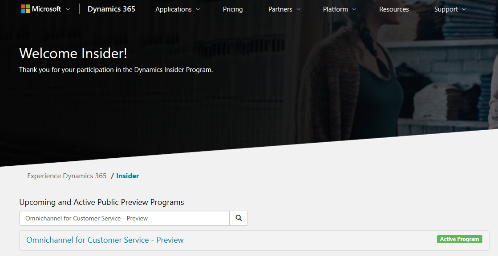

# Preview features in Omnichannel for Customer Service

[!INCLUDE[cc-use-with-omnichannel](../includes/cc-use-with-omnichannel.md)]

[!include[cc-beta-prerelease-disclaimer](../includes/cc-beta-prerelease-disclaimer.md)]

You can sign up for Omnichannel for Customer Service features that are in preview from the Dynamics Insider Portal. You can use the preview features only if you've an active subscription of the Dynamics 365 Customer Service Chat add-on. To learn more, see [Try Chat for Dynamics 365 Customer Service](try-chat-for-dynamics365.md).

> [!IMPORTANT]
> - A preview is a feature that is not complete, as it may employ reduced privacy, security, and/or compliance commitments, but is made available before it is officially released for general availability so customers can get early access and provide feedback. Previews are provided “as-is,” “with all faults,” “as available,” and without warranty.​
> - This preview features does not come with technical support and Microsoft Dynamics 365 Technical Support won’t be able to help you with issues or questions.  If Microsoft does elect to provide any type of support, such support is provided "as is," "with all faults," and without warranty, and may be discontinued at any time.​
> - Previews are not meant for production use, especially to process Personal Data or other data that is subject to heightened compliance requirements, and any use of "live" or production data is at your sole risk.  All previews are subject to separate [Terms and Conditions](../legal/dynamics-insider-agreement.md).

## Sign up for Omnichannel for Customer Service preview

To sign up for the preview features, follow these steps:

1. Go to [Dynamics Insider Portal](http://experience.dynamics.com/insider) and sign in with your Microsoft account.
2. Search for and open **Omnichannel for Customer Service - preview** in the **Upcoming and Active Public Preview Programs** list.

    > [!div class=mx-imgBorder]
    > 

3. Select **Join now**. A preview survey is displayed.

4. Fill in all the required fields. Provide the **Org ID** where you want to set up Omnichannel for Customer Service. To know how to find your Org ID in Dynamics 365 instance, see [Locate your Org ID](administrator/omnichannel-provision-license.md#locate-your-org-id).

    > [!div class=mx-imgBorder]
    > 

5. Select **Submit** to submit the survey.

Once your request is approved, you will receive a confirmation email from Microsoft. Omnichannel for Customer Service will be available in the org that you provided in the survey. You can view the app in **Manage applications** in the **Dynamics 365 Administration Center**.

## See also

[Provision Omnichannel for Customer Service](administrator/omnichannel-provision-license.md)
