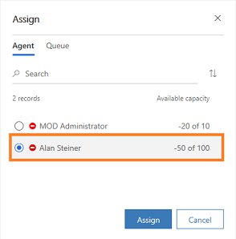

# Assign conversations

[!INCLUDE [cc-beta-prerelease-disclaimer](../../includes/cc-beta-prerelease-disclaimer.md)]

> [!IMPORTANT]
> - [!INCLUDE[cc_preview_features_definition](../../includes/cc-preview-features-definition.md)]  
> - [!INCLUDE[cc_preview_features_expect_changes](../../includes/cc-preview-features-expect-changes.md)]
> - Microsoft doesn't provide support for this preview feature. Microsoft Technical Support won’t be able to help you with issues or questions. Preview features aren't meant for production use and are subject to a separate [supplemental terms of use](https://go.microsoft.com/fwlink/p/?linkid=870960).

[!INCLUDE[cc-use-with-omnichannel](../../includes/cc-use-with-omnichannel.md)]

The omnichannel system, by default, assigns new incoming conversations based on configured routing rules and agent capacity. When agents don't have enough capacity to work on an incoming conversation, the conversation remains in the queue waiting to be assigned to an agent who has the capacity to handle it. 

As a supervisor, you can manually assign these conversations to an agent or another queue.  

> [!NOTE]
> Contact your administrator to enable the option in settings to assign conversations. To learn more, see [Enable supervisors to monitor and assign conversations](../administrator/configure-ongoing-conversations-settings.md).

## Assign a conversation

You can assign a conversation to an agent or to another queue that is in the **Open** state. To assign, follow these steps: 

1. Sign in to the **Omnichannel for Customer Service** app. 

2. In the **Omnichannel Ongoing Conversations** dashboard, choose the conversation that you want to manually assign.

    > [!NOTE]
    > You can assign conversations that are in the **Open** state only.

    The **Assign** action at the top of the grid is active.

3. Select **Assign**. 

    In this example, we are selecting a conversation that is not assigned to an agent or a queue.

    > [!div class=mx-imgBorder]
    > 

4. In the **Assign** dialog box, you can see the list of agents and their available capacity in the **Agent** tab. 

    To assign to a queue, select the **Queue** tab.

    In this example, we are assigning the conversation to **Alberto Gass**.

    > [!div class=mx-imgBorder]
    > 

5. Select **Assign**.

    This initiates the assignment of the conversation and sends you a notification to confirm the assignment.

### See also

[Configure intraday insights dashboard for Unified Service Desk](../administrator/configure-intraday-dashboard-supervisor.md)

[Enable supervisors to monitor and assign conversations](../administrator/configure-ongoing-conversations-settings.md)
