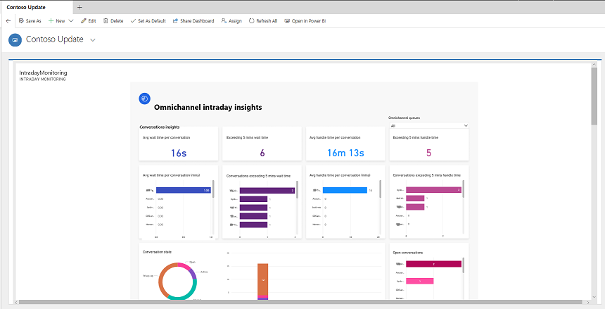
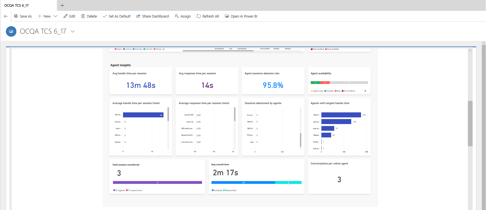
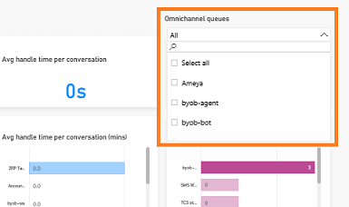

# View and understand Omnichannel intraday insights dashboard

[!INCLUDE[cc-use-with-omnichannel](../../includes/cc-use-with-omnichannel.md)]

The Omnichannel intraday insights dashboard provides information about the health and key performance indicators (KPIs) for your organization. This dashboard consists of two sections:

-	[Conversations insights](#conversations-insights)

-	[Agent insights](#agent-insights)

The information displayed in these sections are displayed based on the conversations closed in the last 24 hours and refreshes every 15 minutes.

> [!IMPORTANT]
> Best practices should be followed to ensure that metrics displayed on the dashboard are not adversely affected. To learn more, see [Best practices to use Omnichannel for Customer Service](../best-practices.md).

## Conversations insights

The **Conversations insights** section provides insights on conversation requests that are generated in the past 24 hours with KPIs such as state of conversations and number of conversations.

The following screen is an example of the **Conversations insights** section.

> [!div class=mx-imgBorder]
> 

This section of the dashboard consists of the following KPIs.

| KPI | Description |
|-------|-------|
| Average wait time per conversation | The average time a conversation is waiting in the queue in open state. |
| Average handle time per conversation | The average time that is taken to complete a conversation. The KPI is calculated based on the conversations handled in the last 24 hours. |
| Conversations exceeding 5 min wait time | The number of conversations that are in active state and exceeded the time in queue threshold of five minutes. |
| Conversations exceeding 5 min handle time | The number of active conversations that are exceeding the handle time threshold of five minutes. |
| Conversation state | The distribution of conversations across open, active, waiting, wrap up, and closed state. |
| Open conversations | The distribution of open conversations in pick mode and push mode respectively. |

## Agent insights

The **Agent insights** section provides information on the latest KPIs, the health of queues, the status of agents on a given day.

The following screen shows an example of the **Agent insights** section.

> [!div class=mx-imgBorder]
> 

This section of the dashboard consists of the following KPIs.

| KPI | Description |
|-------|-------|
| Average handle time per session | The average time that an agent takes to handle a session for conversation. |
| Average response time per session | The average time that an agent takes to accept a conversation from when assigned. |
| Agent sessions abandon rate | The percentage of conversation sessions abandoned by agents due to timed-out or rejected requests. | 
| Agent availability | The distribution of agents by presence status. The presence status of agents can be available, busy, busy-do not disturb, away, offline, or your custom defined status. |
| Sessions abandoned by agents | The number of sessions that are abandoned by agents. | 
| Agents with longest handle time | The list of agents with highest handle time. |
| Total sessions transferred | The number of sessions that are transferred to agents and supervisors, along with the break up between the two. | 
| Average consult time | The average time spent by agents on consultation for other agents or supervisor, across sessions. |
| Conversations per online agent | The average number of conversations that are in active state and being handled by agents. | 

## View and filter report

You can filter the information by selecting the Queues that are custom defined for your organization. To view the queues, from the **Omnichannel queues** dropdown, select the queues as required and the information is filtered according to your selection. This helps you in quickly analyzing the KPIs and take necessary steps to improve outcomes.
 
> [!div class=mx-imgBorder]
> 

### See also

-  [Introduction to intraday insights dashboard](intro-intraday-insights-dashboard.md)

-  [View and understand Ongoing Conversations dashboard](ongoing-conversations-dashboard.md)
