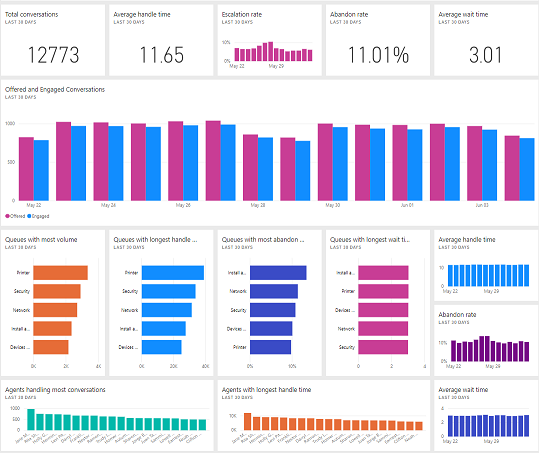
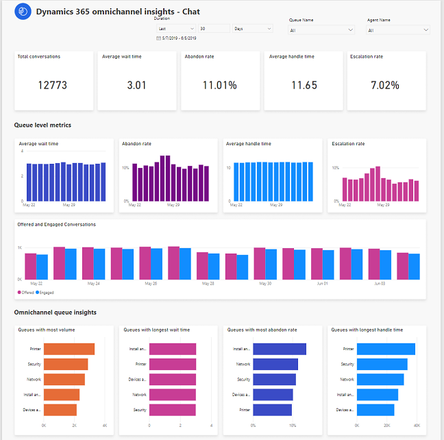
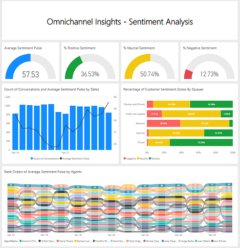
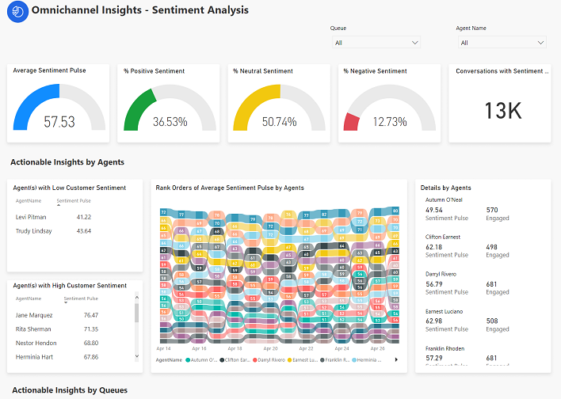

# View and understand Omnichannel Insights dashboards

[!INCLUDE[cc-use-with-omnichannel](../../includes/cc-use-with-omnichannel.md)]

The Omnichannel Insights dashboard provides information about the historic performance of the chat channel and sentiment analysis of the chats offered through key performance indicators (KPIs) in context of the  agents in your organization.
Typically, the dashboard is divided into two sections:

-	[Omnichannel Insights Chat dashboard](#omnichannel-insights-chat-dashboard)

-	[Omnichannel Insights Sentiment Analysis dashboard](#omnichannel-insights-sentiment-analysis-dashboard)

## Omnichannel Insights Chat dashboard

The following screen shot shows an example of the Omnichannel Insights - Chat dashboard:

> [!div class=mx-imgBorder]
>   

### Omnichannel Insights chat report details

The following screen shot shows an example of the Omnichannel Insights - Chat report with more comprehensive information.

> [!div class=mx-imgBorder]
>   

This report consists of the following KPIs:

| KPI | Description |
|-----|-------------|
| Offered Conversations | The number of conversations initiated by the customer. |
| Engaged Conversations | Offered Conversations that are engaged by an agent.  Customer-to-agent communication can begin at this point. |
| Average Wait Time (mins) | The length of time, in minutes, a customer is waiting in queue.   Average wait time = Total length of time (in minutes) / Offered |
| Customer Abandon Rate | The percentage of conversations that are not engaged by agents. |
| Average Handle Time (mins) | Average length of time that an agent takes to complete the conversation with customer. |
| Transferred to Supervisor | The percentage of conversations that are escalated to supervisor. |
| Average Customer Sentiment Pulse (CSP) | The predicted customer sentiment in a given timeframe for a set queue/agent, which indicates the degree of positive sentiment expressed by customers at the end of their interactions. |

## Omnichannel Insights Sentiment Analysis dashboard

The following screen shot shows an example of the Omnichannel Insights - Sentiment Analysis dashboard which provides an overview of important KPIs and trends relative to the sentiment analysis of chats offered.

> [!div class=mx-imgBorder]
>   

### Omnichannel Insights Sentiment Analysis report details

The following screen shot shows an example of the Omnichannel Insights - Sentiment Analysis report with more comprehensive information.

> [!div class=mx-imgBorder]
>   

This report consists of the following KPIs:

| KPI | Description |
|-----|-------------|
| Average Sentiment Pulse | The predicted customer sentiment in a given timeframe for a set queue/agent, which indicates the degree of positive sentiment expressed by customers at the end of their interactions. |
| % Positive Sentiment | Count of positive sentiment zone conversations divided by total chat sessions. |
| % Neutral Sentiment | Count of neutral sentiment zone conversations divided by total chat sessions. |
| % Negative Sentiment | Count of negative sentiment zone conversations divided by total chat sessions. |
| Conversations with Sentiment predication | Count of conversations to predict the customer sentiment metrics. |

Let's look at the sentiment zones in details:

- **Positive Sentiment**: Positive sentiment is expressed by the customer writing messages that they are happy, pleased, or positive with the result of the support interaction. Positive sentiment requires the positive words need to **convey positive feeling beyond just simple pleasantries or politeness**. For example, when a customer writes “thank you”, that is just being polite, it doesn’t necessarily mean they are pleased or happy. However, if a customer writes “I can’t thank you enough” or “thank you very much” that is portraying clear positive feeling. Some other examples of simple pleasantries/politeness that shouldn’t be mischaracterized as positive are “Please help” and “Yes". 

- **Negative Sentiment**: Negative sentiment is expressed by the customer when they are disappointed with the support interaction. These can be cases where the customer is describing their problem and are frustrated or unhappy because of how it is currently impacting them. For something to be scored with negative sentiment the words need to **clearly convey that the user is unhappy, disappointed, frustrated, or so on**.

- **Neutral Sentiment**: Neutral sentiment is represented when a customer’s sentiment was neither positive nor negative. A customer’s problem statement isn’t to be scored Negative, rather it should be scored Neutral, unless it contains words that denote emotion. This is regardless of how severe the user’s problem is. Additionally, messages with non-specific pleasantries and/or politeness are also be scored Neutral and not as Positive.

## View and filter reports 

You can filter the information presented in the reports by selecting **Duration**, **Queue Name**, and **Agent Name**.

> [!div class=mx-imgBorder]
>   

### See also

-  [Configuring Omnichannel Insights dashboard](../administrator/configure-historical-sentiment-dashboard-supervisor.md)

-  [Introduction to Omnichannel Insights dashboard](../supervisor/intro-dynamics-365-omnichannel-insights-dashboard.md)
