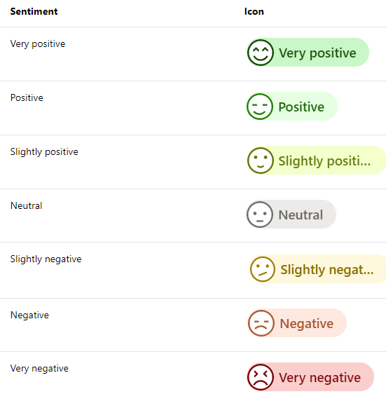
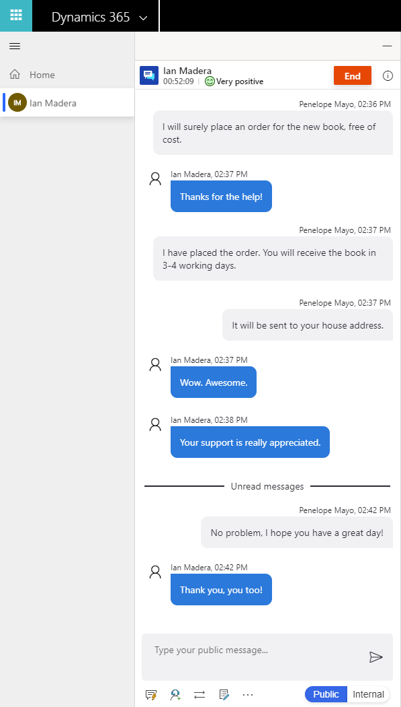
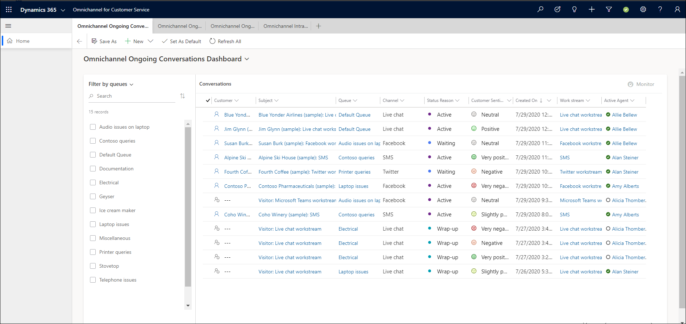

# Preview: Sentiment monitoring

[!INCLUDE[cc-beta-prerelease-disclaimer](../../includes/cc-beta-prerelease-disclaimer.md)]

[!INCLUDE[cc-use-with-omnichannel](../../includes/cc-use-with-omnichannel.md)]

Omnichannel sentiment analysis enables agents and supervisors to understand real-time and historical customer sentiment across channels to improve customer service via the following:

- Natural language processing (NLP) and machine learning (ML) algorithms to understand customer sentiments. 
- Sentiment intensities and indicators, which are displayed based on the previous six customer messages. Sentiments are scored in seven intensities: three positive, three negative, and one neutral gradient. 

    > [!div class=mx-imgBorder]
    > 

- Omnichannel sentiment analysis, which supports multiple languages. Using Microsoft Azure Text Translator API, conversations in more than 40 languages now receive sentiment scores.   

> [!NOTE]
> - Non-English conversations are translated to English and then scored. 
> - Unsupported languages do not receive a sentiment score. 

To learn more, see [Explore Text Translator API](https://docs.microsoft.com/azure/cognitive-services/translator/translator-info-overview).

## Personas

The multi-language sentiment feature (preview) caters to the following personas:

- Administrator: 

    - As an administrator, you can configure sentiment for English only and non-English languages. 
        > [!NOTE]
        > Sentiment is enabled in Omnichannel for Customer Service by default.

- Supervisor (Team Lead)

    - As a supervisor, you can track agents' performance and engage in real time to continuously improve the support quality. 
    
        Example: Identifying negative sentiment events in conversations between agents and customers.

    - As a supervisor, when you identify negative sentiment, provide timely inputs to help an agent resolve an issue. 

        Example: Monitor and join the conversation. 

    - Real-time sentiment tracking enables supervisors to identify chat and SMS sessions that are going well or that require monitoring. 

- Agent: 

    - As an agent, you want to know customers' sentiments in real time and see customers’ satisfaction levels instantly when communicating. 

    - You can be responsible for handling multiple customer engagements at any given time. 

    - You can engage directly with the customer to solve the customer's issue. 

    - Analysis of customer sentiment helps you to understand problem severity and act. 

## Sentiment intensity indicators

Omnichannel sentiment analysis sentiment intensity indicators are an automatic and unbiased measurement of satisfaction levels of the customer in real time. These indicators provide agents and supervisors with the ability to see how a conversation is trending and a real-time gauge that supervisors can use to decide when they need to step in and assist. 

- Agents

    Sentiment intensity indicators on the top of the communication panel help you understand the customer’s sentiment.

    > [!div class=mx-imgBorder]
    > 

- Supervisors

    - Sentiment intensity indicators identify ongoing chat sessions that need the supervisor's attention, so that you can better assess and apply their time where it is the most valuable. 

    - Using sentiment intensity indicators on the Omnichannel Ongoing Conversations dashboard allows you to easily identify ongoing customer support chat sessions that are not going well.

    > [!div class=mx-imgBorder]
    > 

## Multi-language sentiment limitations

Sentiment relies on the initial customer messages in any conversation to detect the language of the conversation.  

Expect the following system behavior: 

- If the customer’s initial messages are detected as English, the system assumes that subsequent messages are in English as well. If your customer switches away from English after these initial messages, the system does not perform language redetection. In this situation, you would most often see a neutral sentiment throughout the rest of the non-English conversation.

- If the customer’s initial messages are detected as non-English, the system performs redetection and scoring for subsequent messages. If any following message is detected as non-English, its subsequent message will be redetected and scored according to its detected language.

## Requirements 

Your environment must have the latest version of Omnichannel for Customer Service. To learn more, see [Upgrade Omnichannel for Customer Service](../administrator/upgrade-omnichannel.md). 

## Install and configure

Once you have signed up, see step 4 of [Enable sentiment analysis](../administrator/enable-sentiment-analysis.md) to configure sentiment analysis. 

## Policy notice 

This feature is intended to help customer service managers or supervisors enhance their team’s performance and improve customer satisfaction. This feature is not intended for use in making, and should not be used to make, decisions that affect the employment of an employee or group of employees, including compensation, rewards, seniority, or other rights or entitlements. Customers are solely responsible for using this feature, and any associated feature or service in compliance with all applicable laws, including laws relating to accessing individual employee analytics and monitoring, recording, and storing communications with end users. This also includes adequately notifying end users that their communications with agents may be monitored, recorded, or stored and, as required by applicable laws, obtaining consent from end users before using the feature with them. Customers are also encouraged to have a mechanism in place to inform their agents that their communications with end users may be monitored, recorded, or stored.

## See also

[Enable sentiment analysis](../administrator/enable-sentiment-analysis.md)

[Monitor real-time customer sentiment](../agent/agent-oc/oc-monitor-real-time-customer-sentiment-sessions.md)

[Monitor conversations](monitor-conversations.md)
