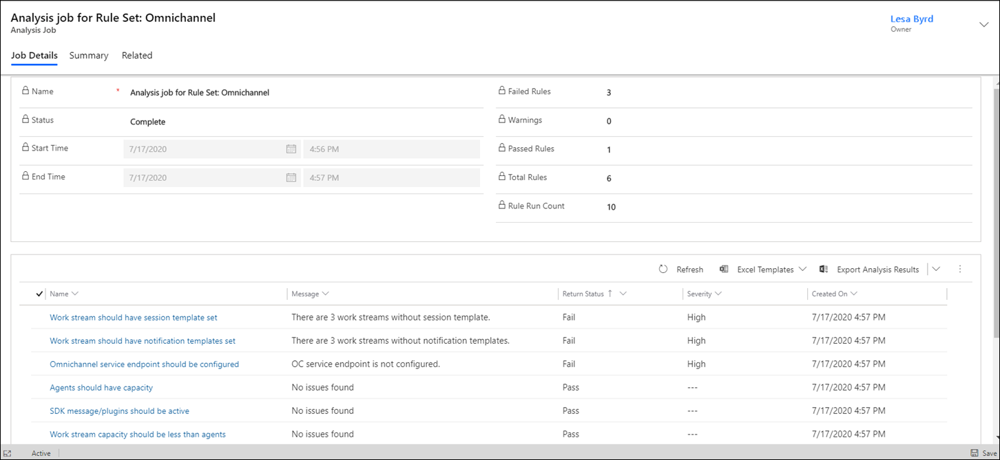

# Troubleshoot issues in Omnichannel for Customer Service using Solution Health Hub

[!INCLUDE[cc-use-with-omnichannel](../includes/cc-use-with-omnichannel.md)]

## Introduction

You can use Solution Health Hub to get a better picture of the state of your Dynamics 365 environment and detect any issues it might have. Solution Health Hub runs rules within an instance to validate the environment's configuration, which might change over time through natural system operations. Some of the rules are specific to Omnichannel for Customer Service; you can run the rules on demand when you run into an issue. Some rules are automatically triggered when Omnichannel for Customer Service is installed or updated. You can regularly run the Omnichannel for Customer Service rule set to monitor the health of your environment.

Solution Health Hub helps detect the following issues:

- Missed or wrong configurations
- Queues with no agents
- Agents with no capacity
- Agents who aren't part of any queues
- Work stream configuration problems<!--To be parallel.-->

## Prerequisites

Omnichannel for Customer Service.

## Run a health check

Perform the following steps to run an analysis job to check for issues in Omnichannel for Customer Service:

1. Open Solution Health Hub app.
2. Select **Analysis Jobs** > **New**.
3. In the **Create Analysis Job** dialog box under **Rule Set**, select **Omnichannel**, and then select **OK**.

## Analyze the health check results

 After the analysis job completes its run, the results are displayed on the **Job Details** tab.

The following information is available:

- **Name:** The name of the analysis job.
- **Status:** The status of the run.
- **Start Time:** The date and time when the job was started.
- **End Time:** The date and time when the job completed its run.
- **Failed Rules:** The number of rules that failed.
- **Warnings:** The number of rules that resulted in warnings.
- **Passed Rules:** The number of rules that passed successfully.
- **Total Rules** The number of available rules.
- **Rule Run Count:** The count of rules that have been run.

The details of the results are displayed in a table as follows:

- **Name:** The name of the rule.
- **Message:** A brief summary of the result.
- **Return Status:** Whether the rule passed, failed, or returned a warning.
- **Severity:** The severity level.

You can do the following:

1. Select a rule whose status appears as failed. The results of the analysis of the objects that failed are displayed in the **Failing Records** area.
      > 
2. Optionally, select the **Summary** tab for an overview of the results.

> [!NOTE]
> If you see any discrepancy in the health check results, rerun the job.

## Out-of-the-box rule sets

When you run the analysis job, the following out-of-the-box rules are run. These rules can't be edited.

| Rule<!--I assume these are named somewhere in a UI? If not, let's use contractions and "plug-ins".--> | Description |
|----|--------|
| Agents should have capacity | Verifies that capacity has been defined for agents. More information: [Manage users](administrator/users-user-profiles.md) |
| Omnichannel service endpoint should be configured | Verifies that the underlying services needed for the functioning of Omnichannel for Customer Service are configured correctly. More information: [Provisioning Omnichannel for Customer Service](administrator/omnichannel-provision-license.md) |
| Queues should have agents | Verifies that the queues that are assigned to the work streams have agents assigned. More information: [Manage queues](administrator/queues-omnichannel.md) |
| SDK message/plugins should be active | Verifies that the SDK messages or plug-ins<!--Neeraja, did you ever bring up with your team that "plug-in" isn't a synonym for add-in or add-on, via Writing Style Guide, but is "a component that permits a specific browser to recognize and support the file format of an object embedded in an HTML document"? I'd love to elevate this term into a Dynamics style guide entry, if we want to keep using it this way.--> are active. More information: [Workaround for repeated messages](omnichannel-readme.md#messages-repeated-in-the-quick-replies-menu) |
| Work stream capacity should be less than agents | Verifies that the capacity defined for agents is more than that defined for the work streams. More information: [Understand work streams](administrator/work-streams-introduction.md) |
| Work stream should have notification templates set | Verifies that notification templates have been set for work streams. More information: [Associate templates with work streams](administrator/associate-templates.md) |
| Work stream should have session template set | Verifies that session templates have been set for work streams. More information: [Associate templates with work streams](administrator/associate-templates.md) |
| Work stream should not have duplicate context variables | Verifies that duplicate context variables haven't been defined for work streams. More information: [Create a work stream](administrator/work-streams-introduction.md#create-a-work-stream)  |
| Work stream should not have empty routing rules above rules with condition | Verifies that empty routing rules haven't been defined for a work stream that prevent routing rules with a lower priority from running. More information: [Create and manage routing rules](administrator/routing-rules.md) |
| Work stream with push mode should not allow offline mode | Verifies that "offline" isn't an allowed presence for work streams that have push mode enabled. More information: [Create a work stream](administrator/work-streams-introduction.md#create-a-work-stream) |

### See also

[Troubleshooting Omnichannel for Customer Service](troubleshoot-omnichannel-customer-service.md)  
[Frequently asked questions](faqs.md)  
