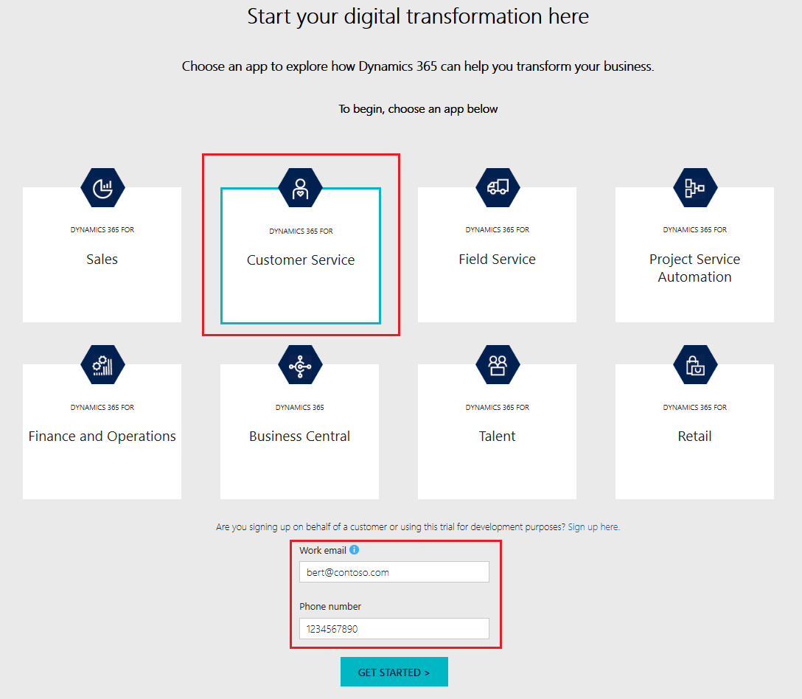
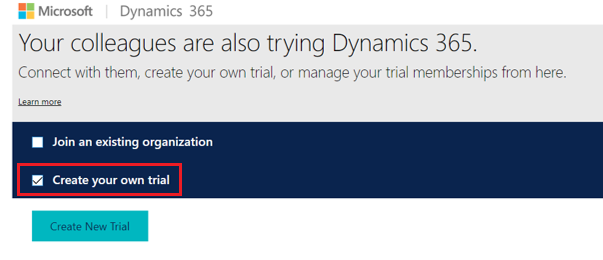
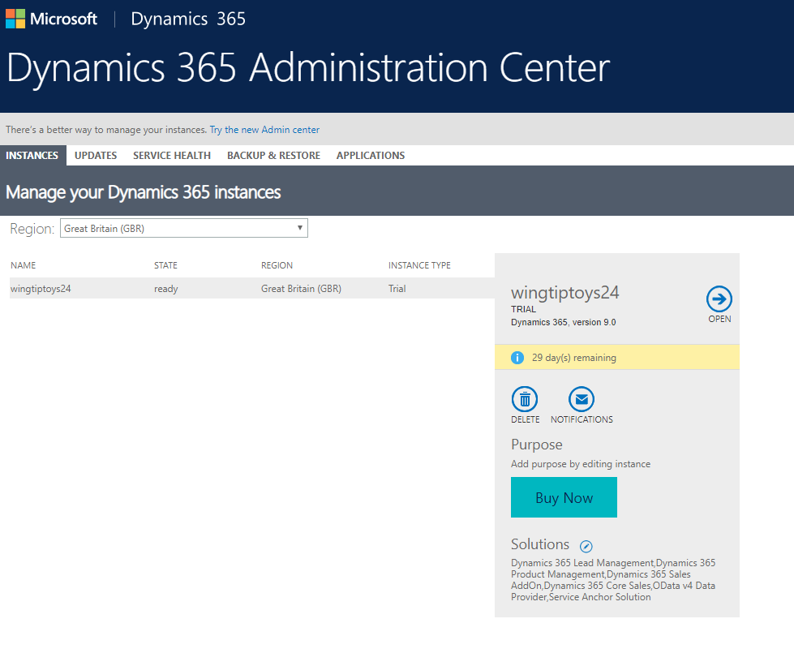
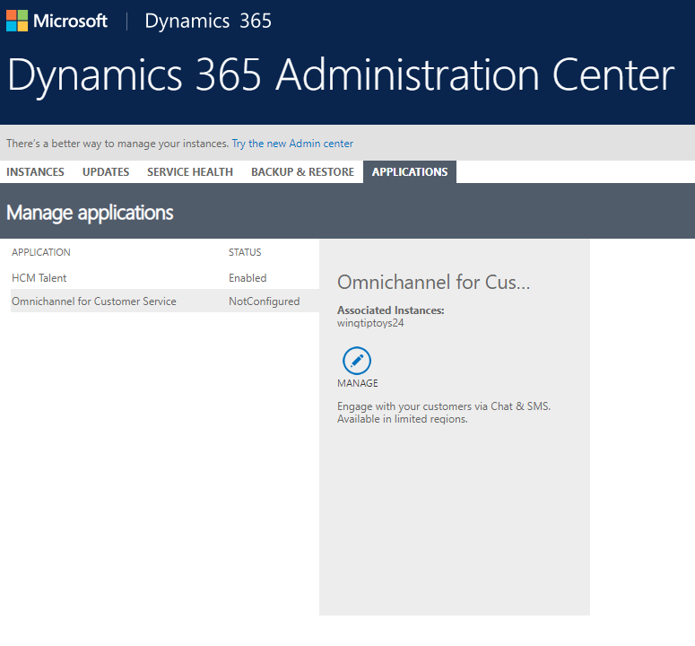
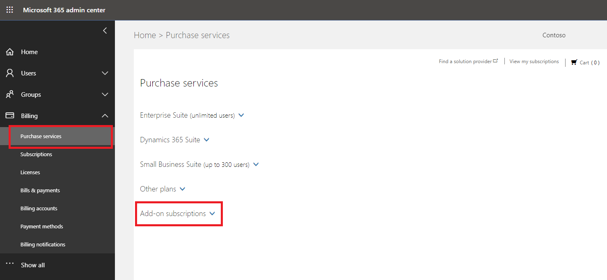
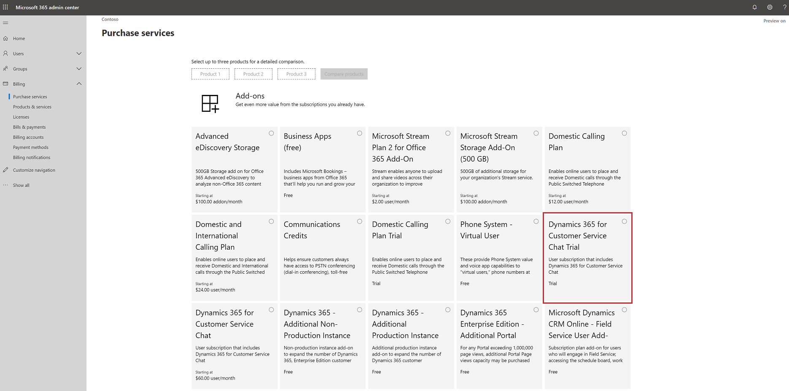
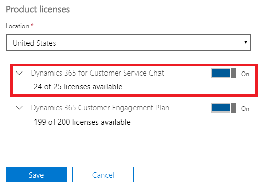
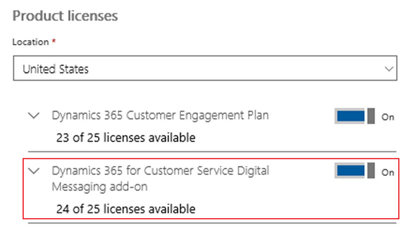

# Try channels in Omnichannel for Customer Service

[!INCLUDE[cc-use-with-omnichannel](../includes/cc-use-with-omnichannel.md)]

Channels, for example Chat and SMS, are the engagement channels that enable your agents to connect with customers in real-time and provide quick personalized help. Channels can only be subscribed and used if you have an active subscription of Dynamics 365 Customer Service Enterprise in your tenant.

There are two options to sign-up for a free 30-day trial of channels:

1. [Channels trial through trials.dynamics.com](#option-1-channels-trial-through-trialsdynamicscom)
2. [Channels trial through Microsoft 365 admin center](#option-2-channels-trial-through-microsoft-365-admin-center)

## Option 1: Channels trial through trials.dynamics.com

With this option, you can get a free 30-day trial of Chat, SMS, and Facebook Messenger channels through [https://trials.dynamics.com](https://trials.dynamics.com). 

**Prerequisites**:

- You must have an existing tenant.
- You must have an existing organizational account with the global administrator role to enable the trial.

> [!NOTE]
> To know the geographic location availability, see [International availability](international-availability.md).

### Step 1: Get a Dynamics 365 trial instance

1. Go to <https://trials.dynamics.com/Dynamics365/Signup/service>.

2. Select **Customer Service**.

    > [!IMPORTANT]
    > - Ensure that you select **Customer Service**. If you select any other option, Omnichannel for Customer Service application will not get enabled in your tenant.
    > - Omnichannel for Customer Service application will not get enabled if you sign up for creating a new trial tenant.

3. Enter your work email and phone number, and then select **Get started**.

    > [!div class=mx-imgBorder]
    > 

4. Sign in with your global administrator credentials and accept the terms and privacy policy. The instance setup takes some time.

5. If you already have trial instances (Dynamics 365 instances with Instance Type set to Trial), you'll be asked to either join an existing organization or create your own trial. Select **Create your own trial** and then select **Create New Trial**. After that, select **Customer service** and then select **Complete Setup**.

   > [!div class=mx-imgBorder]
   > 

    > [!NOTE]
    > The maximum number of allowed trial instances in a tenant is five. If you already have five trial instances in your tenant, you must delete one instance before creating a new trial.

6. If you are redirected to the applications page, select **Customer Service Hub** to open the application once it is setup.

7. You will now be able to see the newly created instance in Dynamics 365 Administration Center under the **Instances** tab. The instance type will be set to Trial.

    > [!div class=mx-imgBorder]
    > 

### Step 2: Get a Power BI (free) subscription

If you already have a subscription of Dynamics 365 Customer Service Enterprise or a subscription of Power BI in your tenant, you can skip this step. Otherwise, you must get a Power BI (free) subscription.

1. Sign in to [Microsoft 365 admin center](https://admin.microsoft.com) with the global administrator credentials.

2. Go to **Billing** > **Purchase services**.

3. Search for Power BI (free) and complete the purchase of Power BI (free) subscription.

    > [!div class=mx-imgBorder]
    >  subscription")

### Step 3: Enable Chat, SMS, and Facebook channels in your organization

In Dynamics 365 Administration Center, go to the **Applications** tab, select the **Omnichannel for Customer Service** application and select **Manage**. This will guide you to enable the required channels on one or more instances that you may have. You can enable a channel or multiple channels on any instance type in this step. For more information on provisioning channels through the Dynamics 365 admin center, see [Provision Omnichannel for Customer Service](administrator/omnichannel-provision-license.md).

> [!div class=mx-imgBorder]
> 

Once a channel is enabled in your organization, you can sign in to Dynamics 365 organization, and select the Omnichannel Administration application to start configuring the channel. More information on configuring channels in Omnichannel for Customer Service: [Configure a chat channel](administrator/set-up-chat-widget.md), [Configure an SMS channel](administrator/configure-sms-channel.md), and [Configure a Facebook channel](administrator/configure-facebook-channel.md).

## Option 2: Channels trial through Microsoft 365 admin center

With this option, you can sign-up for a free 30-day trial of Chat, SMS, and Facebook Messenger channels from the Microsoft 365 admin center only if you have a paid subscription of Dynamics 365 Customer Service Enterprise that has been purchased directly through the Microsoft 365 admin center (that is, Web Direct). If you do not have the pre-requisite subscription, or if you have purchased the pre-requisite subscription other than Web Direct, then the option to try channels will not be available in the Microsoft 365 admin center.

The channel you can try depends on the add-on you purchase from the Microsoft 365 admin center. The following add-ons are available for purchase:

- **Dynamics 365 for Customer Service Chat Trial**: Allows you to try Chat.

- **Dynamics 365 for Customer Service Digital Messaging add-on Trial**: Allows you to try Chat, SMS, and Facebook channels.

> [!NOTE]
> For more information on the Chat and Digital Messaging licenses, pricing, and prerequisites, please refer to the Dynamics 365 licensing guide [here](https://go.microsoft.com/fwlink/p/?LinkId=866544).

### Step 1: Get a trial subscription of channels

1. Sign in to [Microsoft 365 admin center](https://admin.microsoft.com) with the global administrator credentials.

2. Go to **Billing** > **Purchase Services**, and select **Add-ons**. 

    > [!div class=mx-imgBorder]
    > 

3. Under **Add-ons**, select the required add-on.
    
    > [!div class=mx-imgBorder]
    > 
    
    > [!IMPORTANT]
    > You must already have a paid license of Dynamics 365 Customer Service Enterprise in your tenant that was purchased directly through the Microsoft 365 admin center (that is, Web Direct), otherwise the Chat and Digital Messaging options won't be visible.

4. You can start a 30-day trial of Chat or Digital Messaging with 25 user licenses.

5. After signing up for a trial, you must assign licenses of Chat or Digital Messaging to the users who need to engage with customers and provide support via Omnichannel for Customer Service. This can be done by selecting one or more active users and editing their product licenses. After you're done, select **Save**.

    > [!div class=mx-imgBorder]
    > 

    > [!div class=mx-imgBorder]
    > 

### Step 2: Enable channels in your organization

After you have the subscription for the required channels and assigned licenses to users, you can enable the required channels in your organizations from Dynamics 365 Administration Center.

In Dynamics 365 Administration Center, go to the **Applications** tab, select the **Omnichannel for Customer Service** application and select **Manage**. This will guide you to enable the required channels on one or more instances that you may have. You can enable a channel or multiple channels on any instance type in this step. For more information on provisioning channels through the Dynamics 365 admin center, see [Provision Omnichannel for Customer Service](administrator/omnichannel-provision-license.md).

After a channel is enabled in your organization, you can sign in to Dynamics 365 organization, and select the Omnichannel Administration application to start configuring the channel. More information on configuring channels in Omnichannel for Customer Service: [Configure a chat channel](administrator/set-up-chat-widget.md), [Configure an SMS channel](administrator/configure-sms-channel.md), and [Configure a Facebook channel](administrator/configure-facebook-channel.md).

## Videos

[Try channels in Omnichannel for Customer Service](https://go.microsoft.com/fwlink/p/?linkid=2114715)

To view more videos on Omnichannel for Customer Service, see [Videos](videos.md).

### See also

[Provision Omnichannel for Customer Service](administrator/omnichannel-provision-license.md)

[Configure a chat channel](administrator/set-up-chat-widget.md)

[Configure an SMS channel](administrator/configure-sms-channel.md)

[Configure a Facebook channel](administrator/configure-facebook-channel.md)
