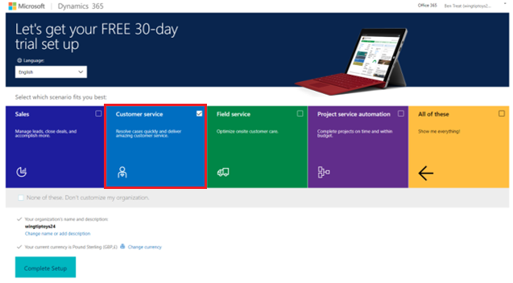

# Try Chat for Dynamics 365

[!INCLUDE[cc-use-with-omnichannel](../includes/cc-use-with-omnichannel.md)]

Chat for Dynamics 365 is an engagement channel that enables your agents to connect with customers in real-time. Chat can only be used if you have an active subscription of Dynamics 365 for Customer Service Enterprise or Dynamics 365 Customer Engagement Plan in your tenant.

You can sign-up for a free 30-day trial of Chat from the Microsoft 365 admin center only if you have a paid subscription of either Dynamics 365 for Customer Service Enterprise or Dynamics 365 Customer Engagement Plan that has been purchased directly through the Microsoft 365 Admin Center (that is, Web Direct channel). If you do not have one of these pre-requisite subscriptions, or if you have purchased these pre-requisite subscriptions through another channel then the option to try Chat will not be available.

You can also enable a free 30-day trial of Chat using the Dynamics 365 trial instance with Customer Service. You must be a global administrator to enable the trial.

This topic explains the steps to help you sign up for a trial of Chat for Dynamics 365.

> [!NOTE]
> For more information on the Chat license, pricing and pre-requisites, please refer to the Dynamics 365 licensing guide [here](https://go.microsoft.com/fwlink/p/?LinkId=866544).

## Start a trial using Microsoft 365 admin center

1. Go to <https://portal.office.com> and sign in with the global administrator credentials. 

2. Go to **Billing** > **Purchase Services**, and select **Add-ons**. 

  

  You'll see **Dynamics 365 for Customer Service Chat Trial** under **Add-on**. You must already have a paid license of either Customer Service Enterprise or Customer Engagement Plan in your tenant that was purchased directly through the Microsoft 365 Admin Center (that is, Web Direct channel), otherwise the **Dynamics 365 for Customer Service Chat Trial** option won't be visible.

  
    
You can start a 30-day trial of Chat with 25 user licenses. After signing up for a trial, you must assign licenses of Chat to the users who need to engage with customers and provide support via Chat. This can be done by selecting one or more active users and editing their product licenses. After you're done, select **Save**.

## Start a trial using Dynamics 365 trial instance

1. Go to <https://trials.dynamics.com>.

2. Select **Customer Service**.

3. Enter your work email and phone number, and then select **Get started**.

  

4. Sign-in with your global administrator credentials and accept the terms and privacy policy. The instance setup takes some time. If you already have a trial instance, see Step 6.

5. Select **Customer Service Hub** to open the application once it is setup.

6. If you already have a trial instance, you'll be asked to either join an existing organization or create your own trial. Select **Create your own trial** and then select **Create New Trial**.

  

  > [!NOTE]
  > The maximum number of allowed trial instances in a tenant is five. If you already have five trial instances in your tenant, you must delete one instance before creating a new trial.

7. Select **Customer service** and then select **Complete Setup**.

  

8. The newly created instance is displayed in Dynamics 365 Administration Center under the **Instances** tab.

### Get a Power BI (free) subscription

If you already have a subscription of Dynamics 365 Customer Engagement Plan or Power BI in your tenant, you can skip this step.

1. Go to <https://portal.office.com> and sign in with the global administrator credentials.
 
2. Go to **Billing** > **Purchase services**.
 
3. Search for Power BI (free) and complete the purchase of Power BI (free) subscription.

   subscription")

## Enable Chat in your organization

Once you have the subscription for Chat and assigned licenses to desired users, you can enable Chat in your organizations from Dynamics 365 admin center. 

In Dynamics 365 Administration Center, go to the **Applications** tab, select the **Omnichannel for Customer Service** application and select **Manage**. This will guide you to enable Chat within one or more organizations that you may have. 
For more information on provisioning channels through the Dynamics 365 admin center, see [Provision Omnichannel for Customer Service](administrator/omnichannel-provision-license.md).

## Configure Chat in your organization

Once Chat is enabled in your organization, you can sign in to Dynamics 365 organization, and select the Omnichannel Administration application to start configuring Chat. 
For more information on configuring Chat in Dynamics 365, see [Configure a chat channel](administrator/set-up-chat-widget.md).

### See also

[Provision Omnichannel for Customer Service](administrator/omnichannel-provision-license.md)  
[Configure a chat channel](administrator/set-up-chat-widget.md)
