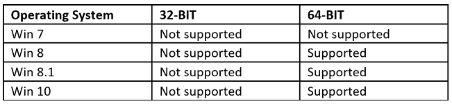

# Microsoft Dynamics 365 for Outlook software requirements
[!INCLUDE[pn_crm_for_outlook_short](../../includes/pn-crm-for-outlook-short.md)] works the way that you do by providing a seamless combination of [!INCLUDE[pn_microsoftcrm](../../includes/pn-microsoftcrm.md)] features in the familiar [!INCLUDE[pn_MS_Outlook_Short](../../includes/pn-ms-outlook-short.md)] environment. This section lists software requirements for [!INCLUDE[pn_crm_for_outlook_short](../../includes/pn-crm-for-outlook-short.md)] and [!INCLUDE[pn_crm_outlook_offline_access](../../includes/pn-crm-outlook-offline-access.md)].  
  
 One of the following operating systems is required:  
  
- [!INCLUDE[pn_windows_10](../../includes/pn-windows-10.md)] (64-bit and 32-bit versions)*  
  
- [!INCLUDE[pn_windows_8_1](../../includes/pn-windows-8-1.md)] or [!INCLUDE[pn_windows8](../../includes/pn-windows8.md)] (64-bit and 32-bit versions)  
  
- [!INCLUDE[pn_Windows_7](../../includes/pn-windows-7.md)] Service Pack 1 (64-bit and 32-bit versions) * Windows 7 does not support offline capabilities.
  
- [!INCLUDE[pn_windowsserver2012](../../includes/pn-windowsserver2012.md)] and [!INCLUDE[pn_windows_server_2012_r2](../../includes/pn-windows-server-2012-r2.md)] when running as a [!INCLUDE[pn_Remote_Desktop_Services](../../includes/pn-remote-desktop-services.md)] application  
  
*This feature is available only if your organization has updated to [!INCLUDE[pn_crm_online_2015_update_1_1](../../includes/pn-crm-online-2015-update-1-1.md)], [!INCLUDE[pn_crm_2015_update_0_2](../../includes/pn-crm-2015-update-0-2.md)] or [!INCLUDE[pn_dynamics_crm_online](../../includes/pn-dynamics-crm-online.md)].  
  
   
## Microsoft Dynamics 365 for Outlook software feature prerequisites  
 The following software must be installed and running on the computer before you run [!INCLUDE[pn_Microsoft_Dynamics_CRM_for_Outlook_Setup](../../includes/pn-microsoft-dynamics-crm-for-outlook-setup.md)]:  
  
 **Web Browser**. One of the following: 
  
- [!INCLUDE[pn_ie_11](../../includes/pn-ie-11.md)]  
  
- [!INCLUDE[pn_IE_10](../../includes/pn-ie-10.md)]  
  
> [!IMPORTANT]
>  [!INCLUDE[pn_IE_9](../../includes/pn-ie-9.md)] or earlier versions are not supported for use with [!INCLUDE[pn_crm_for_outlook_short](../../includes/pn-crm-for-outlook-short.md)].  
> 
>  You should add your [!INCLUDE[pn_crm_2016_shortest](../../includes/pn-crm-2016-shortest.md)] URL to Trusted sites in Internet Explorer. See [Troubleshooting: Unblock required URLs](../../admin/troubleshooting-unblock-urls-required.md). 
  
 **Microsoft Office**. One of the following:  
  
- [!INCLUDE[pn_microsoft_office_2016](../../includes/pn-microsoft-office-2016.md)]*  
  
- [!INCLUDE[pn_ms_office_2013_long](../../includes/pn-ms-office-2013-long.md)]  
  
- [!INCLUDE[pn_Microsoft_Office_2010](../../includes/pn-microsoft-office-2010.md)]  
  
  *This feature is available only if your organization has updated to [!INCLUDE[pn_crm_online_2015_update_1_1](../../includes/pn-crm-online-2015-update-1-1.md)], [!INCLUDE[pn_crm_2015_update_0_2](../../includes/pn-crm-2015-update-0-2.md)] or [!INCLUDE[pn_dynamics_crm_online](../../includes/pn-dynamics-crm-online.md)].  
  
> [!IMPORTANT]
>  [!INCLUDE[pn_crm_for_outlook_short](../../includes/pn-crm-for-outlook-short.md)] isn’t supported with Office for Mac versions of [!INCLUDE[pn_MS_Outlook_Full](../../includes/pn-ms-outlook-full.md)].  
> 
>  To install and run the 64-bit version of [!INCLUDE[pn_crm_for_outlook_short](../../includes/pn-crm-for-outlook-short.md)], a 64-bit version of [!INCLUDE[pn_MS_Office](../../includes/pn-ms-office.md)] is required.  
> 
>  Before you run the [!INCLUDE[pn_configuration_wizard](../../includes/pn-configuration-wizard.md)] to configure [!INCLUDE[pn_crm_for_outlook_short](../../includes/pn-crm-for-outlook-short.md)], a [!INCLUDE[pn_MS_Outlook_Full](../../includes/pn-ms-outlook-full.md)] profile must exist for the user. Therefore, [!INCLUDE[pn_MS_Outlook_Short](../../includes/pn-ms-outlook-short.md)] must be run at least once to create the user's [!INCLUDE[pn_MS_Outlook_Short](../../includes/pn-ms-outlook-short.md)] profile.  
> 
>  Both the web application and [!INCLUDE[pn_crm_for_outlook_short](../../includes/pn-crm-for-outlook-short.md)] require [!INCLUDE[pn_JavaScript](../../includes/pn-javascript.md)] enabled for certain features, such as Activity Feeds, dashboard areas, and the display of certain panes or menus. Although the web application displays error messages when [!INCLUDE[pn_JavaScript](../../includes/pn-javascript.md)] is disabled, [!INCLUDE[pn_crm_for_outlook_short](../../includes/pn-crm-for-outlook-short.md)] doesn’t. To verify if [!INCLUDE[pn_JavaScript](../../includes/pn-javascript.md)] is enabled in [!INCLUDE[pn_Internet_Explorer](../../includes/pn-internet-explorer.md)], start [!INCLUDE[pn_Internet_Explorer](../../includes/pn-internet-explorer.md)], on the **Tools** menu click or tap **Internet options**. On the **Security** tab, click or tap **Internet**, and then click or tap **Custom level**. In the **Security Settings** dialog box under **Scripting**, **Active scripting** must be set to **Enable**.  
> 
>  The [!INCLUDE[pn_Indexing_Service](../../includes/pn-indexing-service.md)] (now known as the Windows Search Service, or WSS) is required by users who will set up and use [!INCLUDE[pn_crm_for_outlook_short](../../includes/pn-crm-for-outlook-short.md)] and its Help file in offline mode.  
  
 **Dynamics 365 apps**. One of the following editions of [!INCLUDE[pn_microsoftcrm](../../includes/pn-microsoftcrm.md)] must be available so that [!INCLUDE[pn_crm_for_outlook_short](../../includes/pn-crm-for-outlook-short.md)] can connect to it:  
  
- On-premises editions of [!INCLUDE[pn_microsoftcrm](../../includes/pn-microsoftcrm.md)] Server  
  
- [!INCLUDE[pn_CRM_Online](../../includes/pn-crm-online.md)]  
  
   
### Additional Microsoft Dynamics 365 for Outlook software requirements  
 If needed, the following software will be installed by [!INCLUDE[pn_Microsoft_Dynamics_CRM_for_Outlook_Setup](../../includes/pn-microsoft-dynamics-crm-for-outlook-setup.md)]:  
  
- [!INCLUDE[pn_ms_sql_2012_express](../../includes/pn-ms-sql-2012-express.md)]  
  
  > [!NOTE]
  >  Installed from [!INCLUDE[pn_crm_outlook_offline_access](../../includes/pn-crm-outlook-offline-access.md)] only.  
  
- Microsoft .NET Framework 4.6.2.  
  
- Microsoft Windows Installer 4.5.  
  
- Microsoft Visual C++ Redistributable.  
  
- Microsoft Report Viewer 2010.  
  
- [!INCLUDE[pn_Microsoft_Application_Error_Reporting](../../includes/pn-microsoft-application-error-reporting.md)].  
  
- [!INCLUDE[pn_Windows_Identity_Framework_(WIF)](../../includes/pn-windows-identity-framework-wif.md)].  
  
- [!INCLUDE[pn_Azure_AppFabric_SDK](../../includes/pn-azure-appfabric-sdk.md)].  
  
- Microsoft SQL Server Native Client.  
  
- Microsoft SQL Server Compact 4.0.  
  
- Reporting Services Microsoft ActiveX control. If not installed on the computer, the user will be prompted to install the software at first attempt to print a report. This installer package is named RSClientPrint.cab and can found on the [!INCLUDE[pn_SQL_Server_Reporting](../../includes/pn-sql-server-reporting.md)] server at \<drive>:\Program files\Microsoft SQL Server\\<MSSQL\>\Reporting Services\ReportServer\bin.  

 > [!NOTE]
  >  Dynamics 365 for Outlook is not supported when remote Proxy Auto-Configuration (PAC) files are used.

### Offline Support

The following operating systems are supported for offline mode.

  

  
### See Also  
 [Dynamics 365 for Outlook support matrixes](support.md)   
 [Compatibility with Microsoft Dynamics CRM 2016](https://support.microsoft.com/kb/3124955)   
 [Compatibility with Microsoft Dynamics CRM 2015](https://support.microsoft.com/kb/3018360)   
 [Compatibility with Microsoft Dynamics CRM 2013](https://support.microsoft.com/kb/3005167)

[!INCLUDE[footer-include](../../includes/footer-banner.md)]