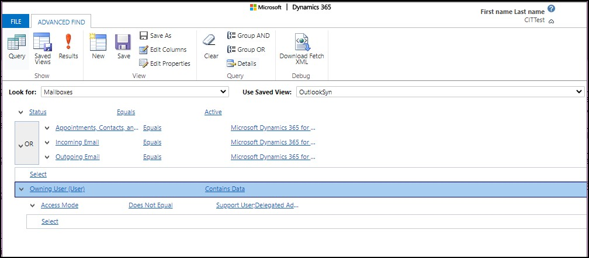

# Dynamics 365 for Outlook support
This topic contains links to information about the supported software requirements for [!INCLUDE[pn_microsoft_dynamics_crm_for_outlook](../../includes/pn-microsoft-dynamics-crm-for-outlook.md)].  
  
> [!IMPORTANT]
>  For [!INCLUDE[pn_microsoftcrm](../../includes/pn-microsoftcrm.md)] applications, we recommend using the latest version and service pack (SP) for all required components, such as [!INCLUDE[pn_Windows_Server](../../includes/pn-windows-server.md)], [!INCLUDE[pn_MS_SQL_Server](../../includes/pn-ms-sql-server.md)], [!INCLUDE[pn_MS_Office](../../includes/pn-ms-office.md)], [!INCLUDE[pn_Internet_Explorer](../../includes/pn-internet-explorer.md)], and [!INCLUDE[pn_Exchange_Server_full](../../includes/pn-exchange-server-full.md)]. In some cases, there might be a delay between the availability of a component update and support for the update in [!INCLUDE[pn_crm_shortest](../../includes/pn-crm-shortest.md)] applications. However, you should always apply the latest update for [!INCLUDE[pn_microsoftcrm](../../includes/pn-microsoftcrm.md)] to fully support the latest version of a required component.  
  
 [!INCLUDE[cc_up_to_date_crm_2016_info](../../includes/cc-up-to-date-crm-2016-info.md)]  
  
 [!INCLUDE[cc_up_to_date_crm_2015_info](../../includes/cc-up-to-date-crm-2015-info.md)]  
  
 [!INCLUDE[cc_up_to_date_crm_2013_info](../../includes/cc-up-to-date-crm-2013-info.md)]  
  
> [!NOTE]
>  Supported configurations and requirements for [!INCLUDE[pn_dyn_365](../../includes/pn-dyn-365.md)] features are listed throughout our documentation. Specific configurations not documented should be  considered unsupported.  
  
   
## Microsoft Office  
 For versions of [!INCLUDE[pn_MS_Office](../../includes/pn-ms-office.md)] that are supported for [!INCLUDE[pn_crm_for_outlook_short](../../includes/pn-crm-for-outlook-short.md)], see [Microsoft Dynamics 365 for Outlook software requirements](software-requirements.md).  
  
   
## Microsoft Windows  
 For versions of [!INCLUDE[pn_ms_Windows_long](../../includes/pn-ms-windows-long.md)]that are supported for [!INCLUDE[pn_crm_for_outlook_short](../../includes/pn-crm-for-outlook-short.md)], see [Microsoft Dynamics 365 for Outlook software requirements](software-requirements.md).  
  
## Find users that are using the Outlook COM add-in in your environment
 If you are not sure which users are accessing the add-in, you can use Advanced Find to query **Mailboxes** entity. This will identify the users currently configured to use Outlook COM add-in.
 
 The advanced find query on mailboxes should filter on whether the mailbox has Microsoft Dynamics 365 for Outlook as the synchronization method for **Incoming email** or **Outgoing email** or **Appointments**, **Contacts**, and **Tasks**. 
Subsequently, you should filter out **Owning User (User)**, if it contains data and if the **Access Mode** is not configured to **Support User** or **Delegated Admin**.

1. On the command bar, the select **Advanced Find** button .
2. The screenshot illustrates the filter criteria.

   > [!div class="mx-imgBorder"] 
   > 
 
 
 

### See Also  
 [Microsoft Dynamics 365 for Outlook hardware requirements](hardware-requirements.md)   

[!INCLUDE[footer-include](../../includes/footer-banner.md)]