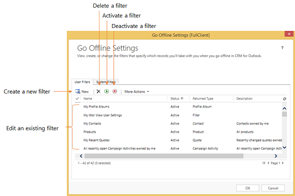

# Choose records to work with offline in Dynamics 365 for Outlook
Choose a subset of [!INCLUDE[pn_microsoftcrm](../../includes/pn-microsoftcrm.md)] data to take with you when you go offline with [!INCLUDE[pn_microsoft_dynamics_crm_for_outlook](../../includes/pn-microsoft-dynamics-crm-for-outlook.md)] by using offline synchronization filters. By default, these filters copy the appointments, contacts, and tasks records you own to your local drive. You might want to modify the filters to take a smaller subset of data with you or to synchronize particular records. For example, you might want to synchronize all reports since reports you don’t own wouldn’t normally be synchronized.  
  
 You can modify the existing filters or create new filters. You can also delete, deactivate, or activate filters. You can reset the filters every time you go offline.  
  
> [!TIP]
>  To synchronize data and go online and offline more quickly, you can decrease the interval for automatic synchronization. [!INCLUDE[proc_more_information](../../includes/proc-more-information.md)] [Set personal options that affect tracking and synchronization between Dynamics 365 apps and Outlook or Exchange](set-personal-options-affect-tracking-synchronization-exchange.md)  
  
## Create or modify offline synchronization filters  
  
1. Do one of the following:  
  
   -   In the web app:  
  
       -   Choose the  **Options** button  in the upper-right corner of the window, and then choose **Options**.  
  
       -   In the **Set Personal Options** dialog box, choose the **Synchronize** tab.  
  
   -   In Dynamics 365 for Outlook:  
  
       -   On the **File** menu, choose **Dynamics 365 apps**.  
  
       -   Choose **Options**, and then in the **Set Personal Options** dialog box, choose the **Synchronize** tab.  
  
2. Under **Manage your offline filters and take your information offline in [!INCLUDE[pn_crm_for_outlook_short](../../includes/pn-crm-for-outlook-short.md)]**, choose the **offline filters** link.  
  
    [!INCLUDE[pn_crm_shortest](../../includes/pn-crm-shortest.md)] displays the **Go Offline Settings** dialog box with the **User Filters** tab selected. You can use this tab to create or edit a filter, or to delete, activate, or deactivate a filter.  
  
      
  
   > [!NOTE]
   >  If you’re a system administrator, you can create or modify organization-wide filters (system filters) through the SDK. [!INCLUDE[proc_more_information](../../includes/proc-more-information.md)] [MSDN: Tell me more about system filters](/previous-versions/dynamicscrm-2016/developers-guide/gg328205(v=crm.8))  
  
3. Do one of the following:  
  
   -   To open an existing filter, choose the filter.  
  
   -   To create a new filter, choose **New**.  
  
## Creating or modifying filter criteria  
 You use a criteria row to create or modify criteria in an offline synchronization filter. Each criteria row contains three values: the field to use in the filter (for example, **City**), an operator (for example, **Equals** or **Contains**), and the value to filter on (for example, **WA**).  
  
   
  
### Add a criteria row  
  
1.  In the **Look for** list, select a record type.  
  
2.  Point to **Select** in the criteria grid, and then select the field to filter on from the list.  
  
3.  Select an operator from the list.  
  
4.  Enter a value to filter on.  
  
### Group rows of criteria  
  
1. For each row you want to group, choose the **down arrow** to the left of the field name, and then choose **Select Row**.  
  
    To remove a row from a group, choose the **down arrow** to the left of the field name, and then choose **Delete**. To clear all rows from the criteria grid, choose **Clear**.  
  
2. Choose **Group AND** or **Group OR**.  
  
   After creating a group, you can click the down arrow next to the **And** or **Or** to select from different options. You can select a group, ungroup the group, change a Group AND to a Group OR or vice versa, add a clause, or delete a group.  
  
     
  
### See also  
 [Choose the records to synchronize between Dynamics 365 apps and Outlook or Exchange](choose-records-synchronize-exchange.md)   
 [Frequently asked questions about synchronizing records between Microsoft Dynamics 365 apps and Microsoft Outlook](frequently-asked-questions-synchronizing-records.md)

[!INCLUDE[footer-include](../../includes/footer-banner.md)]