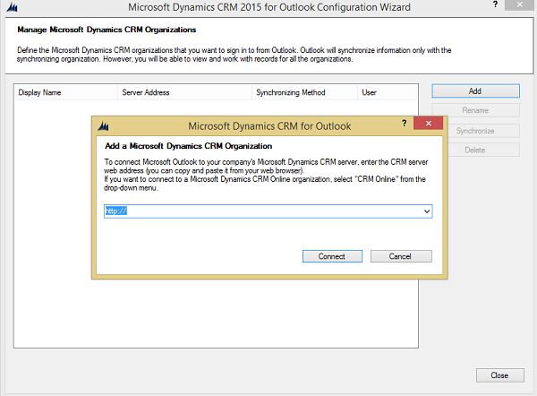

# Configure another organization to use with Dynamics 365 for Outlook
If you’re a member of more than one [!INCLUDE[pn_microsoftcrm](../../includes/pn-microsoftcrm.md)] organization, and you’re using [!INCLUDE[pn_crm_2015_outlook](../../includes/pn-crm-2015-outlook.md)] or later, you can use this procedure to configure each organization.  
  
1. Close [!INCLUDE[pn_Outlook_short](../../includes/pn-outlook-short.md)].  
  
2. Do one of the following:  
  
   - In [!INCLUDE[pn_windows8](../../includes/pn-windows8.md)] or [!INCLUDE[pn_windows_10](../../includes/pn-windows-10.md)], choose **Start**, search for **Configuration Wizard**, and then press **Enter**.  
  
   - In earlier versions of [!INCLUDE[pn_ms_Windows_short](../../includes/pn-ms-windows-short.md)], choose **Start**, point to **All Programs**, choose **[!INCLUDE[pn_crm_2015](../../includes/pn-crm-2015.md)]** or **[!INCLUDE[pn_crm_2016](../../includes/pn-crm-2016.md)]**> **[!INCLUDE[pn_configuration_wizard](../../includes/pn-configuration-wizard.md)]**.  
  
3. In the **Microsoft Dynamics CRM 2015 for Outlook Configuration Wizard** or **Microsoft Dynamics 365 apps 2016 for Outlook Configuration Wizard** dialog box, choose the **Add** button to add a new organization.  
  
    You’ll see the following (or similar) dialog box:  
  
      
  
4. Do one of the following:  
  
   - If you’re using [!INCLUDE[pn_crm_online_shortest](../../includes/pn-crm-online-shortest.md)], select **[!INCLUDE[pn_crm_online_shortest](../../includes/pn-crm-online-shortest.md)]** from the list.  
  
   - If you’re using [!INCLUDE[pn_crm_2015_shortest](../../includes/pn-crm-2015-shortest.md)] on-premises or later version, open a browser, log in to your [!INCLUDE[pn_crm_shortest](../../includes/pn-crm-shortest.md)] organization’s website, copy the URL address (copy the whole address) from the address bar, and then paste it in the **Add a [!INCLUDE[pn_microsoftcrm](../../includes/pn-microsoftcrm.md)] Organization** dialog box.  
  
5. Choose **Connect**.  
  
6. If prompted, enter your credentials.  
  
7. Repeat steps 2 through 5 for each organization you want to add.  
  
8. If you want to change the organization that synchronizes email messages, appointments, contacts, and tasks, select the row for the organization, and then choose **Synchronize**.  
  
    When you’re prompted about whether you want to change your synchronizing or primary organization, choose **OK**.  
  
   > [!NOTE]
   >  You can synchronize information with only one organization. You can connect to or work with more than one organization. If you connect to more than one organization, they are both listed in the [!INCLUDE[pn_crm_for_outlook_short](../../includes/pn-crm-for-outlook-short.md)] Navigation Pane.  
  
9. Choose **OK**.  
  
10. In the wizard, choose **Close**.  
  
### See also  
 [Do your Dynamics 365 apps work in Outlook using Dynamics 365 for Outlook](dynamics-365-work-outlook.md)   
 [Frequently asked questions about synchronizing records between Microsoft Dynamics 365 apps and Microsoft Outlook](frequently-asked-questions-synchronizing-records.md)   
 [Set personal options that affect tracking and synchronization between Dynamics 365 apps and Outlook or Exchange](set-personal-options-affect-tracking-synchronization-exchange.md)

[!INCLUDE[footer-include](../../includes/footer-banner.md)]