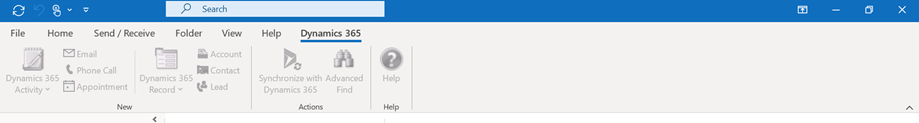
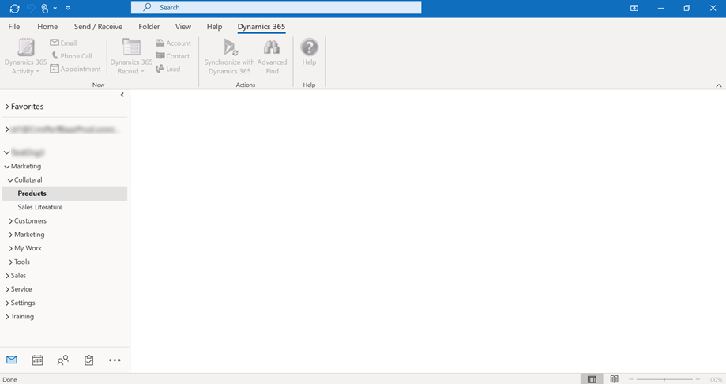
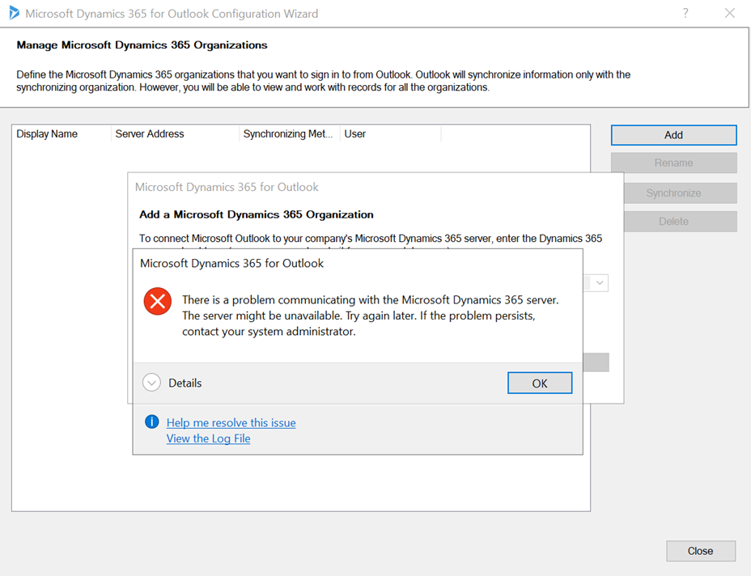

# Dynamics 365 for Outlook User Guide

> [!IMPORTANT]
> Effective October 1 2020, the legacy Dynamics 365 for Outlook (also referred to as Outlook COM add-in) is retired. Customers must transition to the modern [Dynamics 365 App for Outlook](../../outlook-app/overview.md) at the earliest. Microsoft will not provide support or any further updates (including security and critical updates) to the Outlook COM Add-in.
> 
> Starting December 4, 2020 the legacy Dynamics 365 for Outlook (also referred to as Outlook COM add-in) will be removed and users will no longer be able to use Outlook COM add-in. This removal will happen by geographic location and follows the weekly release schedule.
>
> For more information and steps to make a smooth transition, download [Dynamics 365 for Outlook (COM add-in) Playbook](https://aka.ms/OutlookCOMPlaybook).

- For [!INCLUDE[pn_crm_8_2_0_both](../../includes/pn-crm-8-2-0-both.md)] and later releases, the preferred way to use [!INCLUDE[pn_crm_2016](../../includes/pn-crm-2016.md)] together with [!INCLUDE[pn_MS_Outlook_Short](../../includes/pn-ms-outlook-short.md)] is to use [!INCLUDE[pn_dyn_365_app_outlook](../../includes/pn-dyn-365-app-outlook.md)], a [!INCLUDE[pn_MS_Office](../../includes/pn-ms-office.md)] add-in. [!INCLUDE[proc_more_information](../../includes/proc-more-information.md)] [Dynamics 365 App for Outlook User's Guide](../../outlook-app/dynamics-365-app-outlook-user-s-guide.md). 
- Configuring [!INCLUDE[pn_dyn_365_app_outlook](../../includes/pn-dyn-365-app-outlook.md)] and [!INCLUDE[pn_crm_for_outlook_short](../../includes/pn-crm-for-outlook-short.md)] for the same Dynamics 365 user is not supported.
- When using Dynamics 365 online for Outlook version 9.0 in offline mode, attachments to synchronized records will not be available in offline mode. If there is an attachment to a record, the attachment will only be available when you are back online. If you added an attachment to a record in offline mode, the attachment will be synchronized to the server when you are back online. To use attachments in offline mode, consider saving the attachment your device.
- The offline capability in [!INCLUDE[pn_crm_for_outlook_short](../../includes/pn-crm-for-outlook-short.md)] version 9.0 isn't available in Dynamics 365 Customer Engagement (on-premises).

## Dynamics 365 for Outlook is retired and removed

Starting December 4, 2020 the legacy Dynamics 365 for Outlook (also referred to as Outlook COM add-in) will be removed and users will no longer be able to use Outlook COM add-in. This removal will happen by geographic location and follows the weekly release schedule.

Once the service is removed, users need to manually uninstall the add-in. Users will be able to launch the Outlook COM add-in, however none of any features will work.

Existing Outlook COM add-in users will experience the following behavior:

  - Dynamics 365 ribbon is disabled.

    > [!div class="mx-imgBorder"]
    >

  - Dynamics 365 org folders show empty pages.

    > [!div class="mx-imgBorder"]
    >

 - You’ll not be able configure new mailboxes in Outlook COM add-in. Adding a Dynamics 365 Organization will show the below message:

   > [!div class="mx-imgBorder"]
   >

## Privacy notices  
 [!INCLUDE[cc_privacy_crm_outlook1](../../includes/cc-privacy-crm-outlook1.md)]  
  
 [!INCLUDE[cc_privacy_crm_go_offline_in_outlook](../../includes/cc-privacy-crm-go-offline-in-outlook.md)]  
  
 [!INCLUDE[cc_privacy_crm_sync_to_outlook](../../includes/cc-privacy-crm-sync-to-outlook.md)]  

[!INCLUDE[footer-include](../../includes/footer-banner.md)]