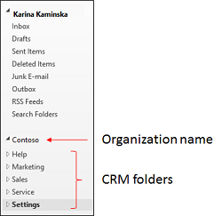
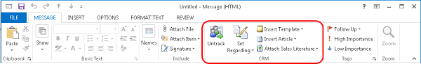
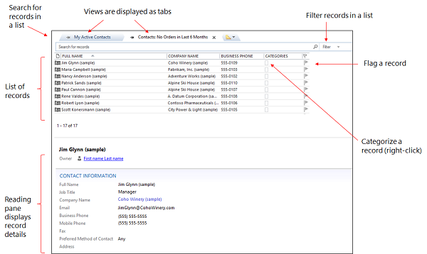

# Do your Dynamics 365 apps work in Outlook using Dynamics 365 for Outlook
If you’re like many people, you use [!INCLUDE[pn_MS_Outlook_Short](../../includes/pn-ms-outlook-short.md)] as your communications, scheduling, and contact management hub for business. You can continue to use the familiar [!INCLUDE[pn_Outlook_short](../../includes/pn-outlook-short.md)] interface and integrate [!INCLUDE[pn_microsoftcrm](../../includes/pn-microsoftcrm.md)] at the same time by using [!INCLUDE[pn_microsoft_dynamics_crm_for_outlook](../../includes/pn-microsoft-dynamics-crm-for-outlook.md)], an [!INCLUDE[pn_Outlook_short](../../includes/pn-outlook-short.md)] client provided by [!INCLUDE[pn_microsoftcrm](../../includes/pn-microsoftcrm.md)].  

## What Dynamics 365 for Outlook offers
 When you use [!INCLUDE[pn_crm_for_outlook_short](../../includes/pn-crm-for-outlook-short.md)], you can access all the [!INCLUDE[pn_crm_shortest](../../includes/pn-crm-shortest.md)] core functionality directly from [!INCLUDE[pn_Outlook_short](../../includes/pn-outlook-short.md)]. [!INCLUDE[pn_crm_for_outlook_short](../../includes/pn-crm-for-outlook-short.md)] also provides extra functionality that isn’t available in the web client. For example, you can:

- Track [!INCLUDE[pn_Outlook_short](../../includes/pn-outlook-short.md)] email, appointments, contacts, and tasks. When you track a record in [!INCLUDE[pn_crm_for_outlook_short](../../includes/pn-crm-for-outlook-short.md)], a copy of that record is “pushed” to [!INCLUDE[pn_crm_shortest](../../includes/pn-crm-shortest.md)] and the two records are synchronized. After a record is tracked, you can update it in [!INCLUDE[pn_crm_for_outlook_short](../../includes/pn-crm-for-outlook-short.md)] or in [!INCLUDE[pn_crm_shortest](../../includes/pn-crm-shortest.md)]. Tracking provides a great way to keep your personal information separate from your business information, because only the information you manually track is pushed to [!INCLUDE[pn_crm_shortest](../../includes/pn-crm-shortest.md)]. [!INCLUDE[pn_crm_for_outlook_short](../../includes/pn-crm-for-outlook-short.md)] also automatically synchronizes records you own from [!INCLUDE[pn_crm_shortest](../../includes/pn-crm-shortest.md)] to [!INCLUDE[pn_crm_for_outlook_short](../../includes/pn-crm-for-outlook-short.md)]. [!INCLUDE[proc_more_information](../../includes/proc-more-information.md)] [Overview of tracking records in Dynamics 365 for Outlook](overview-tracking-records.md)

- Apply [!INCLUDE[pn_crm_shortest](../../includes/pn-crm-shortest.md)] email templates, or attach sales literature and Knowledge Base articles from [!INCLUDE[pn_crm_shortest](../../includes/pn-crm-shortest.md)] when you are sending an [!INCLUDE[pn_Outlook_short](../../includes/pn-outlook-short.md)] email message to customers.

- Take advantage of native [!INCLUDE[pn_Outlook_short](../../includes/pn-outlook-short.md)] functionality to customize views of [!INCLUDE[pn_crm_shortest](../../includes/pn-crm-shortest.md)] data. For example, you can sort, filter, format, group, and categorize views the same way you manage views in [!INCLUDE[pn_Outlook_short](../../includes/pn-outlook-short.md)], and you can open multiple views at once. You can also add conditional formatting and set follow-ups.

- Access your [!INCLUDE[pn_crm_shortest](../../includes/pn-crm-shortest.md)] data on the go by working in offline mode. [!INCLUDE[pn_crm_for_outlook_short](../../includes/pn-crm-for-outlook-short.md)] provides offline synchronization filters that you can modify before you go offline so you take just the data you need with you. When you’re offline, changes are stored to your local drive. When you go back online, [!INCLUDE[pn_crm_for_outlook_short](../../includes/pn-crm-for-outlook-short.md)] automatically synchronizes the data again with the [!INCLUDE[pn_crm_shortest](../../includes/pn-crm-shortest.md)] server. [!INCLUDE[proc_more_information](../../includes/proc-more-information.md)] [Work offline with Dynamics 365 for Outlook](work-offline-dynamics-365-outlook.md)

- Create [!INCLUDE[cc_Microsoft](../../includes/cc-microsoft.md)][!INCLUDE[pn_ms_Word_short](../../includes/pn-ms-word-short.md)] mail-merge documents to send form letters or form email messages to contacts, accounts, or marketing mailing lists. You can also use mail merge to create faxes and quotes. [!INCLUDE[proc_more_information](../../includes/proc-more-information.md)] [Create a Microsoft Word mail-merge document with Dynamics 365 for Outlook](create-word-mail-merge-document.md)

> [!NOTE]
>  If people in your organization share the same computer by using different user accounts, each person can install and use [!INCLUDE[pn_crm_for_outlook_short](../../includes/pn-crm-for-outlook-short.md)] for their own account.

## Explore Dynamics 365 for Outlook
 When you [Install Dynamics 365 for Outlook](../../customerengagement/on-premises/basics/basics-guide.md), the software adds several user interface elements to your [!INCLUDE[pn_Outlook_short](../../includes/pn-outlook-short.md)] screen.

 **Navigation pane**

 You’ll see a folder for your organization in the navigation pane on the left side of the screen. Under your organization name, you’ll see a list of Dynamics 365 apps folders. Use these folders to navigate to your area and open different record types.  

 

 If you connect to more than one organization, you’ll see a separate folder for each organization in the navigation pane.

 **Ribbon**

 You access commands in [!INCLUDE[pn_crm_for_outlook_short](../../includes/pn-crm-for-outlook-short.md)] through the ribbon. The ribbon displays different buttons and features depending on context. For example, if you view a list of opportunities, the ribbon displays buttons that apply to opportunities. For appointments, contacts, and tasks, you’ll see a special **[!INCLUDE[pn_crm_shortest](../../includes/pn-crm-shortest.md)]** section on the ribbon.

   

 **Lists, views, and the reading pane**

 When you use the navigation pane to open a folder for a type of record (Accounts, for example), you’ll see a list of records. The list is determined by the view you’re in and any search criteria or filter you have applied.

 When you select a record in a list, the details for that record are displayed in the reading pane below the list. Data in the reading pane is read only—it’s a quick way to view the contents of a record. If you want to edit the data in [!INCLUDE[pn_crm_shortest](../../includes/pn-crm-shortest.md)], just double-click the record in the list.

 

 You can change the location of the reading pane or turn it off or on. You can also customize what you see in the reading pane. [!INCLUDE[proc_more_information](../../includes/proc-more-information.md)] [Customize the Reading Pane in Dynamics 365 for Outlook](customize-reading-pane.md)

## What Outlook features are unavailable in Dynamics 365 for Outlook?
 [!INCLUDE[pn_microsoftcrm](../../includes/pn-microsoftcrm.md)] uses standard [!INCLUDE[pn_Internet_Explorer](../../includes/pn-internet-explorer.md)] controls, so some [!INCLUDE[pn_Outlook_short](../../includes/pn-outlook-short.md)] features are unavailable in [!INCLUDE[pn_crm_for_outlook_short](../../includes/pn-crm-for-outlook-short.md)]. Use the workarounds in the following table for features that aren’t available.

|                                     Feature                                     |                                                                                                                                      Workaround                                                                                                                                       |
|---------------------------------------------------------------------------------|---------------------------------------------------------------------------------------------------------------------------------------------------------------------------------------------------------------------------------------------------------------------------------------|
|                                Email signatures                                 |                                                                            Use a global email template or use native email signatures in [!INCLUDE[pn_Outlook_short](../../includes/pn-outlook-short.md)].                                                                            |
|                           Full-text editing features                            |                                                                           Use standard editing controls. For example, press **Enter** for double-spaced lines and **Shift+Enter** for single-spaced lines.                                                                            |
|                          Attach files during creation                           |                                                                                                                    Save an email activity before attaching files.                                                                                                                     |
|                     Move records by dragging and dropping.                      |                                                                                       There’s no workaround for dragging and dropping records. Dragging and dropping records causes data loss.                                                                                        |
|                                    Reminders                                    | After synchronization with [!INCLUDE[pn_Outlook_short](../../includes/pn-outlook-short.md)], 15-minute reminders are created for appointments and service activities created in the [!INCLUDE[pn_microsoftcrm](../../includes/pn-microsoftcrm.md)] folders or in the web application. |
| [!INCLUDE[pn_microsoftcrm](../../includes/pn-microsoftcrm.md)] Service calendar |                                                         The [!INCLUDE[pn_crm_shortest](../../includes/pn-crm-shortest.md)] Service calendar isn’t available by default, but you can ask your system administrator to add it.                                                          |

### See also  
 [Overview of tracking records in Dynamics 365 for Outlook](overview-tracking-records.md)   
 [Work offline with Dynamics 365 for Outlook](work-offline-dynamics-365-outlook.md)   
 [Create a Microsoft Word mail-merge document with Dynamics 365 for Outlook](create-word-mail-merge-document.md)   
 [Customize the Reading Pane in Dynamics 365 for Outlook](customize-reading-pane.md)   
 [Frequently asked questions about synchronizing records between Microsoft Dynamics 365 apps and Microsoft Outlook](frequently-asked-questions-synchronizing-records.md)   

[!INCLUDE[footer-include](../../includes/footer-banner.md)]