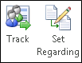
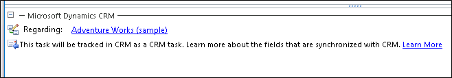
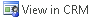
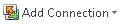
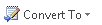
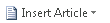
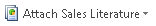

# Overview of tracking records in Dynamics 365 for Outlook
You can use [!INCLUDE[pn_microsoft_dynamics_crm_for_outlook](../../includes/pn-microsoft-dynamics-crm-for-outlook.md)] to track email messages, contacts, tasks, and appointments. When you track an email message, contact, task, or appointment record, a copy of that record is saved as an activity in [!INCLUDE[pn_microsoftcrm](../../includes/pn-microsoftcrm.md)] and synchronized with the [!INCLUDE[pn_Outlook_short](../../includes/pn-outlook-short.md)] record. You can then view and edit that record in [!INCLUDE[pn_crm_for_outlook_short](../../includes/pn-crm-for-outlook-short.md)] or [!INCLUDE[pn_crm_shortest](../../includes/pn-crm-shortest.md)]. If you sync [!INCLUDE[pn_Outlook_short](../../includes/pn-outlook-short.md)] on your mobile device, you can also access these records on that device.

 Tracking records in Dynamics 365 for Outlook is a manual process. This gives you the ability to keep your personal Outlook records separate from your Dynamics 365 apps records.  

> [!TIP]
> - If you want, you can set an option to track email automatically. [!INCLUDE[proc_more_information](../../includes/proc-more-information.md)] [Set an option to automatically track incoming Outlook email in Dynamics 365 for Outlook](set-option-automatically-track-incoming-outlook-email.md)
> - If your organization synchronizes records through server-side synchronization, you can track email messages through folder tracking. Folder tracking is a powerful and intuitive way to track email directly from virtually any device. [!INCLUDE[proc_more_information](../../includes/proc-more-information.md)] [Track Outlook email by moving it to a tracked Exchange folder](track-outlook-email-by-moving-it-tracked-exchange-folder.md).

## Using the Track button vs. the Set Regarding button
 To track a record in [!INCLUDE[pn_crm_for_outlook_short](../../includes/pn-crm-for-outlook-short.md)], you click or tap the **Track** button or the **Set Regarding** button for the record you want to track.

   

 You can use either button to track a record, but it’s almost always better to use the **Set Regarding** button. When you use the **Set Regarding** button, you can link an email message, appointment, or task to a specific [!INCLUDE[pn_crm_shortest](../../includes/pn-crm-shortest.md)] record such as an account or opportunity, or even a custom record type (entity). Some organizations also use the **Set Regarding** button to track projects.

## Using the tracking pane
 When a record is tracked, a [!INCLUDE[pn_microsoftcrm](../../includes/pn-microsoftcrm.md)] pane (also known as the “tracking pane”) appears at the bottom of the record. This pane shows:

- Whether the item is tracked

- The regarding record, if set

- The name of the parent account for contacts, if set

- Links to [!INCLUDE[pn_crm_shortest](../../includes/pn-crm-shortest.md)] records for email recipients. This is very useful when you want to quickly access the [!INCLUDE[pn_crm_shortest](../../includes/pn-crm-shortest.md)] contact record of an email recipient or see other information stored in [!INCLUDE[pn_crm_shortest](../../includes/pn-crm-shortest.md)].

- Related records, along with a symbol that identifies the record type in [!INCLUDE[pn_crm_shortest](../../includes/pn-crm-shortest.md)]

- Whether email addresses, names, or distribution lists in an email message are [!INCLUDE[pn_crm_shortest](../../includes/pn-crm-shortest.md)] records

  For example, the following screen shot shows the tracking pane for a tracked task linked to the Adventure Works account:

    

  You can open the regarding record, parent record for a contact, or related records directly from the tracking pane. The tracking pane also includes an **Options** button that provides quick access to personal tracking options.

> [!NOTE]
>  If you track an email message without first expanding a distribution list, the tracking pane displays the name of the distribution list. To track the individual email addresses, expand the distribution list before you track the message.

## What can you do after you track a record?
 After you track a record, you can use the buttons on the [!INCLUDE[pn_crm_for_outlook_short](../../includes/pn-crm-for-outlook-short.md)] ribbon to do the following tasks.

|                                                                                                                                                   |                                                                                                                                                             |                                          |
|---------------------------------------------------------------------------------------------------------------------------------------------------|-------------------------------------------------------------------------------------------------------------------------------------------------------------|------------------------------------------|
|                                                                **To do this task**                                                                |                                                                         **Choose**                                                                          |              **Applies to**              |
|                            Open the record directly in [!INCLUDE[pn_crm_shortest](../../includes/pn-crm-shortest.md)]                             |                       | Email, appointments, contacts, and tasks |
| Add a connection between the record and any [!INCLUDE[pn_crm_shortest](../../includes/pn-crm-shortest.md)] record capable of tracking connections |                             | Email, appointments, contacts, and tasks |
|                Convert the record into a [!INCLUDE[pn_crm_shortest](../../includes/pn-crm-shortest.md)] opportunity, lead, or case                |                                            |      Email, appointments, and tasks      |
|                                 Insert a [!INCLUDE[pn_crm_shortest](../../includes/pn-crm-shortest.md)] template                                  |                                                                      |                  Email                   |
|                          Insert a [!INCLUDE[pn_crm_shortest](../../includes/pn-crm-shortest.md)] Knowledge base article                           |                             |                  Email                   |
|                              Attach [!INCLUDE[pn_crm_shortest](../../includes/pn-crm-shortest.md)] sales literature                               |  |                  Email                   |

> [!TIP]
>  If these buttons aren’t available, it may be that the record marked to be tracked isn’t synchronized yet. This can happen if your organization uses server-side synchronization to synchronize email, appointments, contacts, and tasks, but the synchronization hasn’t happened yet. If the **View in Dynamics 365 apps** button is enabled, the record has been synchronized. You can also use the tracking pane (as described previously) to determine whether the record has been synchronized.  

## Other things to know about tracking records

- **Using multiple computers.** You can use multiple computers to track items using [!INCLUDE[pn_crm_for_outlook_short](../../includes/pn-crm-for-outlook-short.md)]. For example, you might use a desktop computer and a laptop. Only one computer can be the synchronizing computer, however. Changes or updates to synchronized records will not show up in [!INCLUDE[pn_crm_shortest](../../includes/pn-crm-shortest.md)] if the synchronizing computer is not connected to the [!INCLUDE[pn_crm_shortest](../../includes/pn-crm-shortest.md)] server. [!INCLUDE[proc_more_information](../../includes/proc-more-information.md)] [Set personal options that affect tracking and synchronization between Dynamics 365 apps and Outlook or Exchange](set-personal-options-affect-tracking-synchronization-exchange.md)  

- **Choosing data to store locally.** The [!INCLUDE[pn_crm_shortest](../../includes/pn-crm-shortest.md)] data stored on your local computer is determined by online synchronization filters. You can edit, deactivate, or delete these filters. [!INCLUDE[proc_more_information](../../includes/proc-more-information.md)] [Choose the records to synchronize between Dynamics 365 apps and Outlook or Exchange](choose-records-synchronize-exchange.md)  

- **Deleting tracked records.** When records are tracked, special rules apply when deleting records. [!INCLUDE[proc_more_information](../../includes/proc-more-information.md)] [Deleting records that have been tracked with Dynamics 365 for Outlook](delete-records-that-have-been-tracked.md)

- **Delegating access.** If you’ve delegated access to your [!INCLUDE[pn_Outlook_short](../../includes/pn-outlook-short.md)] account, the delegate can track items on your behalf. These items won’t synchronize with [!INCLUDE[pn_crm_shortest](../../includes/pn-crm-shortest.md)] until you connect to the [!INCLUDE[pn_crm_shortest](../../includes/pn-crm-shortest.md)] server. [!INCLUDE[proc_more_information](../../includes/proc-more-information.md)] [Allow someone else to manage your mail and calendar](https://go.microsoft.com/fwlink/p/?LinkId=201849)

### See also  
 [Track Outlook email by moving it to a tracked Exchange folder](track-outlook-email-by-moving-it-tracked-exchange-folder.md)   
 [Track Outlook email by choosing a button in Dynamics 365 for Outlook](track-outlook-email-by-choosing-button.md)   
 [Track Outlook appointments in Dynamics 365 for Outlook](track-outlook-appointments.md)   
 [Track Outlook contacts in Dynamics 365 for Outlook](track-outlook-contacts.md)   
 [Track Outlook tasks in Dynamics 365 for Outlook](track-outlook-tasks.md)   
 [Deleting records that have been tracked with Dynamics 365 for Outlook](delete-records-that-have-been-tracked.md)   
 [Set personal options that affect tracking and synchronization between Dynamics 365 apps and Outlook or Exchange](set-personal-options-affect-tracking-synchronization-exchange.md)   
 [Frequently asked questions about synchronizing records between Microsoft Dynamics 365 apps and Microsoft Outlook](frequently-asked-questions-synchronizing-records.md)

[!INCLUDE[footer-include](../../includes/footer-banner.md)]