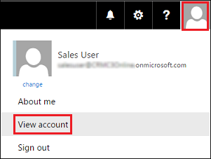
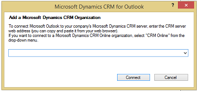

# Set up and configure Dynamics 365 for Outlook from Microsoft 365
You can use [!INCLUDE[pn_microsoft_dynamics_crm_for_outlook](../../includes/pn-microsoft-dynamics-crm-for-outlook.md)] together with [!INCLUDE[pn_microsoftcrm](../../includes/pn-microsoftcrm.md)] access [!INCLUDE[pn_crm_shortest](../../includes/pn-crm-shortest.md)] data while you’re working within the familiar [!INCLUDE[pn_Outlook_short](../../includes/pn-outlook-short.md)] interface. [!INCLUDE[pn_crm_for_outlook_short](../../includes/pn-crm-for-outlook-short.md)] can also provide access to [!INCLUDE[pn_crm_shortest](../../includes/pn-crm-shortest.md)] data while you’re working offline. [Do your Dynamics 365 apps work in Outlook using Dynamics 365 for Outlook](dynamics-365-work-outlook.md).  
  
 If you have a Microsoft 365 subscription, you can install [!INCLUDE[pn_crm_for_outlook_short](../../includes/pn-crm-for-outlook-short.md)] directly from the **[!INCLUDE[pn_Office_365](../../includes/pn-office-365.md)]** Home page, but before you install the add-in, review the following installation prerequisites and configuration instructions.  
  
## Step 1: Review installation prerequisites  
  
### Logging on as a Local Administrator  
  
- To install [!INCLUDE[pn_crm_for_outlook_short](../../includes/pn-crm-for-outlook-short.md)], you must be able to log on to your computer as a user with Local Administrator privileges.  
  
### Software requirements  
  
-   [Microsoft Dynamics 365 for Outlook software requirements](../admin-guide/software-requirements.md)

### Hardware and network requirements

-   [Microsoft Dynamics 365 for Outlook hardware requirements](../admin-guide/hardware-requirements.md)
  
### Installing updates  
  
- Install all the latest [!INCLUDE[pn_MS_Office](../../includes/pn-ms-office.md)] updates, including all security updates, from [!INCLUDE[pn_Microsoft_Update](../../includes/pn-microsoft-update.md)]. [Go to Microsoft Update](https://go.microsoft.com/fwlink/p/?LinkId=165705).  
  
- To ensure that you stay up-to-date with future releases of [!INCLUDE[pn_crm_for_outlook_short](../../includes/pn-crm-for-outlook-short.md)], it is highly recommended that you ensure that [!INCLUDE[pn_ms_Windows_Update](../../includes/pn-ms-windows-update.md)] is enabled on your computer. [Learn how to turn on automatic updates](https://go.microsoft.com/fwlink/p/?LinkID=518633).  
  
## Step 2: Install and configure Dynamics 365 for Outlook  
  
1. These steps apply only if you have an [!INCLUDE[pn_Office_365](../../includes/pn-office-365.md)] subscription in addition to [!INCLUDE[pn_crm_shortest](../../includes/pn-crm-shortest.md)]. If you don't have an [!INCLUDE[pn_Office_365](../../includes/pn-office-365.md)] subscription, see [Set up Dynamics 365 for Outlook](set-up.md).  
  
    Sign in to the [!INCLUDE[pn_Office_365](../../includes/pn-office-365.md)] home page: [https://admin.microsoft.com](https://admin.microsoft.com).  
  
2. In the upper-right corner of the [!INCLUDE[pn_Office_365](../../includes/pn-office-365.md)] home page, click your account picture > **View account**.  
  
      
  
3. Click **Settings** > **Software** > **Tools & add-ins**.  
  
4. Under [!INCLUDE[pn_microsoft_dynamics_crm_for_outlook](../../includes/pn-microsoft-dynamics-crm-for-outlook.md)], click **Install** to install [!INCLUDE[pn_crm_for_outlook_short](../../includes/pn-crm-for-outlook-short.md)].  
  
5. When prompted, restart [!INCLUDE[pn_Outlook_short](../../includes/pn-outlook-short.md)]. This will automatically start the Configuration Wizard and you’ll see the following dialog box:  
  
      
  
   > [!NOTE]
   >  If the Configuration Wizard doesn’t start automatically, in the Start screen, search for **Configuration Wizard** and run it.  
  
6. In the list, select **Dynamics 365 apps **, and then choose **Connect**.  
  
> [!TIP]
>  If you encounter an issue installing, connecting, or enabling [!INCLUDE[pn_crm_for_outlook_short](../../includes/pn-crm-for-outlook-short.md)] with your [!INCLUDE[pn_crm_online_shortest](../../includes/pn-crm-online-shortest.md)] organization, use the [Microsoft Support and Recovery Assistant](https://aka.ms/crmocpub) to diagnose and fix the issue. You’ll need to sign in to the diagnostics tool with your [!INCLUDE[pn_crm_online_shortest](../../includes/pn-crm-online-shortest.md)] credentials.

### See also
 [Dynamics 365 for Outlook support](../admin-guide/support.md)

[!INCLUDE[footer-include](../../includes/footer-banner.md)]