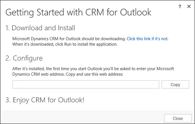
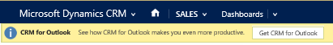
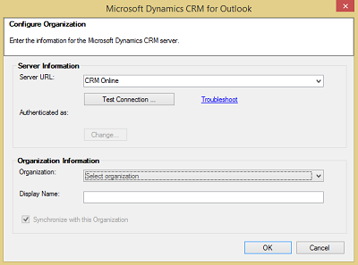

# Set up Dynamics 365 for Outlook
  
## Dynamics 365 for Outlook  
 If you’re like many people, you use [!INCLUDE[pn_MS_Outlook_Full](../../includes/pn-ms-outlook-full.md)] as your communications, scheduling, and contact management hub for business. You can continue to use the familiar [!INCLUDE[pn_Outlook_short](../../includes/pn-outlook-short.md)] interface and integrate [!INCLUDE[pn_microsoftcrm](../../includes/pn-microsoftcrm.md)] at the same time by using [!INCLUDE[pn_crm_2016_outlook](../../includes/pn-crm-2016-outlook.md)]. [!INCLUDE[pn_crm_2016_outlook_shortest](../../includes/pn-crm-2016-outlook-shortest.md)] can also provide access to [!INCLUDE[pn_crm_shortest](../../includes/pn-crm-shortest.md)] data while you’re offline. [!INCLUDE[proc_more_information](../../includes/proc-more-information.md)] [Do your Dynamics 365 apps work in Outlook using Dynamics 365 for Outlook](dynamics-365-work-outlook.md)  
  
> [!IMPORTANT]
>  To install and use [!INCLUDE[pn_crm_2016_outlook_shortest](../../includes/pn-crm-2016-outlook-shortest.md)], your organization must be running [!INCLUDE[pn_microsoft_dynamics_crm_2016_server](../../includes/pn-microsoft-dynamics-crm-2016-server.md)].

### Step 1: Review installation prerequisites

#### Sign in as a Local Administrator

- To install [!INCLUDE[pn_crm_for_outlook_short](../../includes/pn-crm-for-outlook-short.md)], you must be able to sign in to your computer as a user with Local Administrator privileges.

   In smaller companies, [!INCLUDE[pn_crm_for_outlook_short](../../includes/pn-crm-for-outlook-short.md)] is often installed manually, on a computer-by-computer basis. Administrators or individual users who have Local Administrator privileges and who possess a general familiarity with installing software can do these installations.

#### Review software requirements

-   [Microsoft Dynamics 365 for Outlook software requirements](../admin-guide/software-requirements.md)

#### Review hardware and network requirements

-   [Microsoft Dynamics 365 for Outlook hardware requirements](../admin-guide/hardware-requirements.md)

#### Install updates

- Before you install [!INCLUDE[pn_crm_for_outlook_short](../../includes/pn-crm-for-outlook-short.md)], make sure you have all the latest [!INCLUDE[pn_MS_Office](../../includes/pn-ms-office.md)] updates, including all security updates from [!INCLUDE[pn_Microsoft_Update](../../includes/pn-microsoft-update.md)]. [Go to Microsoft Update](https://go.microsoft.com/fwlink/p/?LinkId=165705).

#### Verify permissions

- To install [!INCLUDE[pn_crm_2016_outlook_shortest](../../includes/pn-crm-2016-outlook-shortest.md)], you must have the appropriate security permissions. [Permissions required for Dynamics 365 for Outlook tasks](../admin-guide/permissions-required-tasks.md)
  
### Step 2: Download the software  
 Before you or your users install [!INCLUDE[pn_crm_2016_outlook_shortest](../../includes/pn-crm-2016-outlook-shortest.md)], please note the following:  
  
- Make sure you have completed your desired [!INCLUDE[pn_crm_shortest](../../includes/pn-crm-shortest.md)] customizations. If your users will use [!INCLUDE[pn_crm_2016_outlook_shortest](../../includes/pn-crm-2016-outlook-shortest.md)] in offline mode, for best performance, enable only the minimum required record types (entities) and views for offline use. For more information, see [Customize Dynamics 365 apps](../../customize/overview.md).
  
- Group Policy Folder Redirection with offline files is not supported in [!INCLUDE[pn_crm_for_outlook_short](../../includes/pn-crm-for-outlook-short.md)]. If your [!INCLUDE[pn_crm_shortest](../../includes/pn-crm-shortest.md)] data is stored with redirected offline files, users may be unable to use [!INCLUDE[pn_crm_for_outlook_short](../../includes/pn-crm-for-outlook-short.md)]. [!INCLUDE[proc_more_information](../../includes/proc-more-information.md)] [Using Folder Redirection](https://technet.microsoft.com/library/cc753996.aspx)  
  
- For synchronization to work correctly, we recommend that you turn on Cached Exchange Mode in Outlook. [!INCLUDE[proc_more_information](../../includes/proc-more-information.md)] [Turn Cached Exchange mode on or off](https://support.office.com/article/turn-on-cached-exchange-mode-7885af08-9a60-4ec3-850a-e221c1ed0c1c)  
  
#### Download the software  
  
1. In [!INCLUDE[pn_crm_shortest](../../includes/pn-crm-shortest.md)], click the **Settings** icon , and then click **Apps for Dynamics 365 apps**.  
  
2. On the **Apps for Dynamics 365 apps** page, click **Download from [!INCLUDE[cc_Microsoft](../../includes/cc-microsoft.md)] Download Center**.  
  
   > [!TIP]
   >  If you prefer, you can [download the software from this web page](https://go.microsoft.com/fwlink/p/?LinkId=690396).

3. If you see one or more **Security Warning** dialog boxes, click **Run** in each.

    The software will start downloading and you’ll see the following dialog box:

    

4. In the **Getting Started with Dynamics 365 for Outlook** dialog box, under **2. Configure**, click **Copy** to copy your organization’s URL to your computer’s Clipboard. You’ll paste this URL in the following **Configure** step.

5. Click **Run**, when prompted, to download the software.

6. In the **Browse For Folder** dialog box, select a folder to store the extracted [!INCLUDE[pn_Outlook_short](../../includes/pn-outlook-short.md)] files. We recommend that you store the extracted files in a separate folder (choose the **Make New Folder** option in the dialog box to create a folder without exiting the wizard).

7. On the **License Agreement** page, if you accept the license agreement, select **I accept the license agreement**, and then click **Next**.

8. Do one of the following:

   - To install [!INCLUDE[pn_crm_for_outlook_short](../../includes/pn-crm-for-outlook-short.md)] without offline capability, click **Install Now**.

   - To install [!INCLUDE[pn_crm_for_outlook_short](../../includes/pn-crm-for-outlook-short.md)] with offline capability, click **Options**, select the **Offline Capability** check box on the **Customize Installation** page, and then click **Install Now**. If you don’t install offline capability during installation, you can add it later by choosing **Go Offline** in [!INCLUDE[pn_crm_for_outlook_short](../../includes/pn-crm-for-outlook-short.md)].

     > [!IMPORTANT]
     >  If you aren’t able to install offline capability, check to make sure you don’t have any pending [!INCLUDE[pn_ms_Windows_short](../../includes/pn-ms-windows-short.md)] updates. [Learn more about Windows updates](https://go.microsoft.com/fwlink/p/?LinkID=399355)  
  
9. When prompted, restart [!INCLUDE[pn_Outlook_short](../../includes/pn-outlook-short.md)].  
  
### Step 3: Configure Dynamics 365 for Outlook  
 After restarting [!INCLUDE[pn_Outlook_short](../../includes/pn-outlook-short.md)], you’ll see the following dialog box:  
  
   
  
1. Press **Ctrl+V** to paste the URL you copied in the preceding **Download the software** step, and then click **Connect**. You can also enter a Server URL or a Discovery URL.  
  
2. If you’re prompted for a password, enter the password.  
  
   > [!TIP]
   >  If you want to add another organization, you can run the Configuration Wizard again after you have successfully configured the first organization. To run the Configuration Wizard, in the [!INCLUDE[pn_windows8](../../includes/pn-windows8.md)] Start screen, search for **Configuration Wizard** and run it. In earlier versions of [!INCLUDE[pn_ms_Windows_short](../../includes/pn-ms-windows-short.md)], click **Start > All Programs > Microsoft Dynamics 365 apps**, and then click **Configuration Wizard**.  
   > 
   >  If you encounter an issue configuring [!INCLUDE[pn_crm_for_outlook_short](../../includes/pn-crm-for-outlook-short.md)] with your [!INCLUDE[pn_crm_online_shortest](../../includes/pn-crm-online-shortest.md)] organization, use the [Microsoft Support and Recovery Assistant](https://aka.ms/crmocpub) to diagnose and fix the issue. You’ll need to sign in to the diagnostics tool with your [!INCLUDE[pn_crm_online_shortest](../../includes/pn-crm-online-shortest.md)] credentials.  
  
## CRM 2015 for Outlook  
 If you’re like many people, you use [!INCLUDE[pn_MS_Outlook_Full](../../includes/pn-ms-outlook-full.md)] as your communications, scheduling, and contact management hub for business. You can continue to use the familiar [!INCLUDE[pn_Outlook_short](../../includes/pn-outlook-short.md)] interface and integrate [!INCLUDE[pn_microsoftcrm](../../includes/pn-microsoftcrm.md)] at the same time by using [!INCLUDE[pn_crm_2015_outlook](../../includes/pn-crm-2015-outlook.md)]. [!INCLUDE[pn_crm_2015_outlook_shortest](../../includes/pn-crm-2015-outlook-shortest.md)] can also provide access to [!INCLUDE[pn_crm_shortest](../../includes/pn-crm-shortest.md)] data while you’re offline. [!INCLUDE[proc_more_information](../../includes/proc-more-information.md)] [Do your Dynamics 365 apps work in Outlook using Dynamics 365 for Outlook](dynamics-365-work-outlook.md)  
  
  [Watch a video on setup, configuration, and upgrading (5:19)](https://go.microsoft.com/fwlink/p/?LinkId=522526)  
  
> [!IMPORTANT]
> - To install and use [!INCLUDE[pn_crm_2015_outlook_shortest](../../includes/pn-crm-2015-outlook-shortest.md)], your organization must be running [!INCLUDE[pn_crm_2015_server](../../includes/pn-crm-2015-server.md)].
> - [!INCLUDE[pn_crm_2013_for_outlook_long](../../includes/pn-crm-2013-for-outlook-long.md)] is not compatible with [!INCLUDE[pn_crm_2015_server](../../includes/pn-crm-2015-server.md)]. At a minimum, you must update [!INCLUDE[pn_crm_2013_for_outlook_short](../../includes/pn-crm-2013-for-outlook-short.md)] to UR1 to use it with [!INCLUDE[pn_crm_2015_server](../../includes/pn-crm-2015-server.md)]. [!INCLUDE[proc_more_information](../../includes/proc-more-information.md)] [TechNet: Upgrading from CRM 2013 for Outlook to CRM 2015 for Outlook](https://technet.microsoft.com/library/hh699711.aspx)

### Step 1: Review installation prerequisites

#### Sign in as a Local Administrator

- To install [!INCLUDE[pn_crm_for_outlook_short](../../includes/pn-crm-for-outlook-short.md)], you must be able to sign in to your computer as a user with Local Administrator privileges.

   In smaller companies, [!INCLUDE[pn_crm_for_outlook_short](../../includes/pn-crm-for-outlook-short.md)] is often installed manually, on a computer-by-computer basis. Administrators or individual users who have Local Administrator privileges and who possess a general familiarity with installing software can do these installations.

#### Review software requirements

-   [Microsoft Dynamics 365 for Outlook software requirements](../admin-guide/software-requirements.md)

#### Review hardware and network requirements

-   [Microsoft Dynamics 365 for Outlook hardware requirements](../admin-guide/hardware-requirements.md)

#### Install updates

- Before you install [!INCLUDE[pn_crm_for_outlook_short](../../includes/pn-crm-for-outlook-short.md)], make sure you have all the latest [!INCLUDE[pn_MS_Office](../../includes/pn-ms-office.md)] updates, including all security updates from [!INCLUDE[pn_Microsoft_Update](../../includes/pn-microsoft-update.md)]. [Go to Microsoft Update](https://go.microsoft.com/fwlink/p/?LinkId=165705).

#### Verify permissions

- To install [!INCLUDE[pn_crm_2015_outlook_shortest](../../includes/pn-crm-2015-outlook-shortest.md)], you must have the appropriate security permissions. [Permissions required for Dynamics 365 for Outlook tasks](../admin-guide/permissions-required-tasks.md)
  
### Step 2: Download the software  
 Before you or your users install [!INCLUDE[pn_crm_2015_outlook_shortest](../../includes/pn-crm-2015-outlook-shortest.md)], please note the following:  
  
- Make sure you have completed your desired [!INCLUDE[pn_crm_shortest](../../includes/pn-crm-shortest.md)] customizations. If your users will use [!INCLUDE[pn_crm_2015_outlook_shortest](../../includes/pn-crm-2015-outlook-shortest.md)] in offline mode, for best performance, enable only the minimum required record types (entities) and views for offline use. For more information, see [Customize Dynamics 365 apps]../../customize/overview.md).  
  
- Group Policy Folder Redirection with offline files is not supported in [!INCLUDE[pn_crm_for_outlook_short](../../includes/pn-crm-for-outlook-short.md)]. If your [!INCLUDE[pn_crm_shortest](../../includes/pn-crm-shortest.md)] data is stored with redirected offline files, users may be unable to use [!INCLUDE[pn_crm_for_outlook_short](../../includes/pn-crm-for-outlook-short.md)]. [!INCLUDE[proc_more_information](../../includes/proc-more-information.md)] [Using Folder Redirection](https://technet.microsoft.com/library/cc753996.aspx)  
  
- For synchronization to work correctly, we recommend that you turn on Cached Exchange Mode in Outlook. [!INCLUDE[proc_more_information](../../includes/proc-more-information.md)] [Turn Cached Exchange mode on or off](https://support.office.com/article/turn-on-cached-exchange-mode-7885af08-9a60-4ec3-850a-e221c1ed0c1c)    
  
#### Download the software  
  
1. In the [!INCLUDE[pn_crm_shortest](../../includes/pn-crm-shortest.md)] user interface, click **Get Dynamics 365 for Outlook** on the message bar.  
  
      
  
   > [!TIP]
   >  If you prefer, you can [download the software from this page](https://go.microsoft.com/fwlink/p/?LinkID=403030).

2. If you see one or more **Security Warning** dialog boxes, click **Run** in each.

    The software will start downloading and you’ll see the following dialog box:

    

3. In the **Getting Started with Dynamics 365 for Outlook** dialog box, under **2. Configure**, click **Copy** to copy your organization’s URL to your computer’s Clipboard. You’ll paste this URL in the following **Configure** step.

4. Click **Run**, when prompted, to download the software.

5. In the **Browse For Folder** dialog box, select a folder to store the extracted [!INCLUDE[pn_Outlook_short](../../includes/pn-outlook-short.md)] files. We recommend that you store the extracted files in a separate folder (choose the **Make New Folder** option in the dialog box to create a folder without exiting the wizard).

6. On the **License Agreement** page, if you accept the license agreement, select **I accept the license agreement**, and then click **Next**.

7. Do one of the following:

   - To install [!INCLUDE[pn_crm_for_outlook_short](../../includes/pn-crm-for-outlook-short.md)] without offline capability, click **Install Now**.

   - To install [!INCLUDE[pn_crm_for_outlook_short](../../includes/pn-crm-for-outlook-short.md)] with offline capability, click **Options**, select the **Offline Capability** check box on the **Customize Installation** page, and then click **Install Now**. If you don’t install offline capability during installation, you can add it later by choosing **Go Offline** in [!INCLUDE[pn_crm_for_outlook_short](../../includes/pn-crm-for-outlook-short.md)].

     > [!IMPORTANT]
     >  If you aren’t able to install offline capability, check to make sure you don’t have any pending [!INCLUDE[pn_ms_Windows_short](../../includes/pn-ms-windows-short.md)] updates. [Learn more about Windows updates](https://go.microsoft.com/fwlink/p/?LinkID=399355)  
  
8. When prompted, restart [!INCLUDE[pn_Outlook_short](../../includes/pn-outlook-short.md)].  
  
### Step 3: Configure Dynamics 365 for Outlook  
 After restarting [!INCLUDE[pn_Outlook_short](../../includes/pn-outlook-short.md)], you’ll see the following dialog box:  
  
   
  
1. Press **Ctrl+V** to paste the URL you copied in the preceding **Download the software** step, and then click **Connect**. You can also enter a Server URL or a Discovery URL.  
  
2. If you’re prompted for a password, enter the password.  
  
   > [!TIP]
   >  If you want to add another organization, you can run the Configuration Wizard again after you have successfully configured the first organization. To run the Configuration Wizard, in the [!INCLUDE[pn_windows8](../../includes/pn-windows8.md)] Start screen, search for **Configuration Wizard** and run it. In earlier versions of [!INCLUDE[pn_ms_Windows_short](../../includes/pn-ms-windows-short.md)], click **Start > All Programs > Microsoft Dynamics 365 apps**, and then click **Configuration Wizard**.  
  
## CRM 2013 for Outlook  
 If you’re like many people, you use [!INCLUDE[pn_MS_Outlook_Full](../../includes/pn-ms-outlook-full.md)] as your communications, scheduling, and contact management hub for business. You can continue to use the familiar [!INCLUDE[pn_Outlook_short](../../includes/pn-outlook-short.md)] interface and integrate [!INCLUDE[pn_microsoftcrm](../../includes/pn-microsoftcrm.md)] at the same time by using [!INCLUDE[pn_crm_2013_for_outlook_short](../../includes/pn-crm-2013-for-outlook-short.md)]. [!INCLUDE[pn_crm_for_outlook_short](../../includes/pn-crm-for-outlook-short.md)] can also provide access to [!INCLUDE[pn_crm_shortest](../../includes/pn-crm-shortest.md)] data while you’re offline. [!INCLUDE[proc_more_information](../../includes/proc-more-information.md)] [Do your Dynamics 365 apps work in Outlook using Dynamics 365 for Outlook](dynamics-365-work-outlook.md)  
  
> [!IMPORTANT]
>  If you’re using [!INCLUDE[pn_CRM_2011](../../includes/pn-crm-2011.md)] (on-premises), don’t update to the [!INCLUDE[pn_crmv6](../../includes/pn-crmv6.md)] for [!INCLUDE[pn_Outlook_short](../../includes/pn-outlook-short.md)] client; continue to use the [!INCLUDE[pn_CRM_2011_for_Outlook](../../includes/pn-crm-2011-for-outlook.md)] client.
>
>  If you’re using [!INCLUDE[pn_crm_2013_shortest](../../includes/pn-crm-2013-shortest.md)] (on-premises) or [!INCLUDE[pn_crm_online_shortest](../../includes/pn-crm-online-shortest.md)], you can upgrade to [!INCLUDE[pn_crm_2013_for_outlook_short](../../includes/pn-crm-2013-for-outlook-short.md)] or you can use [!INCLUDE[pn_CRM_2011_for_Outlook](../../includes/pn-crm-2011-for-outlook.md)] if you’re not ready to upgrade yet. If you use [!INCLUDE[pn_CRM_2011_for_Outlook](../../includes/pn-crm-2011-for-outlook.md)] with [!INCLUDE[pn_crm_2013_for_outlook_short](../../includes/pn-crm-2013-for-outlook-short.md)] or [!INCLUDE[pn_crm_online_shortest](../../includes/pn-crm-online-shortest.md)], you can’t use the [!INCLUDE[pn_Outlook_short](../../includes/pn-outlook-short.md)] client in offline mode, however. We recommend that you update to [!INCLUDE[pn_crm_2013_for_outlook_short](../../includes/pn-crm-2013-for-outlook-short.md)] at your earliest convenience.

### Step 1: Review installation prerequisites

#### Sign in as a Local Administrator

- To install [!INCLUDE[pn_crm_for_outlook_short](../../includes/pn-crm-for-outlook-short.md)], you must be able to sign in to your computer as a user with Local Administrator privileges.

   In smaller companies, [!INCLUDE[pn_crm_for_outlook_short](../../includes/pn-crm-for-outlook-short.md)] is often installed manually, on a computer-by-computer basis. Administrators or individual users who have Local Administrator privileges and who possess a general familiarity with installing software can do these installations.

#### Review software requirements

-   [Microsoft Dynamics 365 for Outlook software requirements](../admin-guide/software-requirements.md)

#### Review hardware and network requirements

- [Microsoft Dynamics 365 for Outlook hardware requirements](../admin-guide/hardware-requirements.md)
  #### Install updates  
  
- Before you install [!INCLUDE[pn_crm_for_outlook_short](../../includes/pn-crm-for-outlook-short.md)], make sure you have all the latest [!INCLUDE[pn_MS_Office](../../includes/pn-ms-office.md)] updates, including all security updates from [!INCLUDE[pn_Microsoft_Update](../../includes/pn-microsoft-update.md)]. [Go to Microsoft Update](https://go.microsoft.com/fwlink/p/?LinkId=165705).  
  
### Step 2: Download the software  
 Before you or your users install [!INCLUDE[pn_crm_2013_for_outlook_short](../../includes/pn-crm-2013-for-outlook-short.md)], please note the following:  
  
- Make sure you have completed your desired [!INCLUDE[pn_crm_shortest](../../includes/pn-crm-shortest.md)] customizations. If your users will use [!INCLUDE[pn_crm_2013_for_outlook_short](../../includes/pn-crm-2013-for-outlook-short.md)] in offline mode, for best performance, enable only the minimum required record types (entities) and views for offline use. For more information, see [Customize Dynamics 365 apps]../../customize/overview.md).  
  
- Group Policy Folder Redirection with offline files is not supported in [!INCLUDE[pn_crm_for_outlook_short](../../includes/pn-crm-for-outlook-short.md)]. If your [!INCLUDE[pn_crm_shortest](../../includes/pn-crm-shortest.md)] data is stored with redirected offline files, users may be unable to use [!INCLUDE[pn_crm_for_outlook_short](../../includes/pn-crm-for-outlook-short.md)]. [!INCLUDE[proc_more_information](../../includes/proc-more-information.md)] [Using Folder Redirection](https://technet.microsoft.com/library/cc753996.aspx)  
  
- For synchronization to work correctly, we recommend that you turn on Cached Exchange Mode in Outlook. [!INCLUDE[proc_more_information](../../includes/proc-more-information.md)] [Turn Cached Exchange mode on or off](https://support.office.com/article/turn-on-cached-exchange-mode-7885af08-9a60-4ec3-850a-e221c1ed0c1c)  
  
#### Download the software  
  
1. Run the [!INCLUDE[pn_crm_2013_for_outlook_setup](../../includes/pn-crm-2013-for-outlook-setup.md)] to download the software. You can start the Setup from any of the following places:  
  
   - **From the message bar in Dynamics 365 apps:**  In the [!INCLUDE[pn_crm_shortest](../../includes/pn-crm-shortest.md)] user interface, click **Get Dynamics 365 for Outlook** on the message bar. If you see one or more **Security Warning** dialog boxes, click **Run** in each.  
  
        
  
   - **From the web:** [Go to the download page](https://go.microsoft.com/fwlink/p/?LinkID=393787), and then download and run the appropriate executable file (32-bit or 64-bit), depending on your system and the version of [!INCLUDE[pn_Outlook_short](../../includes/pn-outlook-short.md)] you use.  
  
   - **From a DVD:** Double-click **SetupClient.exe** in the appropriate [!INCLUDE[pn_MS_Office](../../includes/pn-ms-office.md)] installation folder (32-bit or 64-bit).  
  
2. In the **Browse For Folder** dialog box, select a folder to store the extracted [!INCLUDE[pn_Outlook_short](../../includes/pn-outlook-short.md)] files. We recommend that you store the extracted files in a separate folder (choose the **Make New Folder** option in the dialog box to create a folder without exiting the wizard).  
  
3. On the **License Agreement** page, if you accept the license agreement, select **I accept the license agreement**, and then click **Next**.  
  
4. In the **Select the installation** page, do one of the following:  
  
   - To install [!INCLUDE[pn_crm_for_outlook_short](../../includes/pn-crm-for-outlook-short.md)] with offline capability, click **Options**, select the **Offline Capability** check box on the **Customize Installation** page, and then click **Install Now**. If you don’t install offline capability during installation, you can add it later by choosing **Go Offline** in [!INCLUDE[pn_crm_for_outlook_short](../../includes/pn-crm-for-outlook-short.md)].  
  
     > [!IMPORTANT]
     >  If you aren’t able to install offline capability, check to make sure you don’t have any pending [!INCLUDE[pn_ms_Windows_short](../../includes/pn-ms-windows-short.md)] updates. [Learn more about Windows updates](https://go.microsoft.com/fwlink/p/?LinkID=399355)

   - To install [!INCLUDE[pn_crm_for_outlook_short](../../includes/pn-crm-for-outlook-short.md)] without offline capability, click **Install Now**.

      [!INCLUDE[pn_crm_shortest](../../includes/pn-crm-shortest.md)] installs [!INCLUDE[pn_crm_for_outlook_short](../../includes/pn-crm-for-outlook-short.md)]. You may need to restart your computer to complete the installation.

5. On the final page of the wizard, click **Close**.

### Step 3: Configure Dynamics 365 for Outlook
 You must configure [!INCLUDE[pn_crm_for_outlook_short](../../includes/pn-crm-for-outlook-short.md)] after installing it. When you restart [!INCLUDE[pn_Outlook_short](../../includes/pn-outlook-short.md)] after installing, the Configuration Wizard starts automatically.

> [!NOTE]
>  If the Configuration Wizard doesn’t start automatically, in the Start screen, search for **Configuration Wizard** and run it. In earlier versions of [!INCLUDE[pn_ms_Windows_short](../../includes/pn-ms-windows-short.md)], click **Start > All Programs > Microsoft Dynamics 365 apps**, and then click **Configuration Wizard**.  
  
1. In the Configuration Wizard, you’ll see a **Server URL** drop-down list. Click the arrow next to the drop-down list, and then do one of the following:  
  
   - To connect to a [!INCLUDE[pn_crm_online_shortest](../../includes/pn-crm-online-shortest.md)] organization, select **Dynamics 365 apps **. If you don’t know if you’re using the online or on-premises version of [!INCLUDE[pn_crm_shortest](../../includes/pn-crm-shortest.md)], look in your browser at the web address for [!INCLUDE[pn_microsoftcrm](../../includes/pn-microsoftcrm.md)]. If the web address contains “dynamics.com” after the name of your organization, you’re using the online version. Otherwise, it’s the on-premises version.  
  
   - To connect to a [!INCLUDE[pn_crm_2013_shortest](../../includes/pn-crm-2013-shortest.md)] (on-premises) organization, there are two types of URLs, depending on whether your computer is connected to the Internet or not:  
  
     - For internal deployments (not connected over the Internet), type the [!INCLUDE[pn_microsoftcrm](../../includes/pn-microsoftcrm.md)] server or discovery service URL using the following format: **<https://crmserver>** or **<https://crmserver:5555>**.  
  
     - To connect over the Internet, use the discovery service URL using the following format: **https://dev.crmserver.contoso.com**.  
  
       > [!NOTE]
       >  If you’re unsure of what url to use, check with your [!INCLUDE[pn_crm_shortest](../../includes/pn-crm-shortest.md)] administrator.

        

2. Click **Test Connection**. This adds organizations to the **Organization Information** list. If you’re prompted for credentials, select from the following options:

   - For a [!INCLUDE[pn_crm_online_shortest](../../includes/pn-crm-online-shortest.md)] organization, do one of the following:

     - If your organization connects through [!INCLUDE[pn_Office_365](../../includes/pn-office-365.md)], enter your [!INCLUDE[cc_Microsoft](../../includes/cc-microsoft.md)] online services user name and password, and then click **OK**. This information was sent to you in email when your account was created.

     - If you’re connecting with an earlier online services platform, enter your [!INCLUDE[cc_Microsoft](../../includes/cc-microsoft.md)] account (formerly [!INCLUDE[pn_ms_Windows_short](../../includes/pn-ms-windows-short.md)] Live ID) and password, and then click **OK**. This information was sent to you in email when your account was created.

   - For a [!INCLUDE[pn_crm_shortest](../../includes/pn-crm-shortest.md)] on-premises organization, you may not be prompted because [!INCLUDE[pn_crm_shortest](../../includes/pn-crm-shortest.md)] uses your [!INCLUDE[pn_Active_Directory](../../includes/pn-active-directory.md)] domain credentials.

3. In the **Organization** list, select the [!INCLUDE[pn_crm_shortest](../../includes/pn-crm-shortest.md)] organization you want to connect to, and then click **OK**. Then click **Close**.

   > [!TIP]
   >  If you have problems installing and configuring [!INCLUDE[pn_crm_for_outlook_short](../../includes/pn-crm-for-outlook-short.md)], try [Configuration Troubleshooting Wizard](https://go.microsoft.com/fwlink/p/?LinkID=394362).

### See also
 [Upgrade Microsoft Dynamics CRM for Outlook](../admin-guide/upgrade.md)
 [Troubleshooting and things to know about Microsoft Dynamics 365 for Outlook](../admin-guide/troubleshooting-things-to-know.md)

[!INCLUDE[footer-include](../../includes/footer-banner.md)]