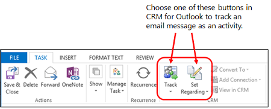

# Track Outlook email by choosing a button in Dynamics 365 for Outlook 
To get the most out of [!INCLUDE[pn_microsoftcrm](../../includes/pn-microsoftcrm.md)], it’s important to keep track of all your customer interactions, and email communications are key. Create a central repository of your [!INCLUDE[pn_Outlook_short](../../includes/pn-outlook-short.md)] email communications by “tracking” them in [!INCLUDE[pn_microsoft_dynamics_crm_for_outlook](../../includes/pn-microsoft-dynamics-crm-for-outlook.md)]. When you track an email message in [!INCLUDE[pn_crm_for_outlook_short](../../includes/pn-crm-for-outlook-short.md)], the email is saved as an activity record in [!INCLUDE[pn_crm_shortest](../../includes/pn-crm-shortest.md)]. Then you, or anyone who has access to your activity records, can view that email message along with all other customer activities in [!INCLUDE[pn_crm_shortest](../../includes/pn-crm-shortest.md)], [!INCLUDE[pn_crm_for_outlook_short](../../includes/pn-crm-for-outlook-short.md)], or on a mobile device.  
  
   
  
 Tracking email in [!INCLUDE[pn_crm_for_outlook_short](../../includes/pn-crm-for-outlook-short.md)] is a manual process. This gives you the ability to keep your personal email separate from your customer email. You can also set an option to automatically track email messages. [!INCLUDE[proc_more_information](../../includes/proc-more-information.md)] [Set an option to automatically track incoming Outlook email in Dynamics 365 for Outlook](set-option-automatically-track-incoming-outlook-email.md)  
  
> [!TIP]
>  If your organization synchronizes email through server-side synchronization, you can track email automatically by dragging it to a tracked folder. Folder-level tracking is a powerful and intuitive way to track email messages directly from virtually any device. [!INCLUDE[proc_more_information](../../includes/proc-more-information.md)] [Track Outlook email by moving it to a tracked Exchange folder](track-outlook-email-by-moving-it-tracked-exchange-folder.md)  
  
   
## Requirements for tracking email messages  
 To track email in [!INCLUDE[pn_crm_for_outlook_short](../../includes/pn-crm-for-outlook-short.md)], your [!INCLUDE[pn_Outlook_short](../../includes/pn-outlook-short.md)] email address must match your [!INCLUDE[pn_crm_shortest](../../includes/pn-crm-shortest.md)] email address. You can’t synchronize to or from multiple email addresses.  
  
   
## Which records are associated with the email activity?  
 By default, when you track an email message, [!INCLUDE[pn_crm_for_outlook_short](../../includes/pn-crm-for-outlook-short.md)] uses the [!INCLUDE[pn_crm_shortest](../../includes/pn-crm-shortest.md)] address book to link the message to [!INCLUDE[pn_crm_shortest](../../includes/pn-crm-shortest.md)] contacts on the **To**, **From**, and **Bcc** lines. You can also link the email message to a more specific record, such as a specific account, opportunity, or case. It’s usually best to link a message to a more specific record, if possible. This will make the record easier to find.  
  
   
## Track an email message  
  
1. In [!INCLUDE[pn_crm_for_outlook_short](../../includes/pn-crm-for-outlook-short.md)], select the email message you want to track.  
  
2. Do one of the following:  
  
   - To track the email message without linking it to a particular record in [!INCLUDE[pn_crm_shortest](../../includes/pn-crm-shortest.md)], on the **Home** tab, in the **[!INCLUDE[pn_crm_shortest](../../includes/pn-crm-shortest.md)]** group, click **Track**.  
  
      -Or-  
  
   - To track the email message and link it to a particular record in [!INCLUDE[pn_crm_shortest](../../includes/pn-crm-shortest.md)], on the **Home** tab, in the **[!INCLUDE[pn_crm_shortest](../../includes/pn-crm-shortest.md)]** group, click **Set Regarding**, click **More**, and then search for the record in the **Look Up Record** dialog box. After you find the record you want, click **Add**.  
  
     When you click the **Track** button or the **Set Regarding** button, a [!INCLUDE[pn_microsoftcrm](../../includes/pn-microsoftcrm.md)] pane (also known as the “tracking pane”) appears at the bottom of the email record. This pane shows that the record is tracked and provides links to related records. If you set a “regarding” record, the tracking pane also provides a link to that record. [!INCLUDE[proc_more_information](../../includes/proc-more-information.md)] [Overview of tracking records in Dynamics 365 for Outlook](overview-tracking-records.md)  
  
     You can also tell that a record is tracked by looking in the [!INCLUDE[pn_Outlook_short](../../includes/pn-outlook-short.md)] folder. You’ll see the **Tracked in Dynamics 365 apps** symbol  next to any tracked records.  
  
3. To modify the [!INCLUDE[pn_crm_shortest](../../includes/pn-crm-shortest.md)] activity record (for example, to change the regarding record), open the email message in [!INCLUDE[pn_Outlook_short](../../includes/pn-outlook-short.md)], and then, in the **[!INCLUDE[pn_crm_shortest](../../includes/pn-crm-shortest.md)]** group, click **View in Dynamics 365 apps**.  
  
   
## What else to I need to know about tracking email records?  
  
- **[!INCLUDE[pn_crm_shortest](../../includes/pn-crm-shortest.md)] address book**. The address book is installed automatically when [!INCLUDE[pn_crm_for_outlook_short](../../includes/pn-crm-for-outlook-short.md)] is installed. This makes it possible to search for a [!INCLUDE[pn_crm_shortest](../../includes/pn-crm-shortest.md)] contact from the **To** field of an email message or appointment when you create it. By default, [!INCLUDE[pn_crm_for_outlook_short](../../includes/pn-crm-for-outlook-short.md)] only searches for contacts you own. You can set a personal option to broaden this search. [!INCLUDE[proc_more_information](../../includes/proc-more-information.md)] [Set address book options in Dynamics 365 for Outlook](set-address-book-options.md)  
  
- **Working offline**. Email messages you track when you’re offline are saved as activities when you go back online. [!INCLUDE[proc_more_information](../../includes/proc-more-information.md)] [Work offline with Dynamics 365 for Outlook](work-offline-dynamics-365-outlook.md)  
  
- **Replies to tracked messages**. You can set whether replies to tracked messages are also tracked. [!INCLUDE[proc_more_information](../../includes/proc-more-information.md)] [Set personal options that affect tracking and synchronization between Dynamics 365 apps and Outlook or Exchange](set-personal-options-affect-tracking-synchronization-exchange.md)  
  
- **Editing tracked email messages**. After an email message has been sent, you can’t edit it, but you can set or change a regarding record for it.  
  
- **Attachments**. Any tracked email message can be accessed by anyone who has permission to view your activities. If the email has attachments, the attachments are included in the activity. If you don’t want to make an attachment available, delete it from the email activity.  
  
   Your administrator can block messages from being saved if they contain attachments of specific file types, such as .exe files. Any messages stored in locations other than the default [!INCLUDE[pn_Microsoft_Exchange](../../includes/pn-microsoft-exchange.md)] location can’t be linked.  
  
### See also  
 [Overview of tracking records in Dynamics 365 for Outlook](overview-tracking-records.md)   
 [Deleting records that have been tracked with Dynamics 365 for Outlook](delete-records-that-have-been-tracked.md)   
 [Set personal options that affect tracking and synchronization between Dynamics 365 apps and Outlook or Exchange](set-personal-options-affect-tracking-synchronization-exchange.md)   
 [Create templates for email](../../admin/create-templates-email.md) 
 [Frequently asked questions about synchronizing records between Microsoft Dynamics 365 apps and Microsoft Outlook](frequently-asked-questions-synchronizing-records.md)

[!INCLUDE[footer-include](../../includes/footer-banner.md)]