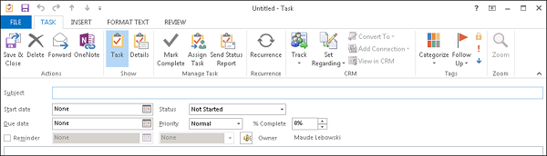
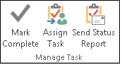
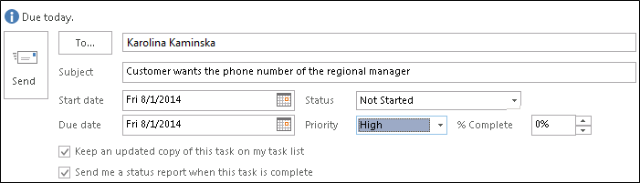
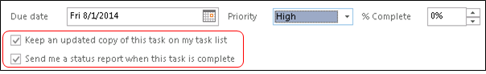

# Track Outlook tasks in Dynamics 365 for Outlook
When you track a task in [!INCLUDE[pn_microsoft_dynamics_crm_for_outlook](../../includes/pn-microsoft-dynamics-crm-for-outlook.md)], a copy of the task record is saved as an activity in [!INCLUDE[pn_microsoftcrm](../../includes/pn-microsoftcrm.md)] and synchronized with the [!INCLUDE[pn_Outlook_short](../../includes/pn-outlook-short.md)] record. You can then work on the task in [!INCLUDE[pn_crm_for_outlook_short](../../includes/pn-crm-for-outlook-short.md)] or [!INCLUDE[pn_crm_shortest](../../includes/pn-crm-shortest.md)]. If you sync [!INCLUDE[pn_Outlook_short](../../includes/pn-outlook-short.md)] on your mobile device, you can also access your task records on that device.

 Tracking tasks in [!INCLUDE[pn_crm_for_outlook_short](../../includes/pn-crm-for-outlook-short.md)] is a manual process. This gives you the ability to keep your personal tasks separate from your [!INCLUDE[pn_crm_shortest](../../includes/pn-crm-shortest.md)] tasks. Synchronization of tasks from [!INCLUDE[pn_crm_shortest](../../includes/pn-crm-shortest.md)] to [!INCLUDE[pn_crm_for_outlook_short](../../includes/pn-crm-for-outlook-short.md)] is automatic, however. You can use [!INCLUDE[pn_crm_for_outlook_short](../../includes/pn-crm-for-outlook-short.md)] to view any task records you own that were created in [!INCLUDE[pn_crm_shortest](../../includes/pn-crm-shortest.md)].

> [!IMPORTANT]
>  To synchronize tasks between [!INCLUDE[pn_crm_for_outlook_short](../../includes/pn-crm-for-outlook-short.md)] and [!INCLUDE[pn_crm_shortest](../../includes/pn-crm-shortest.md)], your [!INCLUDE[pn_Outlook_short](../../includes/pn-outlook-short.md)] email address must match your [!INCLUDE[pn_crm_shortest](../../includes/pn-crm-shortest.md)] email address. You can’t synchronize to or from multiple email addresses.  
  
## Track a task  
  
1. In [!INCLUDE[pn_crm_for_outlook_short](../../includes/pn-crm-for-outlook-short.md)], create a task or open an existing task.  
  
   -   To create a task, click **Tasks** on the navigation bar, and then click **New Task**.  
  
   -   To open an existing task, click **Tasks** on the navigation bar, and then double-click the task to open it.  
  
2. In the **Task** dialog box, if it’s a new task, enter a subject in the **Subject** box. If it’s an existing task, the **Subject** box will already be filled out.  
  
      
  
3. If you haven’t already done so, fill out other fields such as **Start date**, **Due date**, and **Priority**.  
  
   > [!NOTE]
   >  When a task is created in [!INCLUDE[pn_Outlook_short](../../includes/pn-outlook-short.md)], the system assigns the task a reminder time. Reminder information is not synchronized from [!INCLUDE[pn_Outlook_short](../../includes/pn-outlook-short.md)] to [!INCLUDE[pn_crm_shortest](../../includes/pn-crm-shortest.md)]. However, when a task has a **Due date** time set in [!INCLUDE[pn_crm_shortest](../../includes/pn-crm-shortest.md)], it will be synchronized to reminder time in [!INCLUDE[pn_Outlook_short](../../includes/pn-outlook-short.md)].  
   > 
   >  If there is a **Start date** value but no **Due date** value in [!INCLUDE[pn_Outlook_short](../../includes/pn-outlook-short.md)], the **Due date** value will automatically be set to the **Start date** value whenever you change the start date directly in [!INCLUDE[pn_Outlook_short](../../includes/pn-outlook-short.md)]. Likewise, if there is a **Start date** value but no **Due date** value in [!INCLUDE[pn_crm_shortest](../../includes/pn-crm-shortest.md)], the **Due date** value will automatically be set to the **Start date** value. These changes are controlled by [!INCLUDE[pn_Outlook_short](../../includes/pn-outlook-short.md)] or [!INCLUDE[pn_crm_shortest](../../includes/pn-crm-shortest.md)] independently. They don’t have anything to do with synchronization or synchronization direction.  
  
4. If you want to make it a recurring task, click **Recurrence**, and then specify how often you want the task to occur.  
  
5. To track the task, do one of the following:  
  
   - To track the task record without linking it to a particular record in Dynamics 365 apps, on the **Task** tab, in the **[!INCLUDE[pn_crm_shortest](../../includes/pn-crm-shortest.md)]** group, click **Track**.  
  
     > [!NOTE]
     >  To track the task record as a phone call, letter, or FAX, click the down arrow on the **Track** button, and then select the appropriate item. It will then show up as a phone call, letter, or FAX on your Activities list.

      -Or-

   - To track the task and link it to a particular [!INCLUDE[pn_crm_shortest](../../includes/pn-crm-shortest.md)] record (for example, a specific opportunity or case), on the **Task** tab, in the **[!INCLUDE[pn_crm_shortest](../../includes/pn-crm-shortest.md)]** group, click **Set Regarding**, click **More**, and then search for the record in the **Look Up Record** dialog box. After you find the record you want, click **Add**.

      When you click the **Track** button or the **Set Regarding** button, a [!INCLUDE[pn_microsoftcrm](../../includes/pn-microsoftcrm.md)] pane (also known as the “tracking pane”) appears at the bottom of the task record. This pane shows that the record is tracked and provides links to related records. If you set a Regarding value, [!INCLUDE[pn_crm_for_outlook_short](../../includes/pn-crm-for-outlook-short.md)] also provides a link to the Regarding record. [Tell me more about how tracking works.](../../customerengagement/on-premises/basics/basics-guide.md)

6. To save the task, click the down arrow on the **Actions** button, and then click **Save & Close**.

    [!INCLUDE[pn_crm_for_outlook_short](../../includes/pn-crm-for-outlook-short.md)] adds the **People** symbol  to the task to show that it’s tracked.

   > [!NOTE]
   >  If you want to stop tracking a task, open the task record, and then on the **Task** tab, in the **[!INCLUDE[pn_crm_shortest](../../includes/pn-crm-shortest.md)]** group, click **Untrack**. It’s best to untrack items one at a time.

## Assigning tasks
 If you’re using [!INCLUDE[pn_crm_2015_outlook](../../includes/pn-crm-2015-outlook.md)] or later, you can also track assigned tasks if your administrator has enabled this capability. [Learn more about enabling tracking of assigned tasks](./system-settings-dialog-box-synchronization-tab.md)

 To track a task, you must be the owner of the task. You own a task that you create until you assign it to someone else. After you assign the task, the person you assign it to owns the task. When a task is tracked, the task owner can work on the task in [!INCLUDE[pn_crm_for_outlook_short](../../includes/pn-crm-for-outlook-short.md)] or [!INCLUDE[pn_crm_shortest](../../includes/pn-crm-shortest.md)]. The person who assigns the task can follow the progress of the task in either tool.

 When a task owner updates a task, all copies of the task are updated, including copies owned by prior owners. When a task owner completes a task, a status report is automatically sent to the person who originally assigned the task, all other prior owners, and anyone else who requests a report.

> [!NOTE]
>  The following limitations apply when tracking assigned tasks:  
> 
> - You can’t assign a task to someone in another organization.  
>   - You can’t track an assigned task if you go offline with [!INCLUDE[pn_crm_for_outlook_short](../../includes/pn-crm-for-outlook-short.md)].  
>   - You can’t track recurring tasks.  
  
### Assign a task  
  
1.  Create a task or open an existing task as described in the previous procedure.  
  
2.  On the **Task** tab, in the **Manage Task** group, click **Assign Task**.  
  
       
  
3.  In the **Task** dialog box, in the **To** box, enter the name or email address of the person you want to assign the task to. To select from a list, click the **To** button.  
  
       
  
    > [!NOTE]
    >  You can’t track tasks assigned to more than one person.

4.  Select both the **Keep an updated copy of this task on my task list** check box and the **Send me a status report when this task is complete** check box.

    > [!IMPORTANT]
    >  You must select both of these check boxes to track an assigned task.

5.  If you want to track the task before assigning it, click the **Track** button or the **Set Regarding** button as described earlier in this topic.

    > [!NOTE]
    >  With assigned tasks, you must track the task record specifically as a task. You can’t track it as a phone call, letter, or FAX by selecting from the drop-down list on the **Track** button.

6.  When you’re ready to assign the task, click **Send**.

     When you click **Send**, ownership of the record passes to the person you’re assigning the task to. If the person you assign the task to declines the task, you’ll receive a declined task message. To reclaim ownership, open the message and click **Return to Task List**. After reclaiming ownership, you can reassign the task to someone else.

### Accept, decline, or reassign a task assigned to you

1. If someone assigns a task to you in [!INCLUDE[pn_crm_for_outlook_short](../../includes/pn-crm-for-outlook-short.md)], you have three options:

   - On the **Task** tab, in the **Respond** group, click **Accept**. If you accept the task, you become the owner of the task.

   - On the **Task** tab, in the **Respond** group, click **Decline**. If you decline the task, ownership of the task passes back to the person who assigned the task to you.

   - On the **Task** tab, in the **Manage Task** group, click **Assign Task**. If you reassign the task, ownership of the task passes to the person you assign the task to.

     > [!IMPORTANT]
     >  [!INCLUDE[pn_crm_for_outlook_short](../../includes/pn-crm-for-outlook-short.md)] can’t track tasks that are reassigned. If a task is already tracked and you reassign the task, the task will be untracked and deleted from Dynamics 365 apps.  
     > 
     >  You can’t reassign a task by forwarding it.  
  
2. To track a task after accepting it, click the **Track** button or the **Set Regarding** button as described earlier in this topic.  
  
   > [!NOTE]
   >  With an assigned task, you must track the task specifically as a task. You can’t track the task record as a phone call, letter, or FAX by selecting the down arrow on the **Track** button.  
  
### Send a status report about a task assignment  
  
1.  Open the task.  
  
2.  Make sure that **Status** and **% Complete** is current.  
  
3.  On the **Task** tab, in the **Manage Task** group, click **Send Status Report**.  
  
4.  In the **To** or **Cc** boxes, enter the names or email addresses of the people you want to send the status report to.  
  
5.  In the body of the message, type any information you want to include in the status report.  
  
6.  Click **Send**.  
  
### Follow the progress of tasks you assign  
  
-   To follow the progress of tasks you assign, select either or both of the following check boxes when you assign the task:  
  
       
  
-   To view tasks that you have assigned to others:  
  
    1.  Go to **Tasks**.  
  
    2.  On the **View** tab, in the **Current View** group, click **Change View**, and then click **Assigned**.  
  
-   To view the list of people who receive updated copies of an assigned task:  
  
    1.  Open the assigned task.  
  
    2.  On the **Task** tab, in the **Show** group, click **Details**, and then review the names in the **Update list** box.  
  
### See also  
 [Overview of tracking records in Dynamics 365 for Outlook](overview-tracking-records.md)   
 [Frequently asked questions about synchronizing records between Microsoft Dynamics 365 apps and Microsoft Outlook](frequently-asked-questions-synchronizing-records.md)

[!INCLUDE[footer-include](../../includes/footer-banner.md)]