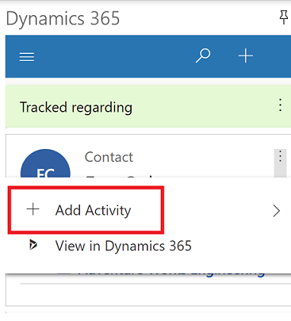
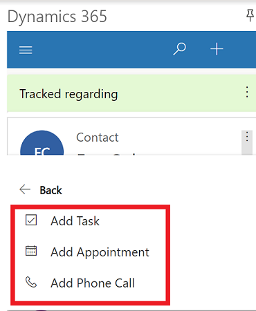
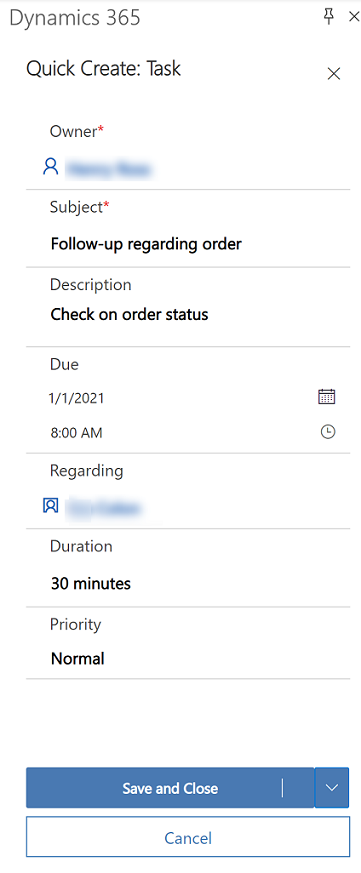

# Add an activity to a tracked row 

When a row is tracked using Dynamics 365 App for Outlook, you can add activities such as a phone call, appointment, or task to the row.

1 . Select **Dynamics 365** to open the **Dynamics 365** pane.  

   > [!div class="mx-imgBorder"] 
   >   
   
2. Select an item in your email that you're tracking using App for Outlook.

3. Select **More commands**  and then select **Add Activity**.

   > [!div class="mx-imgBorder"] 
   >

4. Select an activity.

    > [!div class="mx-imgBorder"] 
    > 

5. Fill in the information. The **Subject** and **Description** fields is auto populated using the information from the tracked record but you can edit this information.

   > [!div class="mx-imgBorder"] 
   > 

6. When you're done, select **Save and Close**. Or, select the down arrow and select **Save & Create New**.

The activity that you created is added in your customer engagement app (such as Dynamics 365 Sales, Dynamics 365 Customer Service, Dynamics 365 Field Service, Dynamics 365 Marketing, and Dynamics 365 Project Service Automation) and linked to the row the activity was added to.

