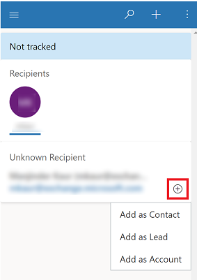
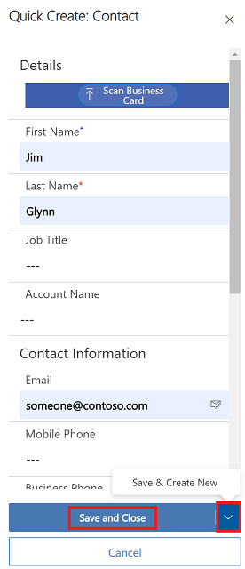

# Add an email recipient as a contact, lead, or account

Quickly add information for a new customer in your app using their eamil address. 

When you receive or create a new email or appointment with a recipient with a new email address, you can add them as a new contact, lead, or account using Dynamics 365 app for Outlook.

1. Open the email or appointment.

2. Select **Dynamics 365** to open the **Dynamics 365** pane.  

   > [!div class="mx-imgBorder"] 
   >  
   
3. In the **Dynamics 365** pane, select **Add to Dynamics 365** (+) and then select **Add as Contact**, **Add as Lead**, or **Add as Account**

   > [!div class="mx-imgBorder"] 
   >
   

4. Fill in the required informaion, and then select **Save and Close**. Or, to save and create another row, select the down arrow and then select **Save & Create New**.

   > [!div class="mx-imgBorder"] 
   >
 

If the sender of the email is unknown to Dynamics 365, when you add them to the system the email is automatically tracked in Dynamics 365 and set regarding this contact, lead, or account. To stop tracking, you can manually untrack the regarding email. 

