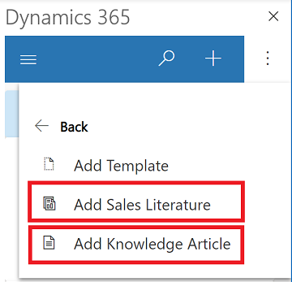

# Insert sales literature or a knowledge base article in an email 

When you create a new email, you can add sales literature or a knowledge base article and send the information to your customer.

To send sales literature, you must have the appropriate permission and use [Dynamics 365 Sales](../../sales-enterprise/help-hub.md) or use [Dynamics 365 Customer Service](../../customer-service/overview.md) to send knowledge base articles. 

1. Compose an email message as you normally would in Outlook.  

2. At the top select, **Dynamics 365** to open the **Dynamics 365** pane.  

   > [!div class="mx-imgBorder"] 
   >   
  
3. Select **More commands**  and then select **Insert**.

   > [!div class="mx-imgBorder"] 
   > 

3. Select **Add Sales Literature** or **Add Knowledge Article**, and then follow the steps to add or insert the literature or article.

   > [!div class="mx-imgBorder"] 
   > 