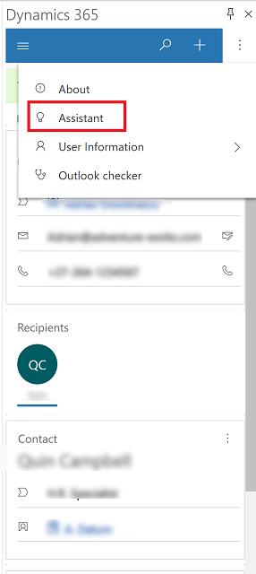

# Use the assistant to gain insights and guide customer communication

The assistant is a feature that keeps an eye on your daily activity, and helps you stay on top of your day with insight cards to provide insights and notifications about what's new and what's due. 

The assistant delivers the most important and relevant information in relation to what you are doing right now. The assistant works by analyzing all of the data at its disposal and then generates a collection of action cards. The assistant sorts the cards by priority and filters them for your current context.

Some of what the assistant can do for you:

- Reminds you of upcoming activities
- Evaluates your communications and suggests when it might be time to reach out to a contact that’s been inactive for a while
- Identifies email messages that may be waiting for a reply from you
- Alerts you when an opportunity is nearing its close date
	

## Prerequisites

To use the assistant, your admin must enable the Dynamics 365 Sales Insights feature. For information, see [Introduction to administering Sales Insights features](https://docs.microsoft.com/dynamics365/ai/sales/intro-admin-guide-sales-insights). 

For more information on how to use the assistant when you're running an app in a web browser, see [Use the assistant to guide customer communications](https://docs.microsoft.com/dynamics365/ai/sales/assistant).

## Use the assistant

When you start your day the assistant draws your attention to your most important items and tasks that needs your attention. 

1. To access the assistant, open the Dynamics 365 pane, and then select an item in your email that you're tracking using App for Outlook.
2. Select **More commands**  > **Assistant**.

   > [!div class="mx-imgBorder"] 
   > 

