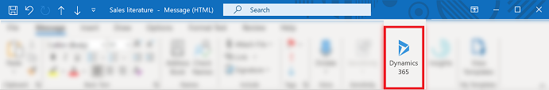
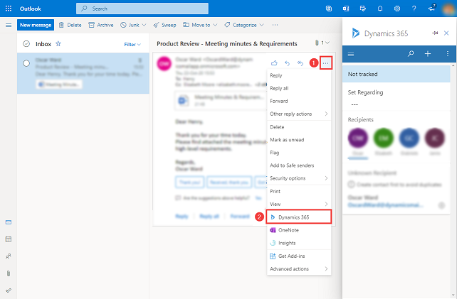
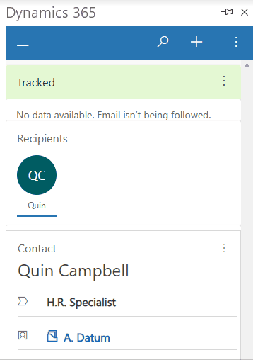
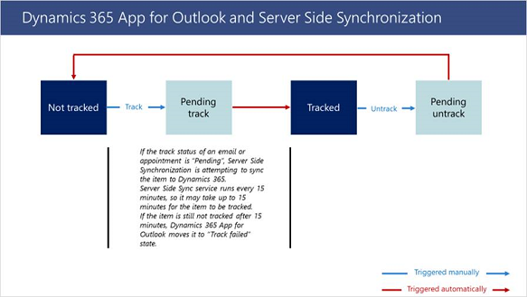
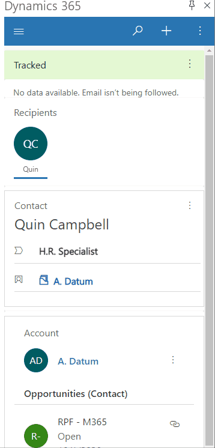
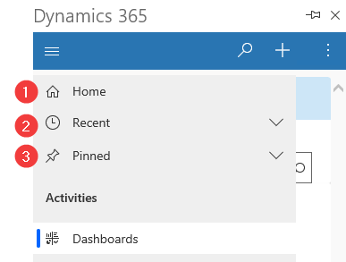
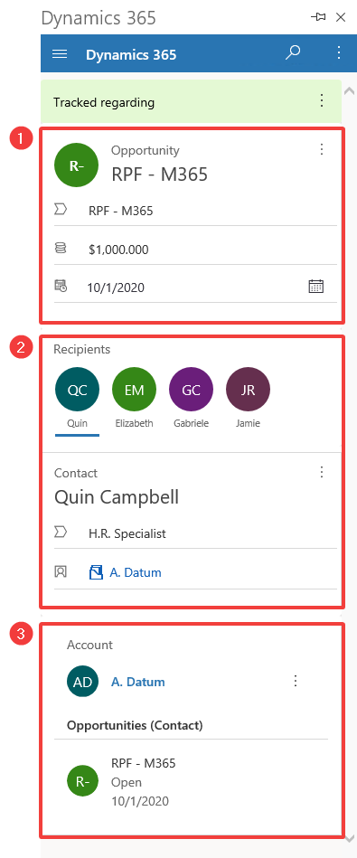
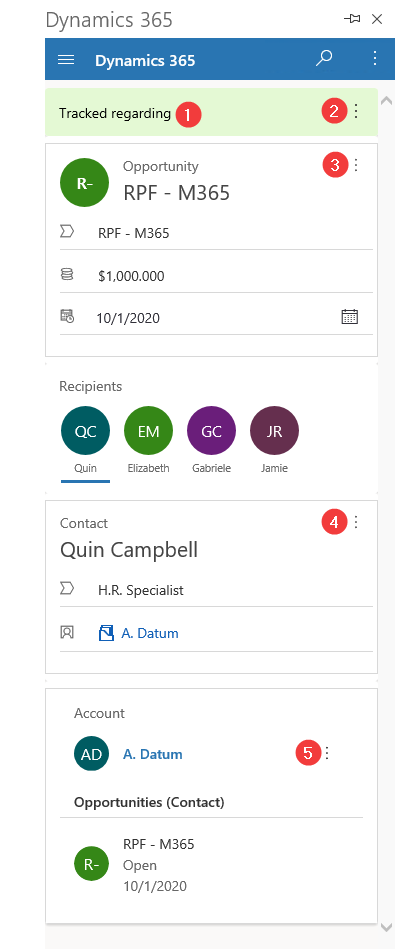

# Basic navigation in App for Outlook

Extend the power of productivity in Outlook with Dynamics 365 App for Outlook so you can experience your Dynamics 365 apps in context of customer communication in Outlook. Track  emails and appointments in Outlook to your Dynamics 365 app and associate them to the right record.

Use App for Outlook while you’re using Outlook on the desktop, web, or phone. When App for Outlook is installed, depending on which version of the app you have installed, you'll see a Dynamics 365 pane or window next to a selected Outlook email message, or when you're composing an email message or setting up a meeting or appointment.

> [!IMPORTANT]
> - Dynamics 365 App for Outlook works with latest release of [!INCLUDE[pn_ms_dyn_crm_app_for_outlook](../includes/pn-ms-dyn-crm-app-for-outlook.md)] works with customer engagement apps (such as [Dynamics 365 Sales](../sales-professional/help-hub.md), [Dynamics 365 Customer Service](../customer-service/help-hub.md), [Dynamics 365 Marketing](../marketing/help-hub.md). [Dynamics 365 Field Service](../dynamics365/field-service/overview.md), and [Dynamics 365 Project Service Automation](../dynamics365/project-operations/psa/overview.md)), [Dynamics 365 Customer Engagement (on-premises), version 9](../customerengagement/on-premises/overview.md), and [Microsoft Dataverse](/powerapps/maker/common-data-service/data-platform-intro).
> - For a prior release that works with earlier versions of Dynamics 365 apps, see [Deploy Dynamics 365 App for Outlook](/previous-versions/dynamicscrm-2016/administering-dynamics-365/dn946901(v=crm.8)). 

## Install 

Before installing App for Outlook, contact your administrator and make sure all the prerequisites are met. For more information, see [Deploy Dynamics 365 App for Outlook](../deploy-dynamics-365-app-for-outlook.md).

In most cases, you're administrator will automaticlly push the app to you and it should be aviliable in the Outlook ribbon. If you don't see it, then you can install it yourself. For more information, see [Have users install App for Outlook themselves](../deploy-dynamics-365-app-for-outlook.md#have-users-install-app-for-outlook-themselves).

## Access the app

Once installed it's easy to access the Dynamics 365 App for Outlook pane whether you're using Outlook on your desktop or the web app.

- In the Outlook desktop client, select **Dynamics 365**.

   > [!div class="mx-imgBorder"] 
   >   
   
- In Outlook Web Access, open an email and then select More (...) > **Dynamics 365**.

   > [!div class="mx-imgBorder"] 
   >   
   
## Pin 

If you're using the Outlook desktop client or Outlook Web Access, you can pin App for Outlook so that it remains open when you navigate from one email to another. If don't see the pin option verify that it's supported for your setup. For more information, see [What's supported](support-matrix.md).

- To pin the app, select the pin. To unpin, select the pin again.

   > [!div class="mx-imgBorder"] 
   >   

## Terminology

|Term  |Definition  |
|---------|---------|
|[Set regarding](track-message-or-appointment.md)     |Track and link the email or appointment to an existing row your Dynamics 365 app.|
|[Track](track-message-or-appointment.md)     |Create a copy of the email or appointment in your Dynamics 365 app.   |
|[Untrack](track-message-or-appointment.md#untrack-a-linked-email-or-appointment)     |Remove the copy of the email or appointment from your Dynamics 365 app. |
|Track Successful |Your email or appointment is successfully copied to  your Dynamics 365 app.   |
|Track failure |Your email or appointment is failed to copy to your Dynamics 365 app.   | 
|Track pending |Your email or appointment is in pending state to be copied to your Dynamics 365 app.   | 

## Synchronization and tracking 

The Dynamics 365 App for Outlook tracks and synchronizes your mail and calendar data between Outlook (Exchange) and Dynamics 365 apps. Server Side Synchronization is an asynchronous service that runs in the background approximately every 15 minutes to synchronize items between Exchange and Dynamics 365 apps. In most scenarios, the Outlook item is immediately created in Dynamics 365 apps. However, in some cases, Server Side Synchronization service is used to promote the item to Dynamics 365 apps and keep it synchronized, which may take up to 15 minutes. The below table provides a brief explainer of the behavior.

In most cases items are immediately tracked, aside from when an email is in compose mode and recurring appointments.

   > [!NOTE]
   > Server Side Synchronization is used to promote emails when Microsoft Outlook includes images in email signatures as attachments.

If the Dynamics 365 App for Outlook uses Server Side Synchronization to track an item to Dynamics 365 apps, the track status of the item will be “Pending”.

   > [!NOTE]
   > For manually tracked items, App for Outlook only synchronize pre-definded fields between Outlook (Exchange) and Dynamics 365 apps. Any [Field level synchronization settings](/power-platform/admin/what-fields-synchronized-outlook) will have no effect while tracking the items manually from App for Outlook.

## Navigation bar

Use the navigation bar at the top to access the site map, search, quick create, and more commands.

1. **Site map**: Use the site map to navigate to the **Home**, **Recent** items, **Pinned** items and **Dashboards**.
2. **Search**: Search for rows across multiple tables sorted by relevance. 
3. **Create a new row**: Create a new row for the tables that have been included in the App for Outlook and are enabled for quick create.
4. **More commands**: Access more such as user information, information your Dynamics 365 environment, the [**Assistant**](assistant.md), and [**Outlook checker**](../diagnostic-checker.md).
5. **Pin**: Select the pin icon to pin Dynamics 365 App pane so that it remains open when you navigate from one email to another.

## Site map

Use the site map to navigate to **Home**, **Recent** items, **Pinned** items, and **Dashboards**.

### Site map menu items

It's easy to get around and get back to your favorite or most-used rows. The following illustration shows the primary navigation elements

Legend

1. **Home**: Take you to the Dynamics 365 App for Outlook main screen that displays tracking status, the regarding row with contextual information.
2. **Recent**: Expand this entry to view a list of rows you were recently using. Select a row here to open it. Select the push-pin icon next to a row listed here to add it to your pinned rows.
3. **Pinned**: Expand this entry to view and open your favorite pinned rows. Use the **Recent** list to add rows here. Select the remove-pin icon next to a row listed here to remove it from this list.

## Tracked row

Select an email to view additional information about the tracked item in the Dynamics 365 pane.

Legend

1. **Linked row information**: The Dynamics 365 row this Outlook item is linked to. The quick view form displays some of the row's key information.
2. **Recipients**: List of recipients from the email or the attendees of a meeting. You can navigate between the different recipients, which can be a contact, lead, or an account and display a quick view of their information in Dynamics 365. 
3. **Related information**: When a contact is selected, its parent account is also available so you can drill into the account details and surface more Dynamics 365 data. You can also see related data, such as related the contact's opportunities.

1. **Tracked information**: Shows if the email message or meeting is linked to a row and if it's being tracked in your Dynamics 365 app.

2. **More commands**: Select to set or change set regarding or tracking information or view information about the row in Dynamics 365

3. **Add activity**: Select to create activities for that row or view it in Dynamics 365.

4 & 5. **Set regarding**: Select to choose the **Set regarding** for the row or view information about the row in Dynamics 365.

