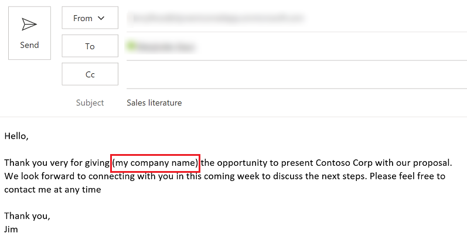
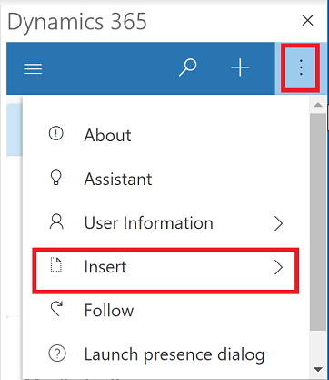
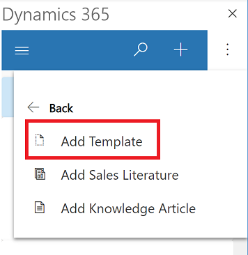
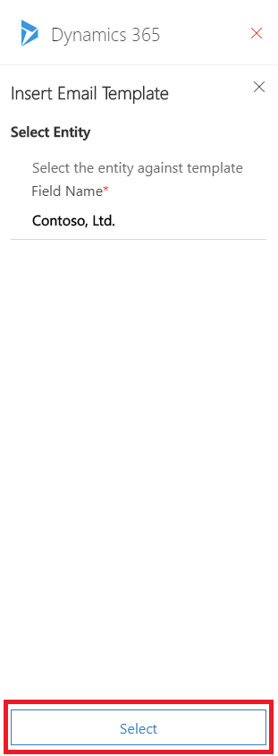
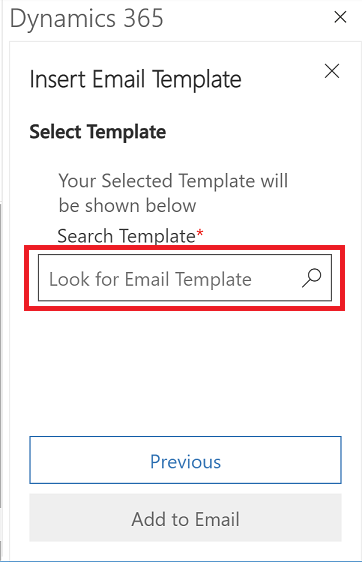
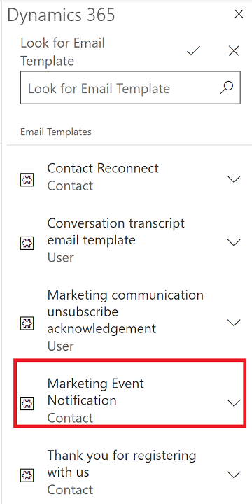
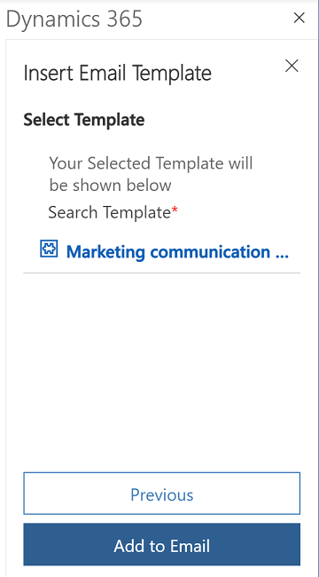
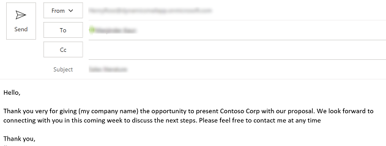

# Add an email template 

If you frequently send the same type of email, you can save time by using an email template. When you use an email template, Dynamics 365 App for Outlook automatically inserts the information such as contacts or set regarding information in the email message.

For example, you could use a **Thank you** template to save time whenever you want to send a thank you message to a customer.

For information on creating email templates: [Create templates for email](https://docs.microsoft.com/power-platform/admin/create-templates-email).  

  > [!div class="mx-imgBorder"] 
  > 

You must have the appropriate permissions to add email templates.

1. Compose an email message as you normally would in Outlook.  

2. At the top select **Dynamics 365** to open the **Dynamics 365** pane.  

   > [!div class="mx-imgBorder"] 
   >   
  
3. Selet **More commands**  and then select **Insert**.

   > [!div class="mx-imgBorder"] 
   > 

4. Select **Add Template**.

   > [!div class="mx-imgBorder"] 
   > 
   
5. Select the record type. The default is the set regarding record and then selexct **Select**.

   > [!div class="mx-imgBorder"] 
   > 
   
6. Select the search box () to look for an email template.

    > [!div class="mx-imgBorder"] 
    > 
   
 7. Use the search to find a tempalte and then select it. 
 
    > [!div class="mx-imgBorder"] 
    > 
   
 8. After selecting the email template that you want to add, select **Add to Email**.  
  
    > [!div class="mx-imgBorder"] 
    > 
   
9. The template is added to your email.

   > [!div class="mx-imgBorder"] 
   > 

